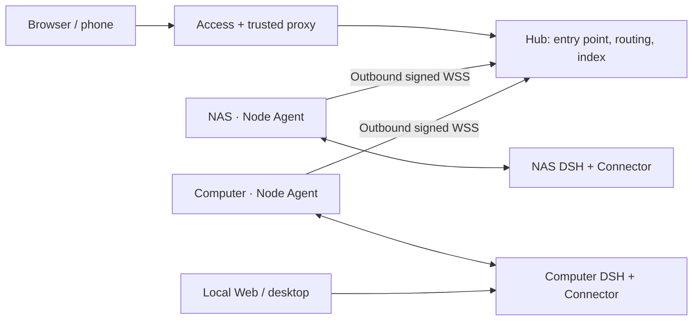

# DSH Hub

English | [中文](README.md)

[](https://github.com/k1412/dsh-hub/actions/workflows/hub-ci.yml)
[](https://github.com/k1412/dsh-hub/releases)
[](LICENSE)

**One browser for DSH across your computers, NAS, and servers.**

Start a task at your desk and continue from your phone. Leave a long task on your NAS while coding in a project on another machine. DSH Hub gives [DeepSeek Harness](https://github.com/deepseek-ai/deepseek-harness) a single entry point: find workspaces and sessions across machines, choose where new work runs, and manage nodes, plugins, and recovery points in one place.

Sessions and files stay on their original machine. Local DSH Web, the desktop client, and Hub share the same Runtime, without copying projects or starting another DSH instance for remote access.

[Get started](#quick-start) · [Tailcat device pairing](#featured-access-direction-tailcat-device-pairing) · [Using Hub](docs/hub/console.md) · [Compatibility](docs/hub/compatibility.md)


## What becomes easier

| What you want to do | How Hub helps |
|---|---|
| Continue work from another computer | Open the original session in the overview; requests return to its owning node without copying history |
| Choose where code runs | Select a node when creating a session, then browse that machine's working directories |
| Keep track of several machines | The overview combines all nodes; changing the default node does not hide the others |
| Check progress or answer a question from your phone | Continue the same session in a browser, with a sidebar and Settings layout for narrow screens |
| Connect a home NAS or laptop | Each node connects outbound to Hub; no public node IP, port forwarding, or exposed local DSH Web listener |
| Recover after a plugin update | Check versions and update history in Node plugins; managed updates keep rollback points automatically |
| Remove stale listings from an unused machine | Clear an offline node's Hub cache directly; revoking a node also removes its discovery index |

Hub is for **an individual or one trusted operator**. An authenticated operator has the full authority of the Node Agent account, including files, terminals, and plugin management. It does not offer separate workspace permissions for multiple users.

## Featured access direction: Tailcat device pairing

**Private access to a personal Hub should feel like pairing devices: generate a key on your laptop, approve its public key on Hub's host, then run the connection script.** Tailcat is our preferred lightweight direction, with three pairing and connection scripts already in this repository.

It suits one Hub and a few personal computers. Pair the browser's device with the Hub host; you do not need a separate tunnel to every DSH node. On a NAS, Tailcat can run on the host and forward a container port published on host loopback, without installing Tailscale inside the Hub container or changing its image. Tailcat and Tailscale are separate tools; installing Tailscale does not install `tailcat`.

| Set up once | Use afterward |
|---|---|
| Run `enroll-client.sh` on the operator device to save a client identity | Reuse that identity with `connect-hub.sh` to start local forwarding |
| Allow its public `nodekey` through `serve-hub.sh` on the Hub host | Only a client holding the approved private key can establish the tunnel |
| Save a server key | Reuse its identity after restarts; stopping the server interrupts the current tunnel |

> **Current status: device tunnel scripts are available; device-only Hub login is not implemented.** Hub still checks Cloudflare Access JWTs, operator email, and the Origin Secret. Forwarding the raw Hub port to `localhost` does not automatically create a usable login entry point. We recommend Tailcat as the access direction for a few trusted devices; for a working browser deployment today, complete the Cloudflare Access path below. See [pairing steps, verification, and the authentication proposal](docs/hub/access-options.md).

Tailcat provides an encrypted tunnel without a Tailscale account or control plane; our scripts additionally require a client public-key allowlist. “Device binding” means **binding to the private key held by the device**, not an uncopyable hardware identity. See the [Tailcat overview](https://tailscale.com/tailcat) and [installation instructions](https://github.com/tailscale/tailcat/blob/main/INSTALL.md).

## Daily use: choose a machine, choose a folder, keep working

1. **Connect a machine:** open Settings → Hub nodes, generate an enrollment code, run the generated installer on that machine, and restart its existing DSH Profile once.
2. **Start new work:** select a node/Runtime beside the new-session input, browse that node's workspace directories, and send your first message.
3. **Continue existing work:** open the session from the overview. It returns to its owning node regardless of the default selected for new sessions.
4. **Change a model or permissions:** check Current Runtime at the top of Settings first. Models, permissions, and Agent presets belong to that Runtime; language and appearance belong to your browser.

A machine can run several Profiles, with a different ID for each independent Runtime. Hub shows the management target so you can distinguish their configurations. See the [console guide](docs/hub/console.md).

<table>
  <tr>
    <td width="64%"></td>
    <td width="36%"></td>
  </tr>
  <tr>
    <td align="center">Nodes and runtime status in one place</td>
    <td align="center">Continue the same session on a phone</td>
  </tr>
</table>

### What happens when a node goes offline?

Hub keeps a minimal session index so you can still see where work belongs. Reading full history, continuing execution, or deleting a real session still requires its node to be online.

To remove stale overview entries, open Settings → Hub nodes and choose **Clear Hub cache** (`清理 Hub 缓存`) for the offline node. Hub performs this locally without waiting for the node; original sessions and files remain intact. Existing sessions synchronize again after reconnection. **Revoke** an unused machine to disconnect it and remove its session discovery index. Revoke its Cloudflare Service Token separately.

### Plugin updates and recovery

Settings → Node plugins first asks which Runtime to manage, then shows installed versions, sources, and available updates. A managed update saves the previous configuration and dependency state. Failure restores it automatically; successful updates can also be rolled back from history. Local and Git sources are marked separately, and one unavailable package does not break the entire inventory.


Use **managed-scope snapshots** for a broader set of configuration or approved data. Snapshots stay on the node, cover the paths configured there, and are not whole-machine backups. See [plugins and snapshots](docs/hub/console.md).

## Quick start

This is the **complete deployment path implemented today**. You need a Docker host, an HTTPS domain protected by Cloudflare Access, and at least one machine already running DSH. Nodes need Node.js 22.19+ in the 22 line or 24+, npm, and platform build tools. Check the [compatibility table](docs/hub/compatibility.md) first: Hub and DSH have separate versions.

### 1. Prepare the Hub entry point

Configure Cloudflare Access policies for the operator and node Service Tokens. A trusted reverse proxy injects an independent `X-DSH-Origin-Secret` before forwarding to Hub. Bind the Hub Origin to loopback or a restricted private interface.

| Your environment | Recommended complete deployment |
|---|---|
| NAS or home network without public ingress | Cloudflare Tunnel → local reverse proxy → Hub |
| Server with a public entry point | Cloudflare Access → HTTPS reverse proxy → Hub |
| VPS entry point, Hub on a NAS | Cloudflare Access → VPS proxy → Tailscale/WireGuard private network → Hub |

See the [deployment guide](docs/hub/deployment.md) for proxy configuration and validation. See [access options](docs/hub/access-options.md) for Tailcat and Tailscale readiness.

### 2. Start Hub

```bash
git clone https://github.com/k1412/dsh-hub.git
cd dsh-hub/deploy/hub
cp .env.example .env
chmod 600 .env
# Edit .env: HTTPS Origin, Access parameters, operator email, and a separate Origin Secret.
# For production, pin DSH_HUB_IMAGE to the chosen release's image digest.
mkdir -p backups
sudo chown 10001:10001 backups
docker compose pull
docker compose up -d
docker compose ps
```

Open the configured HTTPS domain and sign in. A `404` from the raw Origin port is expected protection, not evidence that Hub failed to start. See [image and source installation](docs/hub/deployment.md#3-start-the-hub).

### 3. Connect your existing DSH

Open **Settings → Hub nodes → Generate enrollment**, then run the generated Linux/macOS or Windows command as the same operating-system account that runs DSH.

The installer downloads and verifies Node Agent and Connector, adds Connector to the existing Profile, sets up a current-user background service, and prompts for that node's dedicated Cloudflare Service Token. The enrollment code is single-use and expires after 15 minutes. Restart the existing DSH Profile to load Connector.

**You are done when:** both node and Runtime are online, a session created in local DSH appears in Hub, and both interfaces can continue it. Repeat enrollment for a second machine with a different Service Token. See [node installation and services](docs/hub/node-services.md).

## Where data lives and work runs



Hub stores node identities, minimal discovery indexes, reliable delivery state, and audit records. Nodes handle full sessions, workspace files, model calls, plugin artifacts, and snapshots. Disconnecting Hub does not stop local DSH; Hub itself does not execute node tasks. Back up Hub state, DSH data, and Node Agent state as separate concerns; see [operations](docs/hub/operations.md).

## Versions and capability boundaries

The main branch may include fixes that have not been released. Merging code does not automatically update the installer or image behind `releases/latest`. Check the Release, source commit, and Connector version when choosing an installation source.

The current branch includes Connector adaptations for DSH versions such as `0.1.7-alpha.1`, while the bundled official Web snapshot is still from the `0.1.0-rc.7` family. **Passing transport adaptation tests does not mean every new DSH interface or feature is included.** Read [compatibility notes](docs/hub/compatibility.md) before upgrading, then verify sessions, tools, questions, cancellation, and Settings.

## Read by task

| Next step | Guide |
|---|---|
| Compare Tailcat pairing, Tailscale, and a public entry point | [Access options](docs/hub/access-options.md) |
| Deploy your first Hub and enroll a node | [Deployment](docs/hub/deployment.md) |
| Create sessions, change Settings targets, update plugins | [Console](docs/hub/console.md) |
| Install or troubleshoot background node services | [Node services](docs/hub/node-services.md) |
| Upgrade, back up, restore, clean up, or revoke | [Operations](docs/hub/operations.md) |
| Decide whether to upgrade a DSH version | [Compatibility](docs/hub/compatibility.md) |
| Understand permissions, authentication, and data protection | [Security](docs/hub/security.md) |
| Understand code boundaries or investigate latency | [Architecture](docs/hub/architecture.md) · [Performance](docs/hub/performance.md) |

Developers can start with [contributing](CONTRIBUTING.en.md): run `pnpm install --frozen-lockfile`, then `pnpm run check` and `pnpm run build`. CI also verifies concurrent nodes, mobile and desktop browsers, performance budgets, and the Linux container.

DSH Hub is an independent community project, not an official DeepSeek product. It uses a pinned set of official Web components and public plugin interfaces. See [LICENSE](LICENSE), [third-party notices](THIRD_PARTY_NOTICES.md), and [upstream attribution](docs/upstream.en.md).
