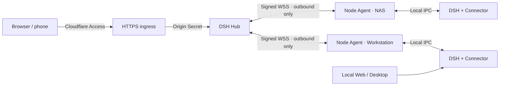

# DSH Hub

English | [中文](README.md)

[](https://github.com/k1412/dsh-hub/actions/workflows/hub-ci.yml)
[](https://github.com/k1412/dsh-hub/releases)
[](LICENSE)

**One browser for continuing DSH sessions across all your computers.**

DSH Hub is a self-hosted multi-node control plane for [DeepSeek Harness](https://github.com/deepseek-ai/deepseek-harness). Your computers, NAS, and cloud hosts continue to run their own DSH Runtime and retain their sessions and files. Each machine makes one outbound connection to Hub, which presents projects and sessions from the complete fleet in an official-style Web interface and lets a new session choose its node and workspace directly.


## What it solves

- **Sessions are no longer trapped on one computer:** local Web, desktop clients, and Hub use the same DSH Runtime and session storage, so any surface can continue the same work.
- **A real fleet view:** projects are grouped by workspace folder and every session carries its node identity; changing the default node never filters the fleet page.
- **Outbound-only nodes:** nodes need no public IP, port forwarding, or exposed SSH. Node Agent connects through signed WSS and reliably recovers after disconnection.
- **Not a reduced Web UI:** Hub assembles pinned official DSH Web components and adds node, workspace, and operations controls to the official settings and session flows.
- **Recoverable node operations:** inspect plugin versions, stage artifacts by hash, apply update transactions, retain the previous recoverable version, and manage node-local snapshots.
- **A usable mobile surface:** sessions, Composer, Runtime picker, sidebar, and full-screen Settings have a 390px browser regression suite.

<table>
  <tr>
    <td width="64%"></td>
    <td width="36%"></td>
  </tr>
  <tr>
    <td align="center">Enrollment, Runtimes, plugins, and transport health</td>
    <td align="center">390px mobile interface</td>
  </tr>
</table>

## Using sessions and Settings

The home page is always a **Fleet view**. It aggregates projects and sessions from every node and is never filtered by the current Runtime. For a new session, choose the node/Runtime above the composer, then use the adjacent official Workspace picker to select or browse a folder on that node. Once created, the encoded Workspace identity routes later messages, Goals, questions, and approvals back to the owner automatically.

All management entry points live under **Settings** in the lower-left corner. “Current Runtime” in the header identifies the owner of official Host settings, but not every setting is node-owned:

| Page or setting | Storage and scope | How to switch |
|---|---|---|
| General: permissions, default agent, submission behavior | Current Runtime | “Current Runtime” in the Settings header |
| General: language and appearance | Current browser | Independent of nodes |
| Models, configurable plugins, and Agent presets | Current Runtime | “Current Runtime” in the Settings header |
| Hub nodes | Hub-global | No node switch required |
| Node plugins, update history, and managed-scope snapshots | Runtime explicitly selected on that page | “Management target” on Node plugins |

Changing Runtime does not reload the Settings shell. Hub invalidates both official schema-backed settings and direct Host controllers such as models, permissions, and agents, while fencing late responses from the previous node so node A state cannot be written to node B. See the [console guide](docs/hub/console.md) for the complete workflow.

## Plugin updates, automatic rollback, and snapshots

**Settings → Node plugins** is more than a list of version buttons. It reads the node's actual Profile and classifies every plugin as npm-registry managed, externally managed, or temporarily unavailable. A private or local plugin returning 404 cannot fail the whole scan.


Every Hub-managed update verifies the dependency lock, downloads one exact version, checks SHA-256, and automatically preserves the old manifest, lockfile, Cordis configuration, and managed artifact on the node. A failed install or composition check restores the previous state immediately; a successful update still retains **Rollback to previous version**. Plugins installed from local files, Workspaces, Git, or independent Releases remain visible, but Hub never rewrites their source.

A **managed-scope snapshot** is a separate explicit protection layer. It includes only selected Profile configuration, dependencies, or data roots approved in Node Agent configuration; it is **not an operating-system image**. Restore creates another protection point first. Ordinary plugin updates do not require a manual snapshot.


## Core design



Hub is **not** another DSH Runtime and has no special local-execution mode. It owns identity, routing, a minimal session index, reliable delivery, node management, and audit. Model calls, complete session content, workspaces, plugins, and snapshots remain authoritative on each node. To execute on the VPS itself, install DSH, Connector, and Node Agent there as an ordinary node.

Connector is a Cordis plugin installed into an existing DSH Profile. It reuses the same Host API already used by local Web and desktop clients. Node Agent is a same-account sidecar that owns node identity, outbound WSS, the recovery journal, and machine-level management. It neither starts a second DSH Runtime nor opens an inbound port.

## Quick start

### 1. Prepare a secure ingress

The recommended topology gives Hub a hostname such as `hub.example.com`, protects browser login with Cloudflare Access, and proxies traffic to a Hub Origin bound only to loopback or a private network. The trusted reverse proxy must strip any client-supplied `X-DSH-Origin-Secret` header and inject its own random value.

The minimum secure configuration includes:

- a Cloudflare Access Self-hosted Application whose human policy allows only your account;
- an exact operator email allowlist inside Hub, in addition to successful Access login;
- an Origin port bound only to loopback or a private interface, with only HTTPS ingress public;
- a separate Cloudflare Service Token for every node;
- unprivileged Hub and Node Agent accounts with owner-only state directories.

See the [deployment guide](docs/hub/deployment.md) and [security model](docs/hub/security.md). The documented **Cloudflare Tunnel topology** accepts no inbound connection at the server, so Hub, its proxy, and a NAS may remain entirely on a private network.

### 2. Start Hub

```bash
git clone https://github.com/k1412/dsh-hub.git
cd dsh-hub/deploy/hub
cp .env.example .env
chmod 600 .env
# Set public origin, Cloudflare Access values, operator email, and an independent Origin Secret.
docker compose pull
docker compose up -d
docker compose ps
```

Production deployments should pin `DSH_HUB_IMAGE` to the immutable digest associated with a Release instead of tracking `latest`. The supplied Compose definition uses UID 10001, a read-only root filesystem, no Linux capabilities, `no-new-privileges`, and a loopback port by default.

### 3. Enroll a node with one command

Open **Settings → Hub nodes**, enter a display name and node ID, and create a one-time enrollment code that expires after 15 minutes. The page generates either a Linux/macOS or Windows command. A representative Unix command is shown below; copy the generated version from your own Hub in normal use:

```bash
curl -fsSL https://github.com/k1412/dsh-hub/releases/latest/download/install-node.sh \
  | DSH_HUB_ENROLLMENT_CODE='one-time-code' bash -s -- \
      --hub 'https://hub.example.com' --node 'workstation'
```

The installer verifies Release SHA-256 checksums, installs the Connector plugin and current-user Node Agent service, and reads the node-specific Service Token Secret through a hidden interactive prompt. Restart the existing DSH Profile once; local Web, desktop, and Hub can then use the same sessions together.

## Deployment choices

| Mode | Ingress | Origin exposure | Best for |
|---|---|---:|---|
| Domain + Access + reverse proxy | Public HTTPS | Loopback or private network | Direct phone and remote-computer access |
| Cloudflare Tunnel | Outbound Cloudflare tunnel | No inbound port | NAS, home networks, and sites without port forwarding |
| Access + overlay network | VPS ingress to Hub over Tailscale/WireGuard | Overlay only | Hub on a NAS with a thin VPS Web ingress |

Direct public `IP:port` exposure without Access and the Origin Secret is not a supported production topology. Tailscale solves reachability, not browser identity by itself; exact operator authorization and Origin isolation still apply when Hub is used through a browser.

## Authority and data boundaries

This project deliberately uses a single-operator model: **the Hub operator has every permission available to the node account**. Nodes do not request another local approval for each command. Run Node Agent under the least-privileged account that still owns the intended DSH Profile and workspaces. Running it as `root` intentionally grants Hub root-equivalent control over that node.

Hub stores nodes, public identities, Runtimes, a minimal session discovery index, command state, reliable-delivery journals, and audit records. It does not cache complete session histories or node files. Plugin artifacts and snapshots stay on their node. See the [operations guide](docs/hub/operations.md) for backup, restore, revocation, queue monitoring, and incident handling.

## Feature overview

- Fleet-wide projects and sessions, with node and browsable workspace selection for new sessions;
- official session, message, reasoning, tool, question, approval, Goal, and queue interactions;
- coexistence with desktop clients and node-local Web;
- node enrollment, revocation, status, Runtimes, and capability inventory;
- bidirectional reliable queues, heartbeat, pressure, suppression, and control-request monitoring;
- node plugin inventory, version pinning, update, rollback, and recovery transactions;
- node file, terminal, and snapshot operations;
- Ed25519 node identity, connection-generation fencing, replay, and a hash-chained audit log;
- desktop, mobile, concurrent multi-node, container, and cross-platform CI coverage.

## Documentation

- [Deployment](docs/hub/deployment.md): three network topologies, Cloudflare, reverse proxies, Docker, and enrollment;
- [Architecture](docs/hub/architecture.md): Hub, Node Agent, Connector, official Web, and storage ownership;
- [Security](docs/hub/security.md): full authority, human and node identity, Origin isolation, and secrets;
- [Operations](docs/hub/operations.md): upgrades, backup, restore, revocation, monitoring, and troubleshooting;
- [Node services](docs/hub/node-services.md): systemd User, launchd, and Windows current-user tasks;
- [Performance and multi-node behavior](docs/hub/performance.md): concurrency, backpressure, and test guarantees;
- [Console](docs/hub/console.md): terminal, files, plugins, snapshots, and their risks.

## Development and contribution

The repository retains only Hub-owned code, a reviewed official-Web build snapshot with its reproducible source patch, deployment files, tests, and bilingual documentation. Hub packages live under `packages/hub`; the browser entry lives under `apps/hub-web`.

```bash
pnpm install --frozen-lockfile
pnpm run check
pnpm run build
```

See [CONTRIBUTING.md](CONTRIBUTING.md) for commits, Issues, compatibility, and security principles that are not open to casual changes. A sole maintainer may work directly on their branches; with multiple contributors, product changes merge through pull requests, required checks, and explicit review. Proposals to change the principle that Hub has all permissions of the node account should be validated in a separate fork rather than changing this project's default model directly.

## Upstream, independence, and license

DSH Hub uses the public DeepSeek Harness plugin APIs and reuses the official Web interaction layer built from a pinned commit, but it is an independently maintained community project, not an official DeepSeek project. Upstream components and this project are used under the MIT License; see [LICENSE](LICENSE), [THIRD_PARTY_NOTICES.md](THIRD_PARTY_NOTICES.md), and [upstream attribution](docs/upstream.en.md). The project does not use DeepSeek names, icons, or other marks to imply official endorsement.
