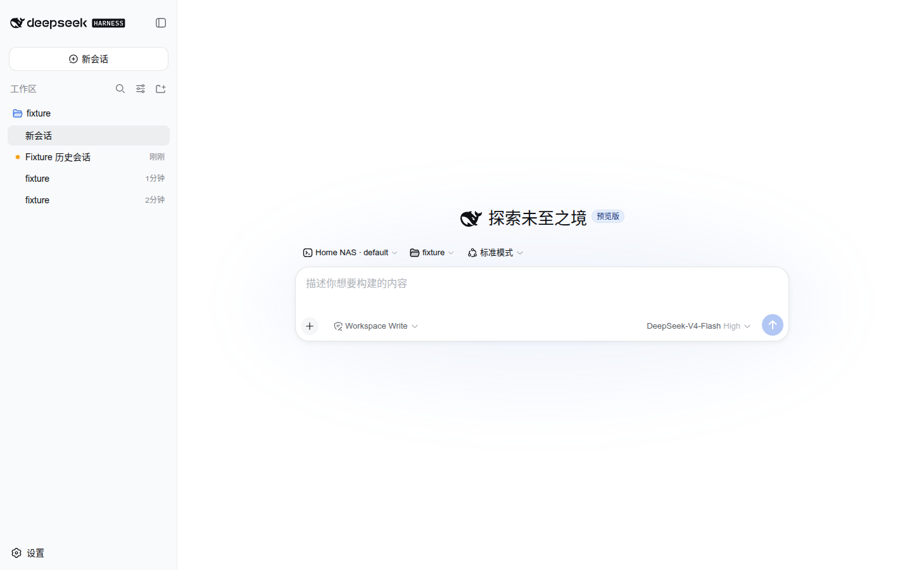
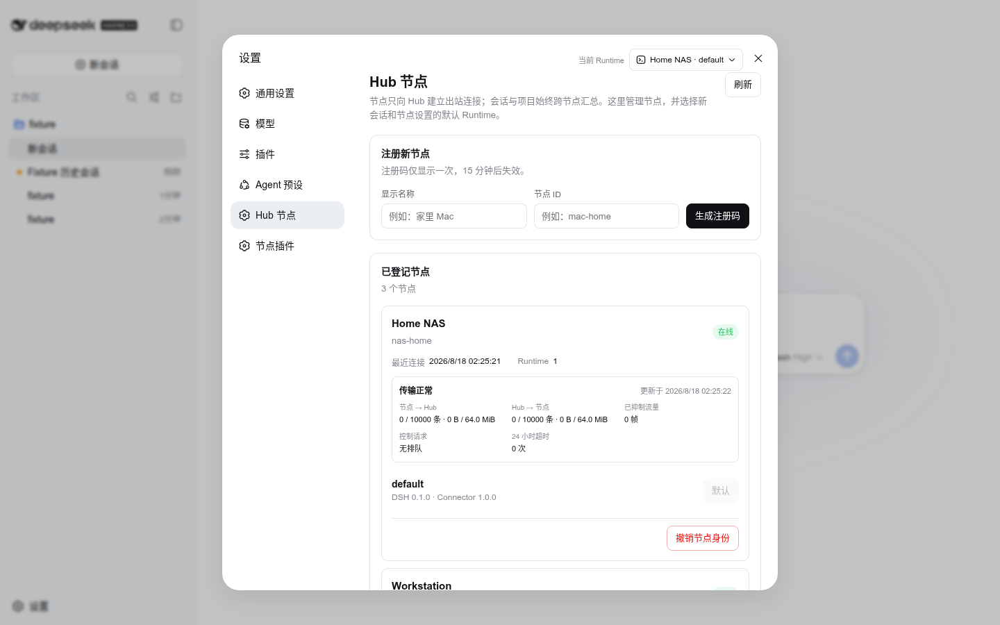
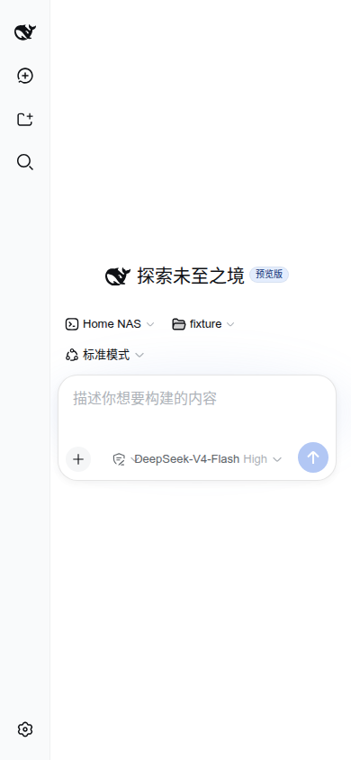
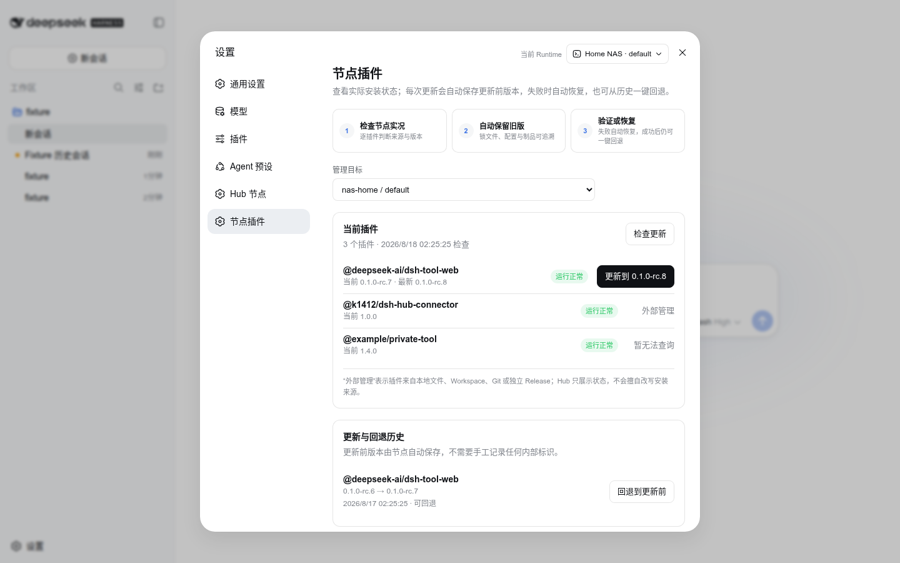
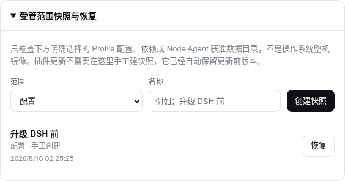
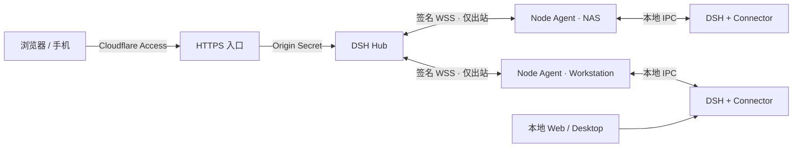

# DSH Hub

[English](README.en.md) | 中文

[](https://github.com/k1412/dsh-hub/actions/workflows/hub-ci.yml)
[](https://github.com/k1412/dsh-hub/releases)
[](LICENSE)

**一个浏览器，继续你所有电脑上的 DSH 会话。**

DSH Hub 是面向 [DeepSeek Harness](https://github.com/deepseek-ai/deepseek-harness) 的自托管多节点控制面。电脑、NAS 和云主机继续在本地运行自己的 DSH Runtime、保存会话与文件；每台机器只需主动连接 Hub，就能在同一个官方风格 Web 界面里按文件夹汇总项目和会话，并在新建会话时直接选择节点与工作区。



## 它解决什么问题

- **会话不再困在一台电脑上**：本地 Web、桌面客户端和 Hub 使用同一个 DSH Runtime 与会话存储，可以从任何入口继续同一个工作。
- **真正的机群视图**：项目按工作区文件夹分组，每条会话同时标明所属节点；切换默认节点不会过滤整页会话。
- **节点只出站连接**：节点无需公网 IP、端口映射或 SSH 暴露，Node Agent 通过签名 WSS 主动连接 Hub，并在断线后可靠恢复。
- **不是阉割版 Web UI**：Hub 组装固定版本的官方 DSH Web 组件，只把节点、工作区和运维能力加入官方设置与会话流程。
- **节点运维可回退**：查看插件清单和版本，按哈希暂存制品，执行更新事务，保留上一个可恢复版本，并管理节点本地快照。
- **手机可以真正使用**：会话、Composer、Runtime 选择器、侧栏和全屏设置均有 390px 浏览器回归测试。

<table>
  <tr>
    <td width="64%"></td>
    <td width="36%"></td>
  </tr>
  <tr>
    <td align="center">节点注册、Runtime、插件与传输健康</td>
    <td align="center">390px 手机界面</td>
  </tr>
</table>

## 从会话到设置，怎么使用

首页始终是 **Fleet 视图**：它汇总全部节点的项目和会话，不会因为当前 Runtime 改变而过滤。新建会话时，先在输入框上方选择节点／Runtime，再用紧邻的官方 Workspace 选择器挑选或浏览该节点的文件夹；会话建立后，编码后的 Workspace 身份会让后续消息、Goal、提问和审批自动回到所属节点。

管理入口统一在左下角 **设置**。顶部的“当前 Runtime”用于提示官方 Host 设置的所有者，但并非所有设置都在节点上：

| 设置页／设置项 | 保存位置与作用域 | 切换方法 |
|---|---|---|
| 通用设置：权限、默认 Agent、发送行为 | 当前 Runtime | 设置顶部“当前 Runtime” |
| 通用设置：语言、外观 | 当前浏览器 | 与节点无关 |
| 模型、可配置插件、Agent 预设 | 当前 Runtime | 设置顶部“当前 Runtime” |
| Hub 节点 | Hub 全局 | 无需切换节点 |
| 节点插件、更新历史、受管范围快照 | 页面中明确选择的 Runtime | “节点插件”页的“管理目标” |

切换 Runtime 不会刷新整个设置页；Hub 会同时失效官方的 Schema 设置和模型／权限／Agent 等直接 Host 控制器，并隔离旧节点晚到的响应，避免把 A 节点数据保存到 B 节点。完整操作说明见[控制台指南](docs/hub/console.zh.md)。

## 插件更新、自动回退和快照

“设置 → 节点插件”不是一个只有按钮的版本列表。它先读取节点真实 Profile，再逐插件区分 npm Registry 管理、外部管理和暂时无法查询；一个私有或本地插件的 404 不会拖垮整页。



每次由 Hub 发起的更新都会核对依赖锁、下载精确版本、校验 SHA-256，并在节点本地自动保存旧 Manifest、锁文件、Cordis 配置和受管制品。安装或组合验证失败会立即自动恢复；成功后仍保留“一键回退到更新前”。外部文件、Workspace、Git 或独立 Release 安装的插件只展示状态，Hub 不会擅自改写来源。

“受管范围快照”是另一层显式保护：它只包含选定的 Profile 配置、依赖或 Node Agent 配置中获准的数据目录，**不是操作系统整机镜像**；恢复前还会自动保存当前状态。插件日常更新不需要手工创建快照。



## 核心设计



Hub **不是**另一个 DSH Runtime，也没有特殊的“本地执行模式”。它负责身份、路由、最小会话索引、可靠交付、节点管理和审计；模型调用、会话正文、工作区、插件和快照仍由节点负责。想让 VPS 本机也执行任务，就在同一台 VPS 上按普通节点方式部署 DSH、Connector 和 Node Agent。

Connector 是安装进现有 DSH Profile 的 Cordis 插件，复用本地 Web 和桌面端已经使用的 Host API。Node Agent 是同账户 Sidecar，负责节点身份、出站 WSS、断线 Journal 和机器级管理；它不会启动第二套 DSH Runtime，也不会开放入站端口。

## 快速开始

### 1. 准备安全入口

推荐准备一个域名，例如 `hub.example.com`，用 Cloudflare Access 保护浏览器登录，并让反向代理把流量转发到仅绑定回环或私有网络的 Hub Origin。反向代理必须删除外部传入的 `X-DSH-Origin-Secret`，再注入自己持有的随机值。

最低安全配置包括：

- Cloudflare Access Self-hosted Application，人员策略只允许你的账号；
- Hub 内再配置精确邮箱白名单，不能只依赖 Cloudflare 登录成功；
- Origin 端口只绑定回环或私有接口，公网只开放 HTTPS 入口；
- 每个节点使用独立的 Cloudflare Service Token；
- Hub 与 Node Agent 均使用非特权账户和仅所有者可读的状态目录。

完整配置见[部署指南](docs/hub/deployment.zh.md)和[安全模型](docs/hub/security.zh.md)。如果不希望服务器接受任何公网入站连接，可以使用文档中的 **Cloudflare Tunnel 模式**；Hub、反向代理与 NAS 都可只留在内网。

### 2. 启动 Hub

```bash
git clone https://github.com/k1412/dsh-hub.git
cd dsh-hub/deploy/hub
cp .env.example .env
chmod 600 .env
# 填写公共 Origin、Cloudflare Access 参数、操作员邮箱和独立 Origin Secret
docker compose pull
docker compose up -d
docker compose ps
```

生产环境建议把 `DSH_HUB_IMAGE` 固定到 Release 对应的不可变 Digest，而不是长期使用 `latest`。随附 Compose 默认以 UID 10001、只读根文件系统、移除全部 Linux Capability、`no-new-privileges` 和回环端口运行。

### 3. 一条命令接入节点

在 Hub 打开 **设置 → Hub 节点**，填写显示名称和节点 ID，生成 15 分钟有效的一次性注册码。页面会给出 Linux／macOS 或 Windows 的安装命令。典型 Unix 命令如下；实际使用时请直接复制页面生成的版本：

```bash
curl -fsSL https://github.com/k1412/dsh-hub/releases/latest/download/install-node.sh \
  | DSH_HUB_ENROLLMENT_CODE='一次性注册码' bash -s -- \
      --hub 'https://hub.example.com' --node 'workstation'
```

安装器会校验 Release 的 SHA-256，安装 Connector 插件与当前用户的 Node Agent 服务，并通过交互式隐藏输入读取节点专属 Service Token Secret。重启一次现有 DSH Profile 后，本地 Web、桌面端和 Hub 就能同时使用同一组会话。

## 部署方式

| 模式 | 入口 | Origin 暴露 | 适合场景 |
|---|---|---:|---|
| 域名 + Access + 反向代理 | 公网 HTTPS | 回环或私网 | 最通用，手机和异地电脑直接访问 |
| Cloudflare Tunnel | Cloudflare 出站隧道 | 不开放入站端口 | NAS、家庭网络、无法做端口映射 |
| Access + Overlay Network | VPS 入口转发到 Tailscale/WireGuard 内的 Hub | 仅 Overlay | Hub 在 NAS，VPS 只做网页入口 |

纯 `IP:端口`、没有 Access 与 Origin Secret 的直接公网暴露不是受支持的生产拓扑。Tailscale 只能解决可达性，若仍通过浏览器使用 Hub，认证、精确操作员授权和 Origin 隔离依然需要保留。

## 权限与数据边界

本项目采用明确的单操作员模型：**Hub 操作员拥有节点账户可以执行的全部权限**。节点不会为每条命令再次弹出本地确认。请用能够访问目标 DSH Profile 和工作区的最低权限账户运行 Node Agent；如果用 `root` 运行，就等于主动把该节点的 Root 权限交给 Hub。

Hub 保存节点、公钥、Runtime、最小会话发现索引、命令状态、可靠交付 Journal 和审计记录；它不缓存会话全文和节点文件。插件制品与快照保留在节点本地。详细备份、恢复、吊销、队列监控与故障处理见[运维手册](docs/hub/operations.zh.md)。

## 功能一览

- 多节点项目与会话聚合，新建会话可选节点和浏览工作区；
- 官方会话、消息、思考、工具、提问、审批、Goal 和队列交互；
- 浏览器、桌面端与本地 Web 的会话共存；
- 节点注册、吊销、在线状态、Runtime 与能力清单；
- 双向可靠队列、心跳、压力、抑制流量和控制请求监控；
- 节点插件盘点、版本锁定、更新、回退与恢复事务；
- 节点文件、终端和快照操作；
- Ed25519 节点身份、连接代次隔离、断线重放和审计哈希链；
- 桌面、手机、多节点并发、容器与跨平台 CI。

## 文档

- [部署指南](docs/hub/deployment.zh.md)：三种网络拓扑、Cloudflare、反向代理、Docker 和节点接入；
- [架构设计](docs/hub/architecture.zh.md)：Hub、Node Agent、Connector、官方 Web 与存储边界；
- [安全模型](docs/hub/security.zh.md)：完整权限、人员／节点认证、Origin 隔离和机密处理；
- [运维手册](docs/hub/operations.zh.md)：升级、备份、恢复、撤销、监控和故障排查；
- [节点服务](docs/hub/node-services.zh.md)：systemd User、launchd 与 Windows 当前用户任务；
- [性能与多节点](docs/hub/performance.zh.md)：并发、背压和测试保证；
- [控制台说明](docs/hub/console.zh.md)：终端、文件、插件与快照的用途和风险。

## 开发与贡献

仓库只保留 Hub 自有代码、经过 Review 的官方 Web 构建快照及其可复现源码补丁、部署文件、测试和双语文档。Hub 包位于 `packages/hub`，浏览器入口位于 `apps/hub-web`。

```bash
pnpm install --frozen-lockfile
pnpm run check
pnpm run build
```

提交、Issue、兼容性和不允许修改的安全原则见 [CONTRIBUTING.md](CONTRIBUTING.md)。个人维护者可以直接维护自己的分支；如果未来有多位贡献者，功能变更通过 PR、必需检查和明确 Review 合并。改变“Hub 拥有节点账户全部权限”这一产品原则的提案应先在自己的 Fork 中验证，不会直接改变本项目默认模型。

## 上游、独立性与许可证

DSH Hub 使用 DeepSeek Harness 的公开插件 API，并复用固定提交构建的官方 Web 交互层；它由社区独立维护，不是 DeepSeek 官方项目。上游组件和本项目均按 MIT License 使用；详见 [LICENSE](LICENSE)、[THIRD_PARTY_NOTICES.md](THIRD_PARTY_NOTICES.md)和[上游归属说明](docs/upstream.md)。项目不会把 DeepSeek 名称、图标或其他商标用作官方背书。
