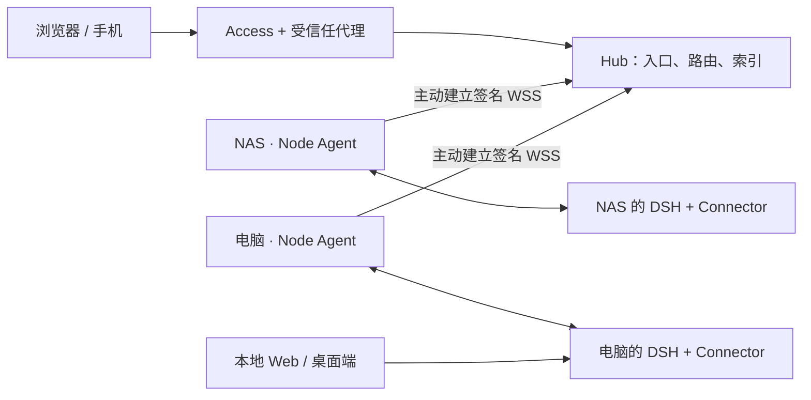

# DSH Hub

[English](README.en.md) | 中文

[](https://github.com/k1412/dsh-hub/actions/workflows/hub-ci.yml)
[](https://github.com/k1412/dsh-hub/releases)
[](LICENSE)

**把电脑、NAS 和服务器上的 DSH，放进一个浏览器。**

在电脑上开始的任务，出门后用手机继续；让 NAS 执行长任务，同时在另一台机器的项目里写代码。DSH Hub 为 [DeepSeek Harness](https://github.com/deepseek-ai/deepseek-harness) 提供统一入口：查看各台机器的工作区和会话，选择任务在哪台机器运行，并从同一处管理节点、插件和恢复点。

会话和文件留在原机器上。本地 DSH Web、桌面客户端和 Hub 复用同一个 Runtime，不需要复制项目，也不会为远程访问再启动一套 DSH。

[开始部署](#快速开始) · [Tailcat 设备配对](#主推接入方向tailcat-设备配对) · [怎么使用](docs/hub/console.zh.md) · [版本兼容](docs/hub/compatibility.zh.md)


## 用起来方便在哪里

| 你想做什么 | 在 Hub 里怎么做 |
|---|---|
| 接着另一台电脑上的任务做 | 在总览中打开原会话，消息仍交给它所属的节点；不用搬运历史记录 |
| 决定代码在哪台机器运行 | 新建会话时先选节点，再浏览这台机器的工作目录 |
| 同时照看几台机器 | 总览汇总所有节点的会话；切换默认节点不会把其他机器藏起来 |
| 从手机查看进度、回答提问 | 浏览器中继续同一会话；移动端侧栏和设置支持窄屏布局 |
| 接入家里的 NAS 或笔记本 | 每台节点主动连接 Hub，不要求节点公网 IP、端口转发或公开本地 DSH Web |
| 更新插件后恢复到原来状态 | 在“节点插件”检查更新、查看更新记录；受管更新自动保留回退点 |
| 清理不用的机器留下的列表 | 离线节点可以直接“清理 Hub 缓存”；吊销节点也会清除它的发现索引 |

Hub 面向**个人或单一可信操作员**。登录后可以使用 Node Agent 账户的全部权限，包括文件、终端和插件管理；它不提供多人分权的工作区。

## 主推接入方向：Tailcat 设备配对

**我们希望个人 Hub 的私有接入像配对设备一样简单：笔记本生成密钥，Hub 登记公钥，之后运行连接脚本。** Tailcat 是我们主推的轻量接入方向，仓库已提供三个配对与连接脚本。

它适合“一台 Hub + 少量自己的电脑”：配对发生在浏览器所在设备和 Hub 主机之间，不需要逐一为每台 DSH 节点建立隧道。Tailcat 可以在 NAS 宿主机上运行，转发容器发布到宿主机回环地址的端口，无需往 Hub 容器安装 Tailscale 或修改镜像。Tailcat 与 Tailscale 是不同工具；已安装 Tailscale 不代表已有 `tailcat`。

| 一次配置 | 以后使用 |
|---|---|
| 操作员设备运行 `enroll-client.sh`，生成并保存客户端密钥 | 使用同一密钥运行 `connect-hub.sh`，建立本地转发 |
| Hub 主机在 `serve-hub.sh` 中允许该设备的公开 `nodekey` | 只有持有获准私钥的客户端能够建立该隧道 |
| 服务端使用保存的密钥 | 重启时复用身份；停止服务即可中断当前隧道 |

> **当前状态：设备隧道脚本已提供，设备免登录 Hub 尚未实现。** 现有 Hub 仍验证 Cloudflare Access JWT、操作员邮箱和 Origin Secret。直接把原始 Hub 端口转发到 `localhost`，不会自动获得一个可用的登录入口。我们推荐 Tailcat 作为少量可信设备的接入方向；今天部署可用的浏览器入口，请按下面的 Cloudflare Access 路径完成。详见 [Tailcat 配对步骤、验证方法与认证方案](docs/hub/access-options.zh.md)。

Tailcat 的便利在于无需 Tailscale 账号或控制面即可建立加密隧道；项目脚本进一步要求客户端公钥白名单。这里的“设备绑定”是**绑定设备持有的私钥**，不是硬件不可复制的身份。底层能力与安装方法见 [Tailcat 官方介绍](https://tailscale.com/tailcat)和[安装说明](https://github.com/tailscale/tailcat/blob/main/INSTALL.md)。

## 日常使用：选机器，选目录，继续工作

1. **第一次接入**：打开“设置 → Hub 节点”，生成注册码，在目标机器运行页面给出的安装命令，重启原来的 DSH Profile 一次。
2. **开始新任务**：在新建会话的输入区域选择节点／Runtime，再用工作区选择器浏览该节点的目录，发送第一条消息。
3. **继续旧任务**：直接打开总览里的会话。它会回到原来的节点，与你当前选择的新会话默认节点无关。
4. **调整模型或权限**：先检查设置页顶部的“当前 Runtime”。模型、权限、Agent 预设属于该 Runtime；语言和外观属于当前浏览器。

同一台机器可以运行多个 Profile，每个独立 Runtime 使用不同 ID。Hub 会显示明确的管理目标，方便区分同机上的不同配置。完整步骤见[控制台指南](docs/hub/console.zh.md)。

<table>
  <tr>
    <td width="64%"></td>
    <td width="36%"></td>
  </tr>
  <tr>
    <td align="center">集中查看节点和运行状态</td>
    <td align="center">手机继续同一会话</td>
  </tr>
</table>

### 节点离线了，列表怎么办

临时离线时，Hub 保留最小会话索引，让你知道任务原来在哪台机器上；读取正文、继续执行或删除节点上的真实会话仍需要该节点在线。

如果只想清理首页残留，进入“设置 → Hub 节点”，对离线节点点击 **清理 Hub 缓存**。这一步由 Hub 本地完成，不用等节点恢复，也不会删除节点文件或原始会话。节点重新上线后，仍存在的会话会再次同步。对不再使用的机器选择 **吊销**，会断开接入并移除其会话发现索引；Cloudflare Service Token 需要另行撤销。

### 插件更新与恢复

“设置 → 节点插件”先让你选择要管理的 Runtime，再显示实际安装版本、来源和可用更新。受管更新会保留更新前配置与依赖状态；失败自动恢复，成功后也可从历史中回退。本地、Git 等外部来源会单独标明，一个包查不到更新不会拖垮整页。


需要保存更大范围的配置或获准数据时，可以使用**受管范围快照**。快照留在节点上，范围由节点配置决定，不是整机备份。操作说明见[插件与快照指南](docs/hub/console.zh.md#插件状态更新与回退)。

## 快速开始

下面是**当前已实现的完整部署路径**。准备一台 Docker 主机、一个 Cloudflare Access 保护的 HTTPS 域名，以及至少一台已经运行 DSH 的机器。节点需要 Node.js 22.19+（22 系列）或 24+、npm 和平台构建工具；先阅读[版本兼容表](docs/hub/compatibility.zh.md)，不要把 Hub 版本和 DSH 版本混为一谈。

### 1. 为 Hub 准备入口

配置 Cloudflare Access 的操作员登录和节点 Service Token 策略。受信任反向代理负责注入独立的 `X-DSH-Origin-Secret`，再转发给 Hub。Hub Origin 只绑定回环或受限私网。

| 你的环境 | 推荐完整部署方式 |
|---|---|
| NAS、家庭网络，没有公网入站 | Cloudflare Tunnel → 本机反向代理 → Hub |
| 有公网入口的服务器 | Cloudflare Access → HTTPS 反向代理 → Hub |
| VPS 做入口，Hub 在 NAS | Cloudflare Access → VPS 代理 → Tailscale/WireGuard 私网 → Hub |

具体代理配置与验证方法见[部署指南](docs/hub/deployment.zh.md)。Tailcat 和 Tailscale 方案的就绪状态见[接入方式选择](docs/hub/access-options.zh.md)。

### 2. 启动 Hub

```bash
git clone https://github.com/k1412/dsh-hub.git
cd dsh-hub/deploy/hub
cp .env.example .env
chmod 600 .env
# 编辑 .env：填写 HTTPS Origin、Access 参数、操作员邮箱和独立 Origin Secret。
# 生产部署把 DSH_HUB_IMAGE 固定为所选 Release 的镜像 Digest。
mkdir -p backups
sudo chown 10001:10001 backups
docker compose pull
docker compose up -d
docker compose ps
```

打开已配置的 HTTPS 域名，登录后应进入 Hub。直接访问原始端口收到 `404` 是预期的 Origin 保护行为，不代表服务没有启动。镜像与源码获取方式见[部署指南](docs/hub/deployment.zh.md#3-启动-hub)。

### 3. 接入现有 DSH

打开 **设置 → Hub 节点 → 生成注册码**，复制页面提供的 Linux／macOS 或 Windows 安装命令，在运行 DSH 的同一个操作系统账户下执行。

安装器下载并校验 Node Agent 与 Connector，把 Connector 安装到现有 Profile，配置当前用户的后台服务，并交互读取该节点专属的 Cloudflare Service Token。注册码有效期为 15 分钟、只能用一次。最后重启现有 DSH Profile，让 Connector 生效。

**完成标志**：节点与 Runtime 都在线；本地 DSH 创建的会话能在 Hub 找到；两边可以交替继续同一会话。增加第二台机器时重复注册，为它使用独立 Service Token。详细说明见[节点安装与服务](docs/hub/node-services.zh.md)。

## 数据在哪里，任务在哪里执行



Hub 保存节点身份、最小发现索引、可靠投递状态和审计记录。完整会话、工作区文件、模型调用、插件制品和快照由节点处理。断开 Hub 不会停止本地 DSH；Hub 自身也不执行节点任务。备份时应分别考虑 Hub 状态、DSH 数据和 Node Agent 状态，详见[运维手册](docs/hub/operations.zh.md)。

## 版本与能力边界

仓库主分支可能包含尚未发布的修复；`releases/latest` 的安装器和镜像不会因为合并代码自动更新。选择安装来源时请核对 Release、源码提交与 Connector 版本。

当前主分支包含面向 `0.1.7-alpha.1` 等 DSH 版本的 Connector 适配，但内置官方 Web 快照仍基于 `0.1.0-rc.7` 家族。**传输适配通过，不等于已经包含新版 DSH 的全部界面与功能。** 升级前查看[兼容说明](docs/hub/compatibility.zh.md)，升级后验证会话、工具、提问、取消和设置流程。

## 按你要做的事阅读

| 下一步 | 文档 |
|---|---|
| 了解 Tailcat 配对、Tailscale 与公网入口的区别 | [接入方案](docs/hub/access-options.zh.md) |
| 部署第一个 Hub 并接入节点 | [部署指南](docs/hub/deployment.zh.md) |
| 新建会话、切换设置目标、更新插件 | [控制台指南](docs/hub/console.zh.md) |
| 安装或排查节点后台服务 | [节点服务](docs/hub/node-services.zh.md) |
| 升级、备份、恢复、清理和吊销 | [运维手册](docs/hub/operations.zh.md) |
| 判断某个 DSH 版本能否升级 | [兼容说明](docs/hub/compatibility.zh.md) |
| 理解权限、认证和数据保护 | [安全模型](docs/hub/security.zh.md) |
| 理解代码边界或排查速度 | [架构](docs/hub/architecture.zh.md) · [性能](docs/hub/performance.zh.md) |

开发者从[贡献指南](CONTRIBUTING.md)开始：`pnpm install --frozen-lockfile`，然后执行 `pnpm run check` 与 `pnpm run build`。CI 还独立验证多节点并发、移动端与桌面浏览器、性能预算和 Linux 容器。

DSH Hub 是独立社区项目，不是 DeepSeek 官方产品。使用固定版本的官方 Web 组件与公开插件接口；许可证和来源见 [LICENSE](LICENSE)、[第三方声明](THIRD_PARTY_NOTICES.md)和[上游归属](docs/upstream.md)。
