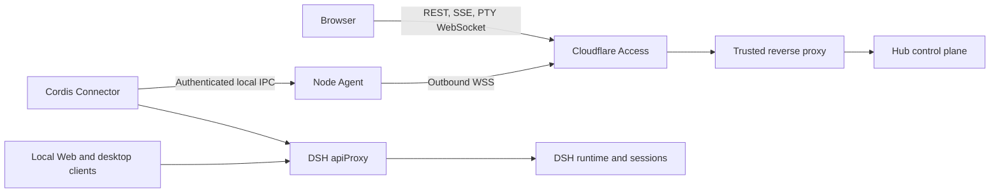

# DSH Hub architecture

English | [中文](architecture.zh.md)

This reference defines the runtime architecture and ownership boundaries of DSH Hub.

## Components

The Hub server owns human authentication enforcement, node enrollment, connection generations, command routing, minimal discovery state, audit records, browser APIs, and the multi-node Web UI. Hub contains no DSH runtime, agent loop, model provider, workspace executor, or Hub-side plugin runtime.

The Node Agent owns the outbound WSS connection, Ed25519 node identity, Cloudflare Access Service Token, durable delivery journal, local Connector endpoint, profile plugin transactions, snapshots, file operations, and PTY processes. Its authority equals the operating-system account that runs it; installation does not implicitly elevate that account.

The Connector is a Cordis plugin inside an existing DSH host composition. It consumes the transport-independent `ctx.apiProxy` host gateway and opens an authenticated local IPC client connection. The gateway is a DSH Host service rather than the Web listener or frontend; a compatible host composition must provide it. The Connector has no HTTP listener, frontend bundle, dependency on the DSH Web transport, or ownership of a second DSH runtime.

## Local-client coexistence

The DSH Web plugin, desktop clients, and Hub Connector reach the same host gateway and therefore address the same `Session` objects, event streams, persistence, settings services, and model configuration. A message created locally appears through the Connector event stream; a Hub message enters the same session and appears in local clients.

Each DSH process advertises one runtime identity. Multiple profiles or processes on one machine use distinct runtime IDs and may share one Node Agent. Two independent DSH processes never claim to be one runtime and never concurrently own the same session persistence directory.

## Capability contracts

Every runtime announces versioned capability descriptors with operation names, idempotency classes, stream names, reconstructibility flags, and JSON Schema hashes. Hub invokes only an exact capability version advertised by the target runtime.

The Connector implements sessions, settings, and runtime health through the DSH Host gateway. The Node Agent adds files, terminals, plugin management, and snapshots when profile management is configured. Hub does not infer capabilities from a DSH version or from the presence of a Web UI.

## Browser transport

REST carries baselines and mutations. SSE carries live state notifications and reconstructible runtime streams without retaining a second event history. The browser reloads node-authoritative baselines after reconnection or a resynchronization marker. A dedicated same-origin WebSocket carries interactive terminal input and output.

## Node transport

Each Node Agent establishes one outbound WSS connection. Application authentication combines a Cloudflare Access service identity, an enrollment grant for first use, a pinned Hub Ed25519 key, a persistent node Ed25519 key, and a fresh signed challenge. Connection generations fence an older socket when a replacement connects.

Every authenticated envelope contains a protocol version, node ID, boot ID, generation, message ID, direction sequence, cumulative acknowledgement, expiry, body, and signature. The sender persists a body before delivery and removes it only after acknowledgement. The receiver persists before dispatch, rejects gaps, deduplicates message IDs, and resumes crash-interrupted work according to the operation idempotency class.

Read operations may replay. Idempotent mutations carry stable mutation IDs. Reconcile operations inspect authoritative state before repeating. Never-retry operations produce an `outcome-unknown` result after an interrupted dispatch. Hub may queue a command for an offline active node only when the target runtime previously advertised the exact contract; the durable journal sends it after the node reconnects.

## Storage

Hub uses SQLite in WAL mode for nodes, runtimes, enrollment hashes, minimal session discovery, command delivery state, audit records, and reliable-delivery journals. An append-only hash chain detects record changes and ordering discontinuities when verified; it does not protect against an administrator who can replace the database and recompute the chain. Command bodies exist only while reliable delivery or acknowledged result retrieval requires them. Hub removes them after browser acknowledgement and periodically removes abandoned completed bodies after a bounded retention window while retaining lifecycle metadata and hashes.

The Hub storage package also provides an explicit content-addressed directory for operator-imported plugin artifacts, snapshots, exports, and backups. Node operation flows do not populate it automatically. Node Agent keeps its downloaded plugin artifacts, rollback transactions, and snapshots in its owner-only local state. Hub does not mirror general workspace files, terminal output, credentials, full session logs, or model transcripts. Live session content is loaded from the node when requested and is not retained by the Hub event broker.

## Plugin transactions and snapshots

Plugin application verifies an exact semantic version and SHA-256 artifact hash, records the current dependency and Cordis files, downloads the artifact from the public npm registry with bounded responses and redirect refusal, invokes DSH profile management without a shell, validates that the profile can compose through `--dump-config`, reads the installed package manifest, and retains a rollback transaction. A failed apply restores the recorded files and runs a frozen dependency install. A stale expected lock fails unless authoritative inventory proves the same requested artifact already landed.

Configuration snapshots include top-level Cordis composition files. Dependency snapshots include top-level manifests and lockfiles. Data snapshots recursively include only explicitly configured roots. Fleet snapshots combine the filtered top-level profile and dependency state. Secret-like filenames, environment files, credentials, Connector secrets, node identities, and symbolic links are excluded. Restore verifies the artifact hash, validates every path and parent before changing a file, stages all replacement files, and rolls back already committed replacements if a later commit fails. It rejects a changed root policy, cannot traverse symlinked parents or escape configured roots, writes only archived files, and does not delete unrelated files.

## Failure behavior

Hub restart preserves node identities, generations, commands, audit records, session discovery, and delivery journals. Node Agent restart preserves its identity and journal, reconnects with a new boot ID, reconciles incomplete work, and asks runtimes for reconstructible baselines. Connector loss marks only its runtime offline; local DSH clients continue operating.
