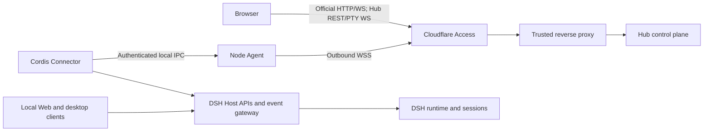

# DSH Hub architecture

English | [中文](architecture.zh.md)

This reference defines the runtime architecture and ownership boundaries of DSH Hub.

## Components

The Hub server owns human authentication enforcement, node enrollment, connection generations, command routing, minimal discovery state, audit records, browser APIs, and the multi-node Web UI. Hub contains no DSH runtime, agent loop, model provider, workspace executor, or Hub-side plugin runtime.

The Node Agent owns the outbound WSS connection, Ed25519 node identity, Cloudflare Access Service Token, durable delivery journal, local Connector endpoint, profile plugin transactions, snapshots, file operations, and PTY processes. Its authority equals the operating-system account that runs it; installation does not implicitly elevate that account.

The Connector is a Cordis plugin inside an existing DSH host composition. It consumes the transport-independent `ctx.apiProxy` and Typert Gateway, then opens an authenticated local IPC client connection. These gateways are DSH Host services rather than a Web listener or frontend; a compatible host composition must provide them. The Connector has no HTTP listener, frontend bundle, DSH Web plugin dependency, or ownership of a second DSH runtime.

## Local-client coexistence

Local DSH Web, desktop clients, and Hub Connector reach the same host services and therefore address the same `Session` objects, event streams, persistence, settings services, and model configuration. A message created locally appears through the Connector event stream; a Hub message enters the same session and appears in local clients. Hub does not require the node to install or start the official Web plugin.

Each DSH process advertises one runtime identity. Multiple profiles or processes on one machine use distinct runtime IDs and may share one Node Agent. Two independent DSH processes never claim to be one runtime and never concurrently own the same session persistence directory.

## Capability contracts

Every runtime announces versioned capability descriptors with operation names, idempotency classes, stream names, reconstructibility flags, and JSON Schema hashes. Hub invokes only an exact capability version advertised by the target runtime.

The Connector implements sessions, settings, and runtime health through the DSH Host gateway. The Node Agent adds files, terminals, plugin management, and snapshots when profile management is configured. Hub does not infer capabilities from a DSH version or from the presence of a Web UI.

## Browser transport

The Hub Web application builds the official DSH Web frontend directly and adds a reviewed Hub client plugin compiled into the fixed artifact. Its normal project and session surfaces are fleet views: Hub requests `session.list`, `session.search`, and `workspace.list` from every online runtime that advertises `dsh.web`, then combines the results. Browser-visible session and workspace IDs carry an opaque node/runtime address. A later history, message, rename, archive, or workspace operation therefore routes to its owner without a manual node switch. Host and session WebSockets multiplex all online runtimes, and Hub combines the official full-snapshot workspace-order and archived-session frames instead of allowing one node to replace fleet state.

The Hub client occupies the optional official `conversation.hero.runtime` seat before the Workspace picker. It lists only online Runtimes advertising `dsh.web.fetch`, restores the last usable choice, and updates the target used by subsequent ownerless directory and Workspace operations without remounting Web. Changing Runtime clears the current blank-session selection before another folder is chosen; selecting an existing fleet Workspace instead synchronizes to its encoded owner. The official Settings header always displays its node and Runtime owner. Switching that owner remounts or invalidates every Host-backed Settings scope and generation-fences late reads from the previous node. Neither control filters the fleet project/session page. Hub converts official HTTP and event traffic to the `dsh.web` capability, and Connector invokes the same runtime's Host APIs instead of proxying a Web server on the node.

Hub Settings uses same-origin REST and exposes a control-event SSE endpoint. Official reconstructible event and Host channels use same-origin WebSockets. Hub sends a protocol Ping every 20 seconds on browser event and rescue-terminal sockets so an otherwise idle connection stays active through bounded reverse-proxy timeouts; a peer that stops answering is terminated and reconnects. The authenticated Hub document explicitly enables remote Host-backed Settings without classifying its public origin as loopback; native desktop actions remain loopback-only. The browser reloads node-authoritative baselines after reconnect. A dedicated same-origin WebSocket carries interactive rescue-terminal input and output.

## Node transport

Each Node Agent establishes one outbound WSS connection. Application authentication combines a Cloudflare Access service identity, an enrollment grant for first use, a pinned Hub Ed25519 key, a persistent node Ed25519 key, and a fresh signed challenge. Connection generations fence an older socket when a replacement connects.

Every authenticated envelope contains a protocol version, node ID, boot ID, generation, message ID, direction sequence, cumulative acknowledgement, expiry, body, and signature. The sender persists a body before delivery and removes it only after acknowledgement. The receiver persists before dispatch, rejects gaps, deduplicates message IDs, and resumes crash-interrupted work according to the operation idempotency class.

Read operations may replay. Idempotent mutations carry stable mutation IDs. Reconcile operations inspect authoritative state before repeating. Never-retry operations produce an `outcome-unknown` result after an interrupted dispatch. Hub may queue a command for an offline active node only when the target runtime previously advertised the exact contract; the durable journal sends it after the node reconnects.

Node Agent reserves journal capacity for command results, lifecycle changes, pending questions and approvals, and the Goal projection used by CAS mutations before suppressing reconstructible high-volume stream frames. The early stream threshold counts only queued `stream.frame` records and bytes, while the hard quota still covers the complete journal; a large history result therefore remains reliable without forcing unrelated live streams into resynchronization. Connector then schedules local work through two bounded lanes: two interactive slots for responses, Goal, session mutations, and Settings, plus four bulk slots for history, indexes, and other large reads. A result is fenced to the local IPC generation that accepted it, so an obsolete Connector connection cannot write into its replacement.

## Storage

Hub uses SQLite in WAL mode for nodes, runtimes, enrollment hashes, minimal session discovery, command delivery state, audit records, and reliable-delivery journals. An append-only hash chain detects record changes and ordering discontinuities when verified; it does not protect against an administrator who can replace the database and recompute the chain. Command bodies exist only while reliable delivery or acknowledged result retrieval requires them. Hub removes them after browser acknowledgement and periodically removes abandoned completed bodies after a bounded retention window while retaining lifecycle metadata and hashes.

Hub has no node-file cache or object directory. Node Agent keeps downloaded plugin artifacts, rollback transactions, and snapshots in owner-only local state. Hub does not mirror workspace files, terminal output, credentials, full session logs, or model transcripts. Live session content is loaded from the node when requested and is not retained by the Hub event broker.

## Plugin transactions and snapshots

Plugin application pins an exact semantic version, records the current dependency and Cordis files, downloads from the public npm registry with bounded responses and redirect refusal, computes and records SHA-256, invokes DSH profile management without a shell, validates composition through `--dump-config`, reads the installed package manifest, and retains a rollback transaction. Failure automatically restores the recorded files and runs a frozen dependency install; success exposes one-click rollback in Settings. A stale expected lock rejects the request unless authoritative inventory proves the same requested artifact already landed.

Configuration snapshots include top-level Cordis composition files. Dependency snapshots include top-level manifests and lockfiles. Data snapshots recursively include only explicitly configured roots. Fleet snapshots combine the filtered top-level profile and dependency state. Secret-like filenames, environment files, credentials, Connector secrets, node identities, and symbolic links are excluded. Restore verifies the artifact hash, validates every path and parent before changing a file, stages all replacement files, and rolls back already committed replacements if a later commit fails. It rejects a changed root policy, cannot traverse symlinked parents or escape configured roots, writes only archived files, and does not delete unrelated files.

## Failure behavior

Hub restart preserves node identities, generations, commands, audit records, session discovery, and delivery journals. Node Agent restart preserves its identity and journal, reconnects with a new boot ID, reconciles incomplete work, and asks runtimes for reconstructible baselines. Connector loss marks only its runtime offline; local DSH clients continue operating.

A browser wait that exceeds 30 seconds receives HTTP 504. Hub writes a payload-free timeout audit record and exposes pending count, oldest pending age, 24-hour timeout count, and last timed-out operation in node health; the durable command is not falsely terminated and may still complete for later reconciliation. Failed Goal mutations release pending UI state and force one authoritative session refresh, so a committed-but-late mutation or stale CAS projection cannot leave the browser indefinitely wrong. A fresh event mux replays pending questions and approvals by stable request ID after reconnect.

## Verification and performance

The release gate runs two simultaneously connected signed nodes with independent journals. It concurrently routes chat and official Web control, stalls one node while the other completes, disconnects one without affecting the other, rejects cross-node outbox delivery, and requires reconnect to recover only the disconnected node's backlog. Connector tests fill all four bulk slots and require Goal and Settings results to complete before any bulk slot is released. The production-CSP browser test verifies the official shell and directory flow at desktop size and the overlay sidebar, bounded Runtime picker, full-screen Settings, and zero horizontal overflow at 390 × 844.

These deterministic gates prove isolation and interaction ordering; they do not pretend to measure an operator's Internet or model latency. Runtime targets, operational metrics, bottlenecks, and the live two-node acceptance procedure are defined in [Performance and concurrency](performance.md).
