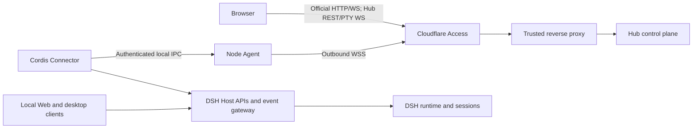

# DSH Hub 架构

[English](architecture.md) | 中文

本参考定义 DSH Hub 的运行架构和所有权边界。

## 组件

Hub Server 负责执行人员认证、节点注册、连接代际、命令路由、最小发现状态、审计记录、浏览器 API 和多节点 Web UI。Hub 不包含 DSH Runtime、agent loop（智能体循环）、模型提供方、工作区执行器或 Hub 侧插件 Runtime。

Node Agent 负责出站 WSS 连接、Ed25519 节点身份、Cloudflare Access Service Token、持久交付日志、本地 Connector 端点、Profile 插件事务、快照、文件操作和 PTY 进程。它的权限等于运行它的操作系统账户；安装过程不会隐式提升该账户的权限。

Connector 是现有 DSH 宿主组合内的 Cordis 插件。它使用与传输无关的 `ctx.apiProxy` 和 Typert Gateway，并建立经过认证的本地 IPC 客户端连接。这些网关是 DSH Host Service，不是 Web 监听器或前端；兼容的宿主组合必须提供它们。Connector 没有 HTTP 监听器、前端 Bundle、DSH Web 插件依赖，也不拥有第二个 DSH Runtime。

## 本地客户端共存

本地 DSH Web、桌面客户端和 Hub Connector 到达同一组宿主 Service，因此访问相同的 `Session` 对象、事件流、持久化、设置服务和模型配置。本地创建的消息会通过 Connector 事件流出现；Hub 消息进入同一会话，并在本地客户端中出现。Hub 不要求节点安装或启动官方 Web 插件。

每个 DSH 进程声明一个 Runtime 身份。同一台机器上的多个 Profile 或进程使用不同的 Runtime ID，并可共享一个 Node Agent。两个独立 DSH 进程不会声称自己是同一个 Runtime，也不会同时拥有同一个会话持久化目录。

## 能力约定

每个 Runtime 声明带版本的能力描述符，其中包含操作名称、幂等类别、流名称、可重建标记和 JSON Schema 哈希。Hub 只调用目标 Runtime 明确声明的精确能力版本。

Connector 通过 DSH Host Gateway 实现会话、设置和 Runtime 健康状态。当配置 Profile 管理后，Node Agent 会增加文件、终端、插件管理和快照能力。Hub 不会根据 DSH 版本或 Web UI 是否存在来推断能力。

## 浏览器传输

Hub Web 应用直接构建官方 DSH Web 前端，并只增加固定编译进制品且经过审查的 Hub 客户端插件。日常项目与会话页面是 Fleet 视图：Hub 会向每个在线且声明 `dsh.web` 的 Runtime 请求 `session.list`、`session.search` 与 `workspace.list`，然后合并结果。每个节点的 Fleet 贡献有 2.5 秒独立预算；超时不会拖住其他节点，`session.list` 与 `workspace.list` 会使用最小发现索引保留该节点的“暂不可用”行。浏览器看到的会话和 Workspace ID 内含不透明的节点／Runtime 地址；后续历史、消息、重命名、归档或 Workspace 操作会自动回到所有者，无需手工切换节点。Host 与 Session WebSocket 同时复用全部在线 Runtime；对于官方协议中的 Workspace 顺序和已归档会话完整快照，Hub 会先合并再推送，避免一个节点覆盖整个 Fleet 状态。

Hub 客户端会占用 Workspace picker 前面的可选官方 `conversation.hero.runtime` seat。它只列出在线且声明 `dsh.web.fetch` 的 Runtime，恢复上次仍可用的选择，并在不重新挂载 Web 的情况下更新后续无所有者目录与 Workspace 操作使用的目标。切换 Runtime 会先清除当前空白会话选择，再选择另一个文件夹；选择已有 Fleet Workspace 时则会同步到其编码的所有者。官方设置标题栏始终显示其所属节点与 Runtime；切换所有者时只更新当前标签页 URL，同时刷新 `SettingsScope` 控制器并广播官方 `connection/reset`，使模型、权限、Agent 预设、命令等直接 Host 控制器也重新读取；两类控制器都用代次隔离阻止旧节点的延迟读取发布。语言和外观仍是浏览器本地状态，Hub 节点是 Hub 全局状态，节点插件页单独选择管理目标。两处 Runtime 选择都不会过滤 Fleet 项目／会话页面。Hub 将官方 HTTP 与事件流量转换为 `dsh.web` 能力，Connector 调用同一 Runtime 的 Host API，而不是代理节点上的 Web Server。

Hub 设置使用同源 REST，控制面事件接口可用 SSE；官方可重建事件通道和 Host 通道使用同源 WebSocket。Hub 每 20 秒向浏览器事件与应急终端 Socket 发送协议 Ping，使空闲连接能够穿过有界的反向代理超时；不再响应的对端会被终止并重连。经过认证的 Hub 文档会显式允许远程使用 Host 持久设置，但不会把公网 Origin 判定为 Loopback，桌面原生动作仍只限回环。浏览器重连后会重新加载节点权威基线。专用同源 WebSocket 承载交互式应急终端输入和输出。

## 节点传输

每个 Node Agent 建立一条出站 WSS 连接。应用认证组合使用 Cloudflare Access Service Identity、首次使用的注册授权、固定的 Hub Ed25519 公钥、持久节点 Ed25519 密钥和新的签名挑战。替代连接建立时，连接代际会隔离旧 Socket。

每个已认证信封包含协议版本、节点 ID、Boot ID、代际、消息 ID、方向序列号、累计确认、过期时间、正文和签名。发送方在交付前持久化正文，只在收到确认后删除；接收方在分派前持久化，拒绝序列缺口，对消息 ID 去重，并根据操作的幂等类别恢复崩溃中断的工作。

读取操作可以重放。幂等变更携带稳定的 Mutation ID。对账操作在重复前检查权威状态。禁止重试的操作在分派中断后产生 `outcome-unknown` 结果。只有目标 Runtime 曾声明完全匹配的合约时，Hub 才能为离线但仍处于活动状态的节点排队命令；持久 Journal 会在节点重连后发送命令。

Node Agent 会先为命令结果、生命周期变化、待处理提问与审批，以及 CAS 变更依赖的 Goal 投影保留 Journal 容量，之后才会抑制可重建的高流量 Stream Frame。Stream 提前阈值只统计排队的 `stream.frame` 记录与字节，硬配额仍覆盖完整 Journal；因此大型历史结果会继续可靠投递，但不会迫使无关实时流进入重同步。Connector 随后通过两个有界通道调度本地工作：两个交互槽用于回答、Goal、会话变更和设置，四个批量槽用于历史、索引和其他大体积读取。结果会绑定到接收它的本地 IPC 代次，因此旧 Connector 连接不能把结果写进替代连接。

## 存储

Hub 使用 WAL 模式的 SQLite 保存节点、Runtime、注册哈希、最小会话索引、命令交付状态、审计记录和可靠交付日志。验证仅追加哈希链时，可以发现记录变化与顺序断裂；它不能防范有权替换数据库并重新计算哈希链的管理员。命令正文只在可靠交付或经过确认的结果领取需要时存在。浏览器确认结果后，Hub 会删除正文；Hub 还会定期删除超过有界保留窗口且无人领取的已完成正文，同时保留生命周期元数据和哈希。

Hub 没有节点文件缓存或对象目录。Node Agent 将下载的插件制品、回滚事务和快照保存在仅所有者可访问的本地状态中。Hub 不镜像工作区文件、终端输出、凭据、完整会话日志或模型 Transcript（文本记录）。实时会话内容在请求时从节点加载，不由 Hub 事件 Broker 保留。

## 插件事务与快照

更新扫描按插件独立执行，最多并发六个、单请求八秒；只有 npm 或 Hub 受管插件查询 Registry，本地文件、Workspace、Git 与独立 Release 来源标记为外部管理。单个 404、超时或 Registry 故障只产生该行的“暂无法查询”，不会中止清单。插件应用会固定精确语义版本，记录当前依赖与 Cordis 文件，以限制响应大小并拒绝重定向的方式从公共 npm Registry 下载制品，计算并记录 SHA-256，在不使用 Shell 的情况下调用 DSH Profile 管理，通过 `--dump-config` 验证 Profile 可以完成组合，读取已安装包的 Manifest，并保留回滚事务。应用失败时会自动恢复已记录文件并执行冻结依赖安装；成功后，设置页提供一键回退。如果预期锁已过期，请求会失败；只有权威清单证明相同制品已成功安装时才会视为已完成。

配置快照包含顶层 Cordis 组合文件，依赖快照包含顶层 Manifest 和锁文件，数据快照递归包含且只包含显式配置的根目录，机群快照组合经过过滤的顶层 Profile 与依赖状态。名称类似机密的文件、环境文件、凭据、Connector 密钥、节点身份和符号链接均被排除。恢复会验证制品哈希，在修改任何文件前验证全部路径与父目录，暂存所有替换文件，并在后续提交失败时回滚已提交的替换。恢复会拒绝已变化的根目录策略，不能经过带符号链接的父目录或逃逸已配置根目录，只写入归档文件，也不会删除无关文件。

## 故障行为

Hub 重启会保留节点身份、代际、命令、审计记录、会话索引和交付日志。Node Agent 重启会保留其身份与日志，使用新的 Boot ID 重连，对账未完成工作，并要求 Runtime 提供可重建基线。Connector 丢失只会将对应 Runtime 标记为离线；本地 DSH 客户端仍可继续工作。

浏览器等待超过 30 秒会收到 HTTP 504；Fleet 聚合读取使用前述更短的单节点预算。Hub 等待结果由 `command.result` 事件唤醒，不轮询 SQLite。Hub 会写入不含 Payload 的超时审计，并在节点健康状态中显示 Pending 数量、最旧 Pending 时长、24 小时超时数和最近超时操作；持久命令不会被错误终止，仍可在稍后完成并参与对账。Goal Gateway 异常会转换为合法 RPC 错误而不是不透明 HTTP 502；浏览器会解除 Pending UI 并执行一次权威会话刷新，避免“命令实际已提交但结果迟到”或过期 CAS 投影让界面长期错误。事件 Mux 重连后会用稳定 Request ID 重放仍待处理的提问与审批。

## 验证与性能

发布门禁会让两个具有独立签名身份和 Journal 的节点同时连接。测试会并发路由聊天与官方 Web 控制，让一个节点停滞而另一个完成，断开一个节点且不影响另一个，拒绝跨节点发件箱投递，并要求重连只恢复断线节点自身的积压。Connector 测试会占满全部四个批量槽，并要求 Goal 与设置结果在释放任何批量槽前完成。生产 CSP 浏览器测试会在桌面尺寸验证官方外壳与目录流程，并在 390 × 844 下验证覆盖式侧栏、有界 Runtime 选择器、全屏设置页和零横向溢出。

这些确定性门禁证明隔离与交互顺序，不会把操作者的 Internet 或模型延迟伪装成产品测量值。运行目标、运维指标、瓶颈与真实双节点验收步骤见[性能与并发](performance.md)。
