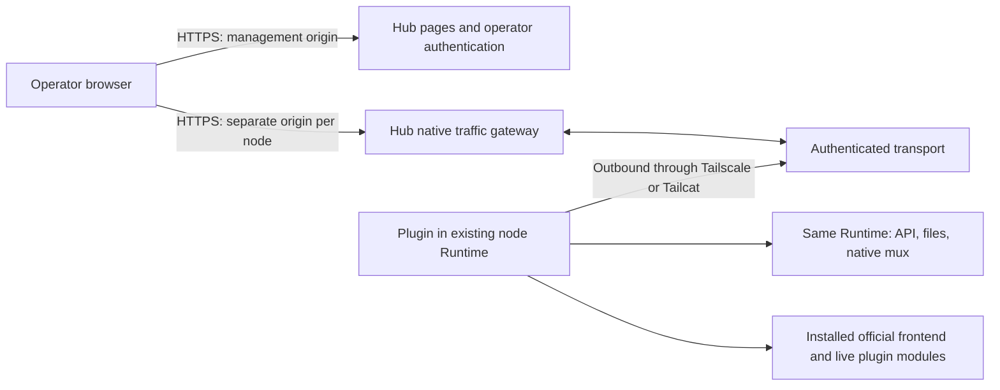

# Native node gateway design

English | [中文](gateway-design.zh.md)

## 1. Scope and evidence

This document describes the minimal gateway rewrite. Existing fleet-workbench documentation describes the legacy implementation; it does not establish the new gateway's behavior. In particular, the legacy rule that Hub serves a centrally reviewed Web snapshot does not apply to this design: each trusted node supplies its own installed official frontend. The legacy artifact remains untouched.

**Required** means a release acceptance condition. **Implemented** means the behavior is visible in the gateway source. **Verified** requires a recorded successful check against a specific revision and environment. A source file, a test case, or an upstream version string alone does not establish verification. The acceptance matrix below deliberately separates automated evidence from deployment evidence.

The initial Gateway has one operator with full authority over paired nodes. The Hub offers server-rendered pages for listing nodes, adding a node, revoking access, and configuring networking. Opening a node opens its complete native DSH page. This version does not implement a React workbench, session/project aggregation, node operations management, or node-to-node control. Session-directory and node-operations ideas belong to separate experimental branches. Hub does not synchronize models or interpret DSH business objects.

## 2. Architecture and ownership

The Hub agent listener binds only to `127.0.0.1:8081` in its own network namespace. A Tailscale or Tailcat helper exposes that listener through the chosen overlay. Container port publication, a public reverse-proxy route, and a LAN listener for this port are forbidden. The public browser listener is a separate entry point with operator authentication.

The node initiates the connection. There is no inbound node port, public node Web listener, generic proxy destination, or second Runtime. The plugin obtains services from the already running Runtime. Frontend assets, the live boot graph, plugin modules, APIs, file operations, and native streams must all refer to that Runtime and installed DSH distribution.

Routing is explicit: a browser origin selects one enrolled node; the authenticated connection binds that node to one Runtime; request and stream identifiers are scoped to that connection. Neither a request body nor a stale browser preference can change ownership. Reconnecting must replace or reject a duplicate connection deliberately and cancel work attached to the old connection. Never send a failed operation to another node.

## 3. Browser origins and trust

Each node needs a distinct HTTPS origin, typically a generated subdomain under a dedicated gateway domain. A path prefix alone does not isolate `localStorage`, IndexedDB, service workers, or frontend configuration. Node identifiers used for host routing must be generated and validated, and unknown hosts must fail closed. Wildcard DNS and certificates are deployment prerequisites if subdomains are used.

Hub's management origin and every node origin require authentication. Use host-only operator cookies; do not share a parent-domain session cookie with node JavaScript. If the implementation transfers authorization from the management origin, the transfer must be short-lived, single-use, node-bound, and removed from the URL immediately. Reject cross-origin mutation requests and WebSocket upgrades. Do not forward Hub login cookies, Cloudflare assertions, invite tokens, or agent credentials into native DSH requests.

Serving a node's frontend gives that node and its installed plugins authority within that node origin. Pairing is therefore a trust decision about executable frontend code as well as the Runtime. Distinct origins limit accidental cross-node state sharing; they do not make a malicious node safe or turn this product into a multi-tenant sandbox. The operator can execute commands and modify files through native DSH. A compromised Hub, operator session, node plugin, or overlay host can threaten that authority.

Cloudflare Access can be an outer authentication layer only if origin bypass is prevented and assertions are validated. Checking an email header or decoding an unsigned token is insufficient. Exact issuer, audience, signature, expiry, and operator policy must be checked. A password fallback must be explicitly configured and protected; it must not silently bypass a configured Access policy. Final enabled modes and endpoints are listed in the implementation snapshot below. See [Cloudflare's JWT validation guidance](https://developers.cloudflare.com/cloudflare-one/access-controls/applications/http-apps/authorization-cookie/validating-json/).

## 4. State and enrollment

Hub persists node identities, invitation lifecycle records, and operator-session/authentication state. Operational configuration and helper identity files are also necessary. It does not persist DSH models, provider credentials, project/session indexes, histories, message bodies, files, or plugin data. Forwarding transient response bytes is not permission to log or cache them. Logs should contain bounded connection/error metadata, not native payloads, tokens, login URLs, or shell commands containing secrets.

The node persists its enrollment identity and long-lived agent credential in a private state directory. Overlay identity is independent of Hub enrollment. A Tailcat address or tailnet membership does not replace Hub authentication.

Required enrollment sequence:

1. An authenticated operator selects exactly `tailscale` or `tailcat`. The selected helper must be ready before Hub produces a usable invite command.
2. Hub creates an expiring invitation, bound to the selected endpoint and enrollment intent. Display the sensitive command only to the operator.
3. The installer checks the installed DSH and package compatibility, starts or locates the selected network helper, and enrolls through the private listener.
4. The first successful enrollment atomically consumes the invite and binds a stable node identity and Runtime identity. Persist the credential before reporting success.
5. A retry after a lost reply must recover the same enrollment only with the same authenticated enrollment identity; a different claimant, changed identity, expired unused invite, or revoked enrollment must fail. An idempotency string by itself is not authentication.
6. Subsequent starts authenticate with the persistent credential. They do not consume a fresh invite. A credential error stops reconnection attempts that would otherwise repeatedly retry invalid authentication.
7. Revocation invalidates future authentication and closes the live tunnel and its HTTP/WS operations. Revocation does not uninstall DSH, erase history, or stop the local Runtime. Rejoining requires an explicit new enrollment.

Invitation states are `available → consumed`, `available → expired`, or `available → revoked`. Node states are `enrolled/offline → connecting → online → offline`, with `revoked` terminal for that identity. A transport outage preserves identity. A revoked identity must never become online merely because a helper reconnects.

## 5. Endpoint and transport contract

These are the architectural surfaces. Concrete gateway routes follow below; legacy Hub routes are not part of this contract.

| Surface | Contract |
| --- | --- |
| Management origin | Server-rendered list/add/revoke/network pages; authenticated reads and protected form mutations |
| Browser node origin `/` and static assets | Installed official frontend from the selected Runtime's distribution, with live official index injections |
| Browser node origin `/plugins/events` | Thin SSE adapter over public `clientModules` graph/rebuild subscriptions; no Web listener |
| Browser node origin `/plugins/*` | That Runtime's `clientModules.fetchBundle`, preserving native module resolution |
| Browser node origin `/api/*` | That Runtime's `connection.createSharedFetchHandler('/api')`; preserve method, query, body, status and end-to-end headers |
| Browser native mux | The upstream mux carrier connected to `typertGateway.wireStream.open`; preserve endpoint names, payloads, items and native failures |
| Private enrollment | Expiring invitation plus stable enrollment identity; returns persistent node authentication |
| Private agent connection | Authenticate enrolled node and Runtime before any forwarded request; multiplex HTTP and WS channels |
| Network settings | Helper readiness, managed Tailscale login, configured host mode and diagnostics; never arbitrary shell execution |

Current `gateway-server/src/server.ts` routes:

| Entry | Method and path | Authorization / result |
| --- | --- | --- |
| Management | `GET /`, `GET /nodes/:id`, `GET /api/nodes` | Operator; node list/detail and connection metadata |
| Management | `GET /invites/new`, `POST /invites` | Operator; Origin check on write; 15-minute invite command |
| Management | `POST /nodes/:id/rename`, `POST /nodes/:id/revoke` | Operator and exact Origin; rename or revoke |
| Management | `GET /network`, `POST /network/tailscale/login` | Operator; Origin check on login; managed helper only |
| Management | `GET /login`, `POST /login` | Enabled only when password configured; POST checks Origin and rate |
| Management | `GET /open/:id` | Operator; online node; redirect with a 60-second node-bound ticket |
| Node origin | `/_hub/ticket?ticket=…` | Consume ticket once, issue host-only node session, redirect to `/` |
| Node origin | Native HTTP paths; WS `/api/remote.mux` | Node-scoped browser session; exact Origin for writes and WS |
| Download/root origin | `GET /install.sh`, `GET/HEAD /downloads/:file` | Allowlisted public artifacts, subject to configured origin protection |
| Download/root origin | `GET /api/enrollment/:token` | Invite token and rate limit; returns enrollment/package manifest |
| Private agent listener | `POST /enroll` | Invite token, client-generated identity/credential and Runtime metadata |
| Private agent listener | WS `/connect?nodeId=…` | Bearer node credential; replace old connection for that node |
| Browser listener | `/healthz` | Process liveness only; does not prove overlay readiness |

The invitation token is a capability: manifest retrieval intentionally does not require the operator's browser cookie. Deployment must make installer downloads reachable without handing the node a Cloudflare service token. Redact enrollment URLs from proxy access logs. Downloads on a separate origin must retain the correct management-origin identity in the manifest and installer; this needs end-to-end acceptance.

HTTP transport streams request and response bodies incrementally, including uploads, downloads and event streams. Carry binary bytes without text conversion. Apply bounded frames, concurrent-request limits and backpressure; on overflow fail the affected transport instead of allocating without limit. Remove hop-by-hop headers, validate upgrade semantics and preserve repeated end-to-end headers where required. The current browser gateway strips all inbound `Authorization` and `Cookie` headers as well as Cloudflare/origin-secret headers; it also strips native `Set-Cookie`. API, history and file responses remain `Cache-Control: private, no-store`; the narrowly scoped static-code exception below permits browser caching. This is an explicit authentication boundary, so compatibility with a plugin that requires its own cookies or authorization must be tested rather than assumed. A disconnect must cancel the native request and release readers, writers and temporary transport state. HEAD and no-body statuses must remain bodyless.

Hub streams gzip on the return hop for eligible 200 GET/HEAD JavaScript and CSS resources when the browser explicitly accepts gzip. It respects existing content encoding, ranges, attachment disposition and `no-transform`; the streaming pipeline preserves backpressure and cancellation. Re-encoding removes stale length/digest/validator headers and varies on `Accept-Encoding`. Native API, SSE and file payloads are not transformed.

Only eligible code with an exact version URL **and** the native owner's `immutable` promise receives `private, max-age=31536000, immutable`. Current matching requires one 12-hex `rev` on a supported plugin-code URL, or an asset filename ending in an eight-character hash; native `no-store`/`no-cache` overrides immutability. Unversioned code, HTML and business responses remain `private, no-store`. Cache storage is private to the browser's node origin, with no Hub shared cache or proxy cache. A cached static file may remain locally after revocation, but it grants no authority to call the Runtime.

The implemented transport uses protocol `1`, a 32 KiB credit window, a 256 KiB control-frame limit, an 8 MiB socket-buffer ceiling, a default limit of 128 channels and a default request timeout of 120 seconds. The native mux adapter separately limits a frame to 1 MiB, queued uplink data to 256 KiB and active native streams to 256. Request and response bodies use binary frames with a one-byte protocol marker and a four-byte unsigned channel ID; control frames are JSON with protocol version `1` and a numeric channel ID. A consumer grants at most 32 KiB credit when it pulls (`highWaterMark: 0`); the sender does not read its producer until credit is available. The credit bounds bytes in flight, not the total body size. Mux text is carried inside a control frame, so the 256 KiB outer limit also applies even though the native adapter accepts larger standalone frames. These limits are implementation values, not throughput guarantees. The 120-second HTTP deadline also closes plugin SSE. Native EventSource reconnects and receives a fresh complete current graph; this recovers settled state, not a replay log of every event during disconnection.

HTTP request and response bodies remain bytes: the Hub does not parse and reserialize business JSON, so numeric spellings, precision-sensitive values and native serialization stay under the upstream contract. The transport may frame bytes and native mux messages; it must not rewrite project IDs, model settings, API schemas, credential objects or business payloads. It must not automatically replay writes after reconnect. If a connection fails after a mutation was sent, the outcome is unknown: show a connection failure and let the operator inspect native state before retrying. A normal reconnect may reopen the carrier but cannot claim recovery of a prior request.

WebSocket handling must preserve the native stream lifecycle, enforce frame and queue limits, and propagate cancellation/close in both directions. Browser tab close, node revoke, gateway shutdown, network loss and Runtime reload all terminate attached work. New endpoints registered through the declared native Connection/Fetch or mux contract can use the same carrier without a Hub business-endpoint registry. Legacy “Open in App” routes and custom HTTP plugins registered only on `webServer` are outside that contract. Serving the installed official frontend does not promise that every local Web-server-only feature works remotely; document and test such features individually, without proxying the local listener.

## 6. Network packaging and configuration

The Hub release must bundle both Tailscale and Tailcat, including `tailscaled` for managed Tailscale. The node installer installs the selected helper; switching modes requires preparing the other helper explicitly. Choosing a network changes the invite command and connection method; it does not select a different application protocol. Do not offer public HTTP, arbitrary TCP, LAN IPs, or local Web URLs as additional connection modes.

Tailscale managed mode owns a userspace daemon, private socket and persistent state within the gateway container. The settings page can start login and show the returned HTTPS login link. The operator completes Tailscale authentication; readiness requires a running daemon, a valid tailnet address and a working private forward. Configuration belongs to the dedicated daemon. Do not change the NAS host's DNS, routes or existing Tailscale identity. Host mode, if selected explicitly, reads an existing daemon and leaves login to its owner. Persist identity so container replacement does not unnecessarily create another tailnet device. Userspace networking is supported by [Tailscale's container documentation](https://tailscale.com/docs/features/containers/docker).

Tailcat uses a persistent key and an address exchanged with the node. It does not require a Tailscale account. It uses Tailscale's encrypted data plane and can relay when a direct connection is unavailable; relay availability remains an external dependency. Hub still authenticates enrollment and reconnects. These properties are described by [Tailcat's official README](https://github.com/tailscale/tailcat).

Helper status distinguishes `starting`, `needs-login`, `ready` and `unavailable`; the two tools are monitored independently. A binary being installed does not mean its listener is ready. Losing one helper must not silently switch an enrolled node to the other. A change of selected network or endpoint needs an explicit repair/reconfiguration flow.

The host-mode Compose alternative shares the host network namespace and mounts its Tailscale socket. This gives the container more authority than managed mode: a read-only socket mount does not make daemon RPC read-only. Treat this as an explicit operator choice, audit actual bind addresses, and keep the managed container as the default.

Release assets must pin versions and per-architecture checksums, validate downloads before execution, preserve upstream license notices, and fail on unsupported platforms. Current network source pins Linux `amd64`/`arm64`, Tailscale `1.102.4` and Tailcat `0.7.0`; these are source pins, not a claim of successful deployment on both architectures.

## 7. Installation, reload, updates and rollback

The install command must be self-contained for the selected network and the pinned gateway release. It must identify an existing DSH installation and its configuration, stage the plugin and helper assets, verify them, back up the changed configuration, and write persistent pairing state with restrictive permissions. Re-running it must reuse a valid enrollment rather than add duplicate plugin declarations or create another Runtime.

Loading the plugin may require the existing Runtime's supported configuration reload or a restart. State this requirement in the command result. Do not promise hot reload unless tested with the installed version. If restart is required, warn about active native work and use the operator's existing service mechanism. Never start a second DSH process to make the Hub page work. On uninstall, remove only gateway-owned configuration and helpers; preserve the original Runtime, data and legacy agent service.

Use a release compatibility record covering gateway protocol revision, DSH package version, official frontend version, Runtime carrier interfaces, network binary versions/checksums, architecture and tested environment. `gateway-node` checks for the required native service methods. Its installer currently admits only DSH `0.1.7-rc.2`; the Runtime adapter itself checks methods rather than a version allowlist. Structural method checks alone are not a supported-version policy. Versions without a recorded native browser and transport test must remain unverified; incompatible carriers must fail with a clear upgrade instruction.

For an update, back up Hub identity/session state and helper keys, stage the pinned container/plugin release, validate schema/protocol compatibility, then reconnect one node before expanding. Serve each node's frontend from the same installed release as its Runtime. Do not combine a cached index from one release with another release's plugin graph. Reload the page after a native plugin or Runtime update.

For rollback, retain the prior image digest, plugin package, configuration backup and state-schema version. Stop the new gateway, restore a compatible state backup when required, restore the previous configuration and image, and recheck authentication and one native request. Do not roll back by discarding node identities or reviving revoked credentials. Native mutations completed during an update are not reversed by gateway rollback.

## 8. Deployment and failure handling

Deploy as a new dedicated Docker application on the NAS, with its own name, image, state volume and public browser port. Preserve the legacy agent application's container, network entry, data, credentials and service unit. Select an unused browser port; route management and node hostnames to the new application with HTTPS and WebSocket support. Do not publish the private `8081` port. Avoid host networking when it would defeat that isolation.

Before enabling the route, verify the actual image contains both helpers, the persistent volume is writable only by the service account, the browser-origin certificate covers the configured hosts, and the reverse proxy does not cache authenticated native traffic or buffer streams indefinitely. Check that invalid hosts and direct unauthenticated origin requests fail. Container health must distinguish a running HTTP process from a ready overlay and an online node.

Node working directories require persistent volumes. One production QA directory used container tmpfs; after a Runtime restart the session appeared in Ungrouped. The directory later existed, but its inode timestamp was later than Runtime startup. The observation establishes state consistency, not the exact historical cause. An unchanged `cwd` string does not prove directory or file persistence. Deployment health checks should also distinguish application HTTP failures from OCI exec or host runtime-directory failures. Verify background probes after leaving the interactive session; one failed exec does not establish application unavailability.

| Failure | Required result and recovery |
| --- | --- |
| Tailscale not logged in | Show `needs-login`; block Tailscale invitation generation; offer managed login |
| Tailcat relay unreachable or helper exits | Show unavailable; bounded recovery; no public-network fallback |
| Invite expired or claimed by another identity | Reject enrollment; create a new invite deliberately |
| Node offline | Show offline; fail promptly; never use another node or cached business response |
| Runtime reload or carrier mismatch | Cancel old work; report the cause; reconnect only after compatibility checks |
| Browser cancellation or slow consumer | Cancel upstream work or apply bounded backpressure; release resources |
| Disconnect after write | Report unknown outcome; no transport replay |
| Hub restart | Restore identity/configuration; nodes reconnect; prior requests remain failed |
| Revocation | Close live channels; deny reconnect; keep local DSH usable |
| Storage or migration failure | Fail safely without claiming enrollment/revocation succeeded |

## 9. Acceptance matrix

All rows are release requirements. A passing unit test verifies only its tested behavior. “Deployment pending” remains true until exercised against the actual container, overlay and installed DSH. Tests that use stub Runtime services cannot establish official frontend compatibility.

| Area | Required cases | Evidence required |
| --- | --- | --- |
| Scope | List/add/revoke/network pages; whole native node page; no fleet aggregation | Page/route tests and browser inspection |
| Authentication | Missing/expired/forged session, wrong host, CSRF, WS origin, configured Access/password behavior | Negative route tests and origin-bypass test |
| Enrollment | Expiry, concurrent consume, same-identity retry after lost reply, different-identity retry, persisted restart | Storage and enrollment integration tests |
| Revocation | Online HTTP/WS cancellation, offline revoke, reconnect denied, local Runtime still works | Integration and real-node test |
| Concurrent ownership | Two nodes with overlapping request/stream/project IDs, simultaneous uploads and WS streams | Multi-node transport test; no byte or state crossover |
| Browser isolation | Distinct origins; different model/provider/localStorage values; no shared Hub cookie | Two-node browser test |
| Native frontend | Installed index, assets, boot graph, plugin imports, refresh, settings, terminal/files | Real supported DSH browser test |
| Native API | Methods/query/body/status/headers, binary and large transfers, HEAD, SSE, native errors | Transport and Runtime integration tests |
| Lifecycle | Abort upload/download, cancel mux, slow consumer, queue/frame overflow, close mid-write | Bounded-resource and cleanup tests |
| No replay | Disconnect after native mutation; reconnect does not issue mutation again | Mutation-count integration test |
| Boundaries | No node listener proxy, second Runtime, arbitrary target, path traversal or symlink escape | Code review and negative tests |
| Packaging | Both tools, pinned checksums, licenses, unsupported architecture, tampered archive | Release artifact checks |
| Networks | Managed login, persisted identity, host mode, Tailcat restart, direct/relayed connection | Helper tests plus actual overlay test |
| Installer | Existing Runtime discovery, repeat install, failure rollback, reload, old service preserved | Temporary-install tests and real-node rehearsal |
| Persistence/privacy | Only control-plane state; payload/token log redaction; restart and disk failure | Storage/log tests and volume inspection |
| Deployment | New isolated container, HTTPS hosts, authenticated proxy, private-port scan, legacy health | Two-node deployment and browser checks recorded in §10; remaining gates stay explicit |
| Updates | Compatible upgrade, mismatch rejection, old plugin/image/state rollback | Versioned rehearsal; pending |
| Repository | `pnpm run check`, `pnpm run build`, bilingual parity and link/privacy checks | Results for final shared revision |

### Performance and stability acceptance

For the initial Gateway, measure per-node pages. Session-directory and node-operations experiments live in separate branches and require their own performance/stability records; their results do not establish acceptance for this product. Pin source/package versions, hardware, browser, dataset size, node count, concurrency, payload size and overlay topology. Separate cold connection, warm requests, reconnect and Hub restart measurements. Report p50/p95 latency, attempts, failures, timeout rate, recovery time and measurement duration; compare against an agreed baseline on the same setup rather than treating local milliseconds as a production SLA.

For each independently evaluated implementation, test repeated navigation, slow readers, simultaneous uploads and mux streams, one-node failure while the other remains usable, cancelled writes without replay, and reconnect/restart with pairing retained. Add a sustained run and inspect memory, queued bytes, descriptors and live channels before load and after cleanup. Accept only zero ownership leaks, zero replayed writes and no retained channels after cancellation/shutdown; record latency/error/resource budgets before the run and report any excess. Rehearse the default 120-second HTTP timeout explicitly. Repeat on separate physical nodes and on available direct/relay paths before making deployment performance claims.

## 10. Current implementation and acceptance evidence

Evidence snapshot: 2026-10-03.

### Implemented contracts

The plugin serves the installed official frontend and live boot graph from the same Runtime, inside its declared Cordis plugin scope. It adds no local Web listener. `/plugins/events` uses public `clientModules.graph`, `onGraphChanged` and `onRebuilt` plus the official `PluginsEventFrame` shape. This thin HMR adapter sends an initial full graph, unchanged rebuild/graph events, 15-second comment heartbeats and a queue bounded to 1 MiB. Abort/cancel releases subscriptions and timers. Actual rc2 Chromium/WebKit graph/rebuild/cancel checks passed; both production nodes now return 200 for the event endpoint. Reconnect checks the node credential and registered `runtimeId`; replacing a connection releases the old carrier. Shutdown prevents peer close callbacks from accessing a closed store.

Invites last 15 minutes, browser sessions default to 8 hours, and node-bound one-use tickets last 60 seconds. Claimed invitation manifests remain available until cleanup, 24 hours after their original expiry. The shell permits claimed-invite recovery; the CLI requires the saved identity with the same invitation hash, and the store requires matching client identity, credential and Runtime. A new invitation rotates identity for explicit re-pairing. Expired unclaimed invitations and recovery by a different identity are rejected. Tailcat enrollment uses a temporary, separate transport key: repeating installation while the node is online must not start another WireGuard process with the Runtime’s active key. The saved Hub client identity/credential and Runtime Tailcat key remain intact. First install and claimed-invite retry over real Tailcat passed without changing the tested Runtime PID or interrupting its old connection.

The manifest separates management `hubUrl` from `downloadUrl` and provides helper arrays keyed by Linux architecture. The installer verifies the package and selected helper, installs into an existing profile, preserves other dependencies, and backs up its configuration changes. Its current download code streams archives to a temporary file while hashing, reports progress, rejects declared or received size overflow and checksum mismatch, and installs only completed files. Archives have a 300 MiB limit and five-minute total deadline; manifests have a 1 MiB limit and 30-second deadline. No response headers within 30 seconds or 30 seconds without download progress cause failure and partial-file cleanup. These describe the inspected source; subsequent installer changes require release validation.

The executable reads protected `DSH_GATEWAY_AUTH_FILE` JSON or environment configuration. Complete Cloudflare settings enable issuer/audience/signature/operator verification and disable password login. Wholly blank optional Cloudflare values from Compose are treated as absent, allowing standalone password mode. Any partially supplied nonblank Cloudflare configuration fails startup instead of falling back to a password. Standalone password mode requires at least 16 characters. The runtime image includes CA certificates for outbound HTTPS verification. The separate gateway build packages the server, node plugin, installer and both network tools; the default Compose application publishes only the browser port on host loopback.

### Evidence, with scope

| Check | Observed result | What it establishes |
| --- | --- | --- |
| Repository gates | Revision `47b45a68c3` release `check`/`build` exited 0: 291 tests passed, four optional skips; CI revision is listed separately | That recorded source revision passes its configured gates; a skipped test is not counted as exercised |
| CI | [Run 37050742806](https://github.com/k1412/dsh-hub/actions/runs/37050742806), revision `69def3feee`, succeeded | Full macOS/Windows/Ubuntu jobs, Gateway checks and installed-DSH Chromium/WebKit checks passed; earlier failures are resolved |
| Graceful shutdown tests | With `GATEWAY_BROWSER_TEST=1` and a complete DSH installation, 98 Gateway tests passed; 32 server tests include real-browser 1012 close checks | Local two-node native browser coverage and the one-second fallback for unacknowledged raw TCP; new CI enables browser tests, without predicting its result |
| Complete installed DSH | DSH `0.1.7-rc.2`, 63 official plugin entries, Chromium and WebKit | Real frontend/Runtime boot, restricted plugin scope, no added Web listener, mobile composer, Full access and model controls |
| Native conversation and files | Fixture LLM send/reply/history after refresh; 65,537-byte UI upload and native `workspaceFiles` download matched byte for byte | Complete installed native paths work with a controlled model fixture; this is not a paid provider or production model test |
| Packaged profile installation | Official gateway tarball and real CLI → already running profile → real Tailcat → HMR; Runtime started once, PID unchanged; index and official JS returned 200 | Plugin can activate in the existing profile without starting a second Runtime or restarting that tested process |
| Production pairing | Node A and Node B installed and online through Tailscale and Tailcat respectively | Both overlays operate across real machines; initial installation preserved Node B’s Runtime/agent PIDs and old credential hash. Later controlled Runtime reloads are recorded separately below |
| Production native reads | Both deployed boot graphs contained 64 client entries; model catalog reads and workspace selection succeeded | Production native reads work; the 63-entry clean-install test and 64-entry deployed graphs are different configurations, not a plugin-count regression |
| Production conversation | One real-model request on each node, exact reply and history restored after refresh: 2/2 each | Actual provider-backed conversation works in these two sessions; no retries or model configuration changes |
| Production native files | 65,537-byte native binary upload and official multipart `workspaceFiles/readBytes` download on each node; SHA-256 matched, 4/4 transfers | Native file integrity on real nodes; generated files and temporary terminals cleaned up |
| Production ownership | Each node returned its own test session projection and `ok:true/null` for the other node's exact session ID | Node ownership checked against native missing-session semantics, not merely HTTP success |
| Production browser interaction | Chromium desktop/phone and WebKit phone on both nodes; workspace, Full access, model menu, input and own history passed | Actual public HTTPS interaction via one-use ticket and host-only cookies; human Cloudflare login itself was not exercised by this QA |

Initial installation and repeat-install smoke tests activated through HMR in the same Runtime. Production **updates** have a different result: on both nodes the official rc2 `pluginManager/installBundle` returned `HMR transactions cannot be nested`. Dependency installation succeeded, but the old running code remained active. After confirming zero active tasks, the operator performed controlled reloads of the existing Runtimes; the new SSE then returned 200. This is an upstream hot-application limitation, not a second Runtime. Do not claim production PIDs stayed unchanged throughout the update. The legacy agent entry and authentication were preserved. The admitted DSH version is `0.1.7-rc.2`, with pinned Tailscale `1.102.4` and Tailcat `0.7.0`. CI operating-system coverage does not expand automatic helper installation beyond Linux amd64/arm64; macOS requires the selected helper already installed, and the shell installer does not support Windows.

“Open in App” uses an upstream listener-only route and remains unavailable remotely. The native browser reports record the corresponding expected 404 limitation; their empty error list must not be described as support for every custom Web-server route.

### Performance: keep the topologies separate

The checked-in [local overlay report](../../deploy/gateway/reports/network-local-2026-10-03.json) uses two isolated identities on **one physical host**. Each mode completed **90/90** exchanges without failures: 40 workload requests per node at concurrency 4, two initial handshakes, six node reconnect checks and one Hub-restart cycle with two client checks. Payloads were 16 KiB. Both modes passed 6/6 reconnects and 1/1 Hub restart; preserved state refers to the probe server.

| Local overlay | Overall HTTP p50 / p95 | Steady HTTP p50 / p95 | Recovery p50 / p95 |
| --- | --- | --- | --- |
| Tailcat | 4.25 / 6243.14 ms | 4.12 / 14.06 ms | 6270.27 / 7746.22 ms |
| Tailscale | 4.30 / 15.84 ms | 4.27 / 15.84 ms | 27.24 / 47.24 ms |

These figures include CLI adapters and HTTP. Tailscale uses its logged-in host daemon and the host's own tailnet address. They measure neither WAN performance nor model generation. Tailcat's recovery tail is about **7.7 seconds**; steady latency must not hide that cost.

Separate **production public-HTTPS** observations are listed below. They were taken during concurrent deployment and browser work, not on an isolated immutable release.

| Production observation | Node A | Node B |
| --- | --- | --- |
| First Chromium desktop composer | 24.70 s | 38.13 s |
| First WebKit phone composer | 20.28 s | 19.43 s |
| Later fresh Chromium context composer | 92.95 s | 94.48 s |
| Single real-model reply | 116.68 s | 5.88 s |
| Refresh and restore own history | 35.18 s | 52.42 s |
| 65,537-byte native upload / download | 2.04 / 1.18 s | 2.12 / 1.90 s |

Each reply timing measures Send click to the expected text, not isolated provider latency. The nodes used different existing default models. These small samples are observations, not SLAs or evidence of an intrinsic overlay/model speed difference. Cold loading reached about **94 seconds**: functional success does not establish acceptable speed. Gzip was observed on an application bundle at about 5.30 MB, but those in-progress measurements are not the final post-compression benchmark. Final cold/warm cache measurement was pending at that stage; the separate post-deployment measurements appear below. Local overlay/fixture numbers must not be mixed into this table.

All observed application plugin bundles returned 200 and no page exception or “Failed to load plugins” was observed. Nevertheless, **HTTP errors were present**: historical Chromium samples included `/plugins/events` 404; WebKit included native desktop-only `/open-in-app/apps` 404 and a cancelled events request. The recorded initial samples were 22 successes/one error per Chromium node and 23 successes/two errors per WebKit node; these include ancillary endpoints and are not business success rates. On a 390-pixel screen, opening the native sidebar narrows chat substantially; collapsing it restores usable chat/composer space. The completed public `clientModules` adapter fixes the historical events 404; subsequent checks on both nodes returned 200. EventSource may normally reconnect after cancellation/deadline. The unsupported local desktop endpoint remains a separately reported limitation.

### Final deployment state checks

The completed recovery JSON spans the marked deployment of `45351c0a8f`. Post-completion snapshots on both nodes retained the same message hash, authored-prompt count, workspace and model state; expected history was visible and native muxes were usable. No new model prompts were sent. The snapshots contain additional system records, so raw message-record counts must not be confused with user submissions.

This establishes state preservation across the observed deployment window. The report did **not** capture an attributable UI disconnect inside that marked window (`observedUiDisconnect: false`); earlier disconnects occurred before the deployment marker. It therefore does not establish a precise final-rebuild outage/reconnect time. The final two-engine cold/warm record started after the deployment-complete marker and now has a completion timestamp; its results follow.

### Cold/warm loading after final deployment

After deploying `45351c0a8f`, public HTTPS testing ran both nodes concurrently per engine: one fresh-context cold entry per node, then two reloads in the same context. Chromium used a desktop viewport and WebKit a phone viewport. Of 12 primary rounds, 11 reached a usable composer and one failed. Node A subsequently ran alone with one new Chromium cold context and two same-context reloads; all three supplementary rounds passed. No new model prompts were sent. Each cell below is one composer-visible observation, not a percentile or SLA.

| Node / engine | Cold entry | Reload 1 | Reload 2 |
| --- | --- | --- | --- |
| Node A / Chromium | Connection closed; navigation timed out | 12.79 s (code still downloaded) | 4.58 s |
| Node B / Chromium | 15.36 s | 7.96 s | 5.07 s |
| Node A / WebKit | 18.57 s | 6.45 s | 5.28 s |
| Node B / WebKit | 16.27 s | 7.40 s | 6.73 s |
| Node A / Chromium, independent supplement | 21.45 s | 3.91 s | 5.10 s |

Node A's Chromium cold round recorded `ERR_CONNECTION_CLOSED`, hit the 150-second navigation timeout and took about 165 seconds overall. Retain that failure; do not attribute it to compression or an overlay without further evidence. Its first reload still transferred about 5.41 MB of code, so it was not a fully warm-cache load. The other seven reloads recorded zero network bytes for code and composer readiness of about 4.58–7.96 seconds. Business APIs still made no-store requests; the page did not become network-free. Successful cold rounds transferred about 5.41–5.61 MB of code, with gzip and private immutable headers observed. WebKit cache-resource counts are incomplete: interpret transfer bytes and headers without assigning every resource to a particular cache layer.

Keep these post-deployment samples separate from the earlier roughly 94-second observations. Environment and concurrent work differed, so they do not support a controlled speedup ratio. The successful supplement does not erase the initial failure: primary results remain 11/12, or 14/15 including the supplement. Across the 14 successful rounds, composer p50 was 6.73 seconds and nearest-rank p95 was 21.45 seconds. The failed 150-second navigation remains in the failure rate but is excluded from successful-latency quantiles; this small sample is not a long-term p95. Read-only reverse-proxy inspection did not establish the original connection closure’s cause, so it is not labeled fixed. This is neither a soak test nor an isolated model-backend latency measurement.

### `69def3feee` shutdown order and separate recovery acceptance

Shutdown now closes Gateway HTTP/WebSocket carriers before stopping overlay helpers. This prevents the overlay disappearing first while agents still wait for an old connection to fail. The recorded real **local-host Tailcat** comparison observed detection/recovery at about 46.95/48.88 seconds with the old order. Two new-order runs detected disconnection at about 2 seconds and recovered in 4.211/6.002 seconds. These are local results with two new-order samples, not public WAN or production guarantees; they do not explain the earlier cold-entry connection closure.

The independent production JSON reached its completed state after the marked restart of this revision. Node B (Tailcat) recorded the original native UI socket closing, two unsuccessful replacement attempts, then an automatically opened socket receiving native frames. Time from the initial close to the first frame was **6.96 seconds** in this single observation. Node A (Tailscale) recorded no original UI socket close or replacement, so **actual disconnect/recovery was not demonstrated for Node A**. Both nodes retained history hash, model, workspace state and exactly one authored user prompt; history remained visible and no additional prompt was sent. This distinguishes observed UI recovery from state preservation: an extra read-only probe stream or a pre-marker incidental reconnect does not qualify. The earlier incomplete recovery observation and 14/15 browser-performance record remain separate; these results neither erase the cold-entry failure nor establish a production recovery SLA.

### Latest completed cold/warm loading measurements

After deployment of `69def3feee`, both nodes ran concurrently in Chromium desktop viewports: one fresh-context cold entry and one same-context reload per node. The composer became available in **4/4** rounds. Fresh contexts reused existing host-only session cookies with empty origin storage/cache. No additional model prompt was sent.

| Node | Cold entry | Warm reload |
| --- | --- | --- |
| Node A | 15.71 s | 3.89 s |
| Node B | 14.26 s | 7.00 s |

Each cell is one observation, timed until the composer was visible. Warm rounds transferred zero code bytes; all 62 API responses were no-store. Local desktop endpoint 404s and cancelled requests remained. Earlier successful cold rounds were 15.36–21.45 seconds and fully warm rounds 3.91–7.96 seconds. Authentication entry conditions differed from the earlier run, so this is not a controlled gzip A/B or a performance measurement of the later `8df24c10d6`. Primary 11/12, supplemented 14/15, and the unexplained 150-second cold-entry timeout remain recorded. Four successful rounds establish neither long-term stability, acceptable performance nor an SLA.

### `8df24c10d6` graceful shutdown

The implementation first sends `1012 Hub restarting` to original browser WebSockets and waits at most one second for close acknowledgement. It then terminates unresponsive connections, closes node carriers, and finally stops network helpers. While closing, both public and private ports reject new WebSocket upgrades with 503. Real local two-node browser checks and the one-second fallback for unacknowledged raw TCP have passed.

Revision `47b45a68c3` changes tests and CI only. The old connector test had a one-second total budget, shorter than the legitimate 999-millisecond fallback plus interprocess communication. After reproducing this, the test now waits for the actual replay event with a three-second limit and cleans up in finally. This fixes test synchronization; it does not replace production evidence of original UI close, replacement open and native frames.

The first new production QA preparation reused an existing subscription and received no new snapshot, so it never entered a valid restart observation. It remains a preparation failure, not a product failure. The next preparation selected the original QA session through the native sidebar for the first time, using a real subscribe/snapshot and correct origin/path as readiness gates. The final report is complete, with results below; extra probes or HTTP readiness do not establish original UI recovery.

Both nodes’ **original UI** received `1012 Hub restarting` with `wasClean=true`, automatically opened new WebSockets on their respective node origins, resubscribed native streams and received `session/follow` snapshots. There was no manual reload/reconnect or additional model prompt. History hashes, models, actual workspace membership and exactly one authored prompt remained unchanged; Node A remained Ungrouped. This supplies actual Node A recovery evidence for this run without rewriting the unproved result recorded for `69def3feee`.

| Production node (one observation each) | Client close→new connection open | Close→first native frame | Close→session snapshot | Start marker→snapshot |
| --- | --- | --- | --- | --- |
| Node A | 1.424 s | 1.819 s | 2.228 s | 100.818 s |
| Node B | 1.421 s | 1.887 s | 2.275 s | 100.867 s |

**Fast end-to-end recovery remains unproved.** Clients received close notifications about 98.6 seconds after the start marker; the marker is not independently established as the instant the server process began shutting down. Read-only HTTP failures had already started before the marker, and HTTP reads recovered before the original UI received close. The stall’s location and cause remain unresolved. Do not attribute it to an overlay or use the roughly 2.2-second close-to-snapshot result to hide the full window. Observations include API cancellations/timeouts, SSE HTTP/2 ping failures/timeouts and local desktop endpoint 404s; they do not establish zero network errors. Polling every 15 seconds with a six-second read timeout provides sampled availability, not exact downtime. This run establishes automatic native resubscription and state preservation on both nodes, not a recovery SLA.

### Remaining acceptance

Real production prompts, replies, refreshed history and native file integrity have passed the bounded checks above. **Still pending:** investigation/retest of Node A’s cold-entry connection closure, investigation of the stall surrounding graceful restart and additional recovery samples, sustained resource/stability tests, and production update/rollback rehearsal. Deployment-window state preservation and the cold/warm samples above are recorded separately from these remaining items. One successful request per node is not a soak test. Later source changes require their own release checks; an earlier passing run does not certify them.

## 11. Primary sources

Reviewed primary sources inform the design; they do not certify this implementation:

- [DeepSeek Harness official repository](https://github.com/deepseek-ai/deepseek-harness): upstream project and plugin architecture. The exact installed package code and gateway tests determine carrier compatibility.
- [Tailscale container documentation](https://tailscale.com/docs/features/containers/docker): daemon configuration and persistent container identity.
- [Tailcat official repository](https://github.com/tailscale/tailcat): address/key model, userspace operation and encrypted transport.
- [Cloudflare Access JWT validation](https://developers.cloudflare.com/cloudflare-one/access-controls/applications/http-apps/authorization-cookie/validating-json/): origin-side authentication requirements.
