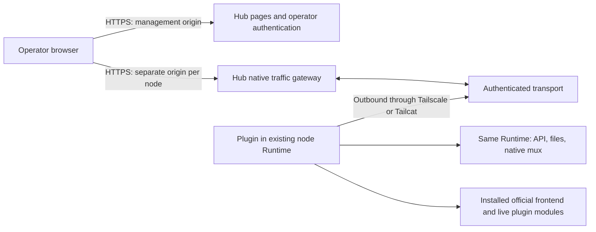

# Native node gateway design

English | [中文](gateway-design.zh.md)

## 1. Scope and evidence

This document describes the minimal gateway rewrite. Existing fleet-workbench documentation describes the legacy implementation; it does not establish the new gateway's behavior. In particular, the legacy rule that Hub serves a centrally reviewed Web snapshot does not apply to this design: each trusted node supplies its own installed official frontend. The legacy artifact remains untouched.

**Required** means a release acceptance condition. **Implemented** means the behavior is visible in the gateway source. **Verified** requires a recorded successful check against a specific revision and environment. A source file, a test case, or an upstream version string alone does not establish verification. The acceptance matrix below deliberately separates automated evidence from deployment evidence.

The rewrite has one operator with full authority over paired nodes. The Hub offers server-rendered pages for listing nodes, adding a node, revoking access, and configuring networking. Opening a node opens its complete native DSH page. Hub does not implement a React workbench, aggregate projects or sessions, synchronize models, or interpret DSH business objects.

## 2. Architecture and ownership

The Hub agent listener binds only to `127.0.0.1:8081` in its own network namespace. A Tailscale or Tailcat helper exposes that listener through the chosen overlay. Container port publication, a public reverse-proxy route, and a LAN listener for this port are forbidden. The public browser listener is a separate entry point with operator authentication.

The node initiates the connection. There is no inbound node port, public node Web listener, generic proxy destination, or second Runtime. The plugin obtains services from the already running Runtime. Frontend assets, the live boot graph, plugin modules, APIs, file operations, and native streams must all refer to that Runtime and installed DSH distribution.

Routing is explicit: a browser origin selects one enrolled node; the authenticated connection binds that node to one Runtime; request and stream identifiers are scoped to that connection. Neither a request body nor a stale browser preference can change ownership. Reconnecting must replace or reject a duplicate connection deliberately and cancel work attached to the old connection. Never send a failed operation to another node.

## 3. Browser origins and trust

Each node needs a distinct HTTPS origin, typically a generated subdomain under a dedicated gateway domain. A path prefix alone does not isolate `localStorage`, IndexedDB, service workers, or frontend configuration. Node identifiers used for host routing must be generated and validated, and unknown hosts must fail closed. Wildcard DNS and certificates are deployment prerequisites if subdomains are used.

Hub's management origin and every node origin require authentication. Use host-only operator cookies; do not share a parent-domain session cookie with node JavaScript. If the implementation transfers authorization from the management origin, the transfer must be short-lived, single-use, node-bound, and removed from the URL immediately. Reject cross-origin mutation requests and WebSocket upgrades. Do not forward Hub login cookies, Cloudflare assertions, invite tokens, or agent credentials into native DSH requests.

Serving a node's frontend gives that node and its installed plugins authority within that node origin. Pairing is therefore a trust decision about executable frontend code as well as the Runtime. Distinct origins limit accidental cross-node state sharing; they do not make a malicious node safe or turn this product into a multi-tenant sandbox. The operator can execute commands and modify files through native DSH. A compromised Hub, operator session, node plugin, or overlay host can threaten that authority.

Cloudflare Access can be an outer authentication layer only if origin bypass is prevented and assertions are validated. Checking an email header or decoding an unsigned token is insufficient. Exact issuer, audience, signature, expiry, and operator policy must be checked. A password fallback must be explicitly configured and protected; it must not silently bypass a configured Access policy. Final enabled modes and endpoints are listed in the implementation snapshot below. See [Cloudflare's JWT validation guidance](https://developers.cloudflare.com/cloudflare-one/access-controls/applications/http-apps/authorization-cookie/validating-json/).

## 4. State and enrollment

Hub persists node identities, invitation lifecycle records, and operator-session/authentication state. Operational configuration and helper identity files are also necessary. It does not persist DSH models, provider credentials, project/session indexes, histories, message bodies, files, or plugin data. Forwarding transient response bytes is not permission to log or cache them. Logs should contain bounded connection/error metadata, not native payloads, tokens, login URLs, or shell commands containing secrets.

The node persists its enrollment identity and long-lived agent credential in a private state directory. Overlay identity is independent of Hub enrollment. A Tailcat address or tailnet membership does not replace Hub authentication.

Required enrollment sequence:

1. An authenticated operator selects exactly `tailscale` or `tailcat`. The selected helper must be ready before Hub produces a usable invite command.
2. Hub creates an expiring invitation, bound to the selected endpoint and enrollment intent. Display the sensitive command only to the operator.
3. The installer checks the installed DSH and package compatibility, starts or locates the selected network helper, and enrolls through the private listener.
4. The first successful enrollment atomically consumes the invite and binds a stable node identity and Runtime identity. Persist the credential before reporting success.
5. A retry after a lost reply must recover the same enrollment only with the same authenticated enrollment identity; a different claimant, changed identity, expired unused invite, or revoked enrollment must fail. An idempotency string by itself is not authentication.
6. Subsequent starts authenticate with the persistent credential. They do not consume a fresh invite. A credential error stops reconnection attempts that would otherwise repeatedly retry invalid authentication.
7. Revocation invalidates future authentication and closes the live tunnel and its HTTP/WS operations. Revocation does not uninstall DSH, erase history, or stop the local Runtime. Rejoining requires an explicit new enrollment.

Invitation states are `available → consumed`, `available → expired`, or `available → revoked`. Node states are `enrolled/offline → connecting → online → offline`, with `revoked` terminal for that identity. A transport outage preserves identity. A revoked identity must never become online merely because a helper reconnects.

## 5. Endpoint and transport contract

These are the architectural surfaces. Concrete gateway routes follow below; legacy Hub routes are not part of this contract.

| Surface | Contract |
| --- | --- |
| Management origin | Server-rendered list/add/revoke/network pages; authenticated reads and protected form mutations |
| Browser node origin `/` and static assets | Installed official frontend from the selected Runtime's distribution, with live official index injections |
| Browser node origin `/plugins/*` | That Runtime's `clientModules.fetchBundle`, preserving native module resolution |
| Browser node origin `/api/*` | That Runtime's `connection.createSharedFetchHandler('/api')`; preserve method, query, body, status and end-to-end headers |
| Browser native mux | The upstream mux carrier connected to `typertGateway.wireStream.open`; preserve endpoint names, payloads, items and native failures |
| Private enrollment | Expiring invitation plus stable enrollment identity; returns persistent node authentication |
| Private agent connection | Authenticate enrolled node and Runtime before any forwarded request; multiplex HTTP and WS channels |
| Network settings | Helper readiness, managed Tailscale login, configured host mode and diagnostics; never arbitrary shell execution |

Current `gateway-server/src/server.ts` routes:

| Entry | Method and path | Authorization / result |
| --- | --- | --- |
| Management | `GET /`, `GET /nodes/:id`, `GET /api/nodes` | Operator; node list/detail and connection metadata |
| Management | `GET /invites/new`, `POST /invites` | Operator; Origin check on write; 15-minute invite command |
| Management | `POST /nodes/:id/rename`, `POST /nodes/:id/revoke` | Operator and exact Origin; rename or revoke |
| Management | `GET /network`, `POST /network/tailscale/login` | Operator; Origin check on login; managed helper only |
| Management | `GET /login`, `POST /login` | Enabled only when password configured; POST checks Origin and rate |
| Management | `GET /open/:id` | Operator; online node; redirect with a 60-second node-bound ticket |
| Node origin | `/_hub/ticket?ticket=…` | Consume ticket once, issue host-only node session, redirect to `/` |
| Node origin | Native HTTP paths; WS `/api/remote.mux` | Node-scoped browser session; exact Origin for writes and WS |
| Download/root origin | `GET /install.sh`, `GET/HEAD /downloads/:file` | Allowlisted public artifacts, subject to configured origin protection |
| Download/root origin | `GET /api/enrollment/:token` | Invite token and rate limit; returns enrollment/package manifest |
| Private agent listener | `POST /enroll` | Invite token, client-generated identity/credential and Runtime metadata |
| Private agent listener | WS `/connect?nodeId=…` | Bearer node credential; replace old connection for that node |
| Browser listener | `/healthz` | Process liveness only; does not prove overlay readiness |

The invitation token is a capability: manifest retrieval intentionally does not require the operator's browser cookie. Deployment must make installer downloads reachable without handing the node a Cloudflare service token. Redact enrollment URLs from proxy access logs. Downloads on a separate origin must retain the correct management-origin identity in the manifest and installer; this needs end-to-end acceptance.

HTTP transport streams request and response bodies incrementally, including uploads, downloads and event streams. Carry binary bytes without text conversion. Apply bounded frames, concurrent-request limits and backpressure; on overflow fail the affected transport instead of allocating without limit. Remove hop-by-hop headers, validate upgrade semantics and preserve repeated end-to-end headers where required. The current browser gateway strips all inbound `Authorization` and `Cookie` headers as well as Cloudflare/origin-secret headers; it also strips native `Set-Cookie` and forces `Cache-Control: private, no-store`. This is an explicit authentication boundary, so compatibility with a plugin that requires its own cookies or authorization must be tested rather than assumed. A disconnect must cancel the native request and release readers, writers and temporary transport state. HEAD and no-body statuses must remain bodyless.

The implemented transport uses protocol `1`, a 32 KiB credit window, a 256 KiB control-frame limit, an 8 MiB socket-buffer ceiling, a default limit of 128 channels and a default request timeout of 120 seconds. The native mux adapter separately limits a frame to 1 MiB, queued uplink data to 256 KiB and active native streams to 256. Request and response bodies use binary frames with a one-byte protocol marker and a four-byte unsigned channel ID; control frames are JSON with protocol version `1` and a numeric channel ID. A consumer grants at most 32 KiB credit when it pulls (`highWaterMark: 0`); the sender does not read its producer until credit is available. The credit bounds bytes in flight, not the total body size. Mux text is carried inside a control frame, so the 256 KiB outer limit also applies even though the native adapter accepts larger standalone frames. These limits are implementation values, not throughput guarantees. Long-lived HTTP streams must be tested against the request timeout; a successful short request does not prove indefinite SSE support.

HTTP request and response bodies remain bytes: the Hub does not parse and reserialize business JSON, so numeric spellings, precision-sensitive values and native serialization stay under the upstream contract. The transport may frame bytes and native mux messages; it must not rewrite project IDs, model settings, API schemas, credential objects or business payloads. It must not automatically replay writes after reconnect. If a connection fails after a mutation was sent, the outcome is unknown: show a connection failure and let the operator inspect native state before retrying. A normal reconnect may reopen the carrier but cannot claim recovery of a prior request.

WebSocket handling must preserve the native stream lifecycle, enforce frame and queue limits, and propagate cancellation/close in both directions. Browser tab close, node revoke, gateway shutdown, network loss and Runtime reload all terminate attached work. New endpoints registered through the declared native Connection/Fetch or mux contract can use the same carrier without a Hub business-endpoint registry. Legacy “Open in App” routes and custom HTTP plugins registered only on `webServer` are outside that contract. Serving the installed official frontend does not promise that every local Web-server-only feature works remotely; document and test such features individually, without proxying the local listener.

## 6. Network packaging and configuration

The Hub release must bundle both Tailscale and Tailcat, including `tailscaled` for managed Tailscale. The node installer installs the selected helper; switching modes requires preparing the other helper explicitly. Choosing a network changes the invite command and connection method; it does not select a different application protocol. Do not offer public HTTP, arbitrary TCP, LAN IPs, or local Web URLs as additional connection modes.

Tailscale managed mode owns a userspace daemon, private socket and persistent state within the gateway container. The settings page can start login and show the returned HTTPS login link. The operator completes Tailscale authentication; readiness requires a running daemon, a valid tailnet address and a working private forward. Configuration belongs to the dedicated daemon. Do not change the NAS host's DNS, routes or existing Tailscale identity. Host mode, if selected explicitly, reads an existing daemon and leaves login to its owner. Persist identity so container replacement does not unnecessarily create another tailnet device. Userspace networking is supported by [Tailscale's container documentation](https://tailscale.com/docs/features/containers/docker).

Tailcat uses a persistent key and an address exchanged with the node. It does not require a Tailscale account. It uses Tailscale's encrypted data plane and can relay when a direct connection is unavailable; relay availability remains an external dependency. Hub still authenticates enrollment and reconnects. These properties are described by [Tailcat's official README](https://github.com/tailscale/tailcat).

Helper status distinguishes `starting`, `needs-login`, `ready` and `unavailable`; the two tools are monitored independently. A binary being installed does not mean its listener is ready. Losing one helper must not silently switch an enrolled node to the other. A change of selected network or endpoint needs an explicit repair/reconfiguration flow.

The host-mode Compose alternative shares the host network namespace and mounts its Tailscale socket. This gives the container more authority than managed mode: a read-only socket mount does not make daemon RPC read-only. Treat this as an explicit operator choice, audit actual bind addresses, and keep the managed container as the default.

Release assets must pin versions and per-architecture checksums, validate downloads before execution, preserve upstream license notices, and fail on unsupported platforms. Current network source pins Linux `amd64`/`arm64`, Tailscale `1.102.4` and Tailcat `0.7.0`; these are source pins, not a claim of successful deployment on both architectures.

## 7. Installation, reload, updates and rollback

The install command must be self-contained for the selected network and the pinned gateway release. It must identify an existing DSH installation and its configuration, stage the plugin and helper assets, verify them, back up the changed configuration, and write persistent pairing state with restrictive permissions. Re-running it must reuse a valid enrollment rather than add duplicate plugin declarations or create another Runtime.

Loading the plugin may require the existing Runtime's supported configuration reload or a restart. State this requirement in the command result. Do not promise hot reload unless tested with the installed version. If restart is required, warn about active native work and use the operator's existing service mechanism. Never start a second DSH process to make the Hub page work. On uninstall, remove only gateway-owned configuration and helpers; preserve the original Runtime, data and legacy agent service.

Use a release compatibility record covering gateway protocol revision, DSH package version, official frontend version, Runtime carrier interfaces, network binary versions/checksums, architecture and tested environment. `gateway-node` checks for the required native service methods. Its installer currently admits only DSH `0.1.7-rc.2`; the Runtime adapter itself checks methods rather than a version allowlist. Structural method checks alone are not a supported-version policy. Versions without a recorded native browser and transport test must remain unverified; incompatible carriers must fail with a clear upgrade instruction.

For an update, back up Hub identity/session state and helper keys, stage the pinned container/plugin release, validate schema/protocol compatibility, then reconnect one node before expanding. Serve each node's frontend from the same installed release as its Runtime. Do not combine a cached index from one release with another release's plugin graph. Reload the page after a native plugin or Runtime update.

For rollback, retain the prior image digest, plugin package, configuration backup and state-schema version. Stop the new gateway, restore a compatible state backup when required, restore the previous configuration and image, and recheck authentication and one native request. Do not roll back by discarding node identities or reviving revoked credentials. Native mutations completed during an update are not reversed by gateway rollback.

## 8. Deployment and failure handling

Deploy as a new dedicated Docker application on the NAS, with its own name, image, state volume and public browser port. Preserve the legacy agent application's container, network entry, data, credentials and service unit. Select an unused browser port; route management and node hostnames to the new application with HTTPS and WebSocket support. Do not publish the private `8081` port. Avoid host networking when it would defeat that isolation.

Before enabling the route, verify the actual image contains both helpers, the persistent volume is writable only by the service account, the browser-origin certificate covers the configured hosts, and the reverse proxy does not cache authenticated native traffic or buffer streams indefinitely. Check that invalid hosts and direct unauthenticated origin requests fail. Container health must distinguish a running HTTP process from a ready overlay and an online node.

| Failure | Required result and recovery |
| --- | --- |
| Tailscale not logged in | Show `needs-login`; block Tailscale invitation generation; offer managed login |
| Tailcat relay unreachable or helper exits | Show unavailable; bounded recovery; no public-network fallback |
| Invite expired or claimed by another identity | Reject enrollment; create a new invite deliberately |
| Node offline | Show offline; fail promptly; never use another node or cached business response |
| Runtime reload or carrier mismatch | Cancel old work; report the cause; reconnect only after compatibility checks |
| Browser cancellation or slow consumer | Cancel upstream work or apply bounded backpressure; release resources |
| Disconnect after write | Report unknown outcome; no transport replay |
| Hub restart | Restore identity/configuration; nodes reconnect; prior requests remain failed |
| Revocation | Close live channels; deny reconnect; keep local DSH usable |
| Storage or migration failure | Fail safely without claiming enrollment/revocation succeeded |

## 9. Acceptance matrix

All rows are release requirements. A passing unit test verifies only its tested behavior. “Deployment pending” remains true until exercised against the actual container, overlay and installed DSH. Tests that use stub Runtime services cannot establish official frontend compatibility.

| Area | Required cases | Evidence required |
| --- | --- | --- |
| Scope | List/add/revoke/network pages; whole native node page; no fleet aggregation | Page/route tests and browser inspection |
| Authentication | Missing/expired/forged session, wrong host, CSRF, WS origin, configured Access/password behavior | Negative route tests and origin-bypass test |
| Enrollment | Expiry, concurrent consume, same-identity retry after lost reply, different-identity retry, persisted restart | Storage and enrollment integration tests |
| Revocation | Online HTTP/WS cancellation, offline revoke, reconnect denied, local Runtime still works | Integration and real-node test |
| Concurrent ownership | Two nodes with overlapping request/stream/project IDs, simultaneous uploads and WS streams | Multi-node transport test; no byte or state crossover |
| Browser isolation | Distinct origins; different model/provider/localStorage values; no shared Hub cookie | Two-node browser test |
| Native frontend | Installed index, assets, boot graph, plugin imports, refresh, settings, terminal/files | Real supported DSH browser test |
| Native API | Methods/query/body/status/headers, binary and large transfers, HEAD, SSE, native errors | Transport and Runtime integration tests |
| Lifecycle | Abort upload/download, cancel mux, slow consumer, queue/frame overflow, close mid-write | Bounded-resource and cleanup tests |
| No replay | Disconnect after native mutation; reconnect does not issue mutation again | Mutation-count integration test |
| Boundaries | No node listener proxy, second Runtime, arbitrary target, path traversal or symlink escape | Code review and negative tests |
| Packaging | Both tools, pinned checksums, licenses, unsupported architecture, tampered archive | Release artifact checks |
| Networks | Managed login, persisted identity, host mode, Tailcat restart, direct/relayed connection | Helper tests plus actual overlay test |
| Installer | Existing Runtime discovery, repeat install, failure rollback, reload, old service preserved | Temporary-install tests and real-node rehearsal |
| Persistence/privacy | Only control-plane state; payload/token log redaction; restart and disk failure | Storage/log tests and volume inspection |
| Deployment | New isolated container, HTTPS hosts, authenticated proxy, private-port scan, legacy health | NAS deployment record; pending |
| Updates | Compatible upgrade, mismatch rejection, old plugin/image/state rollback | Versioned rehearsal; pending |
| Repository | `pnpm run check`, `pnpm run build`, bilingual parity and link/privacy checks | Results for final shared revision |

### Performance and stability acceptance

Run both the initial per-node page experiment and the separate read-only session-directory experiment. Record them independently; aggregation is not a shipped Hub feature. Pin source/package versions, hardware, browser, dataset size, node count, concurrency, payload size and overlay topology. Separate cold connection, warm requests, reconnect and Hub restart measurements. Report p50/p95 latency, attempts, failures, timeout rate, recovery time and measurement duration; compare against an agreed baseline on the same setup rather than treating local milliseconds as a production SLA.

For both experiments, test repeated navigation, slow readers, simultaneous uploads and mux streams, one-node failure while the other remains usable, cancelled writes without replay, and reconnect/restart with pairing retained. Add a sustained run and inspect memory, queued bytes, descriptors and live channels before load and after cleanup. Accept only zero ownership leaks, zero replayed writes and no retained channels after cancellation/shutdown; record latency/error/resource budgets before the run and report any excess. Rehearse the default 120-second HTTP timeout explicitly. Repeat on separate physical nodes and on available direct/relay paths before making deployment performance claims.

## 10. Implementation and verification record

**Implemented:** the node adapter resolves the installed official frontend, renders the live boot graph, dispatches Connection/Fetch and plugin resources, and uses the existing Runtime's mux. Server routes are listed in §5. Reconnect authentication checks both node credentials and the registered `runtimeId`; replacing a connection disposes the old carrier. Shutdown marks the server as closing before destroying peers so close callbacks do not access the closed store.

SQLite stores node/invitation/session/ticket records with hashed secrets. Invites last 15 minutes, sessions default to 8 hours, and node-bound one-use tickets last 60 seconds. Recovery of a consumed invitation requires matching client identity, credential and Runtime identity. Claimed invitation manifests remain readable until invitation cleanup (24 hours after the original expiry); this does not permit another identity to enroll. The installer keys saved identity by invitation hash: retrying the same invitation reuses it; a new invitation rotates identity for explicit re-pairing. Verify expiry/resume through the public shell as well as the store: a shell-side expiry check must not accidentally reject an otherwise recoverable enrollment.

The manifest separates `hubUrl` from `downloadUrl` and supplies helper arrays under `linux-amd64` and `linux-arm64`. The shell checks the download origin, hashes the plugin and selected helper, then calls the packaged CLI. The CLI admits DSH `0.1.7-rc.2`, modifies only its dependency and marked Cordis block in the existing profile, keeps backups, and restores profile files if native plugin installation fails. It returns `needsReload: true`; it does not start or reload a Runtime. Linux automatic helper installation covers amd64/arm64; macOS requires the selected helper already installed; this shell does not support Windows.

The executable `gateway-server/src/bin.ts` reads authentication from `DSH_GATEWAY_AUTH_FILE` (JSON fields `teamDomain`, `audience`, `operatorEmails`, `originSecret`, `ownerPassword`) with environment fallbacks. When Cloudflare configuration supplies the verifier, it passes only the human JWT verifier to the server, disabling password login for that mode. Standalone password mode requires at least 16 characters. Cloudflare verification uses the configured issuer, audience, signing keys and operator-email allowlist. Protect the authentication file and origin secret; configure complete Access settings and verify that partial settings fail closed. The general `createGateway` library can accept both callbacks and passwords, so the executable's exclusive mode is the deployment contract.

`scripts/build-gateway.mjs` builds a separate server and self-contained node plugin/installer package, copies the shell and network pins, and emits the plugin checksum. The Docker build adds both network tools. Compose defines a dedicated persistent application and publishes only the browser listener on host loopback. These artifacts do not establish production deployment.

**Verified local evidence:** the integration owner's shared full gate log records **248 passing tests**, gateway build success, and successful browser fixtures with `nativeConnection: true`. The browser fixture uses real gateway HTTP/WS and published native Connection, with a fixture shell/API; it does not run the complete installed upstream application. Its initial per-node navigation/API experiment made 80 requests at concurrency 6: p50 **6.30 ms**, p95 **10.65 ms**, error rate **0%**. A separate read-only session-directory/fanout experiment made 40 requests at concurrency 2: p50 **2.70 ms**, p95 **4.00 ms**, error rate **0%**. The latter is a test experiment and does not add aggregation to the product.

Real overlay tests used two isolated client identities on **one physical host**, 40 workload requests per node at concurrency 4, 16 KiB payloads, three reconnect cycles and one Hub restart. Each mode completed 88/88 exchanges with no failures, 6/6 node reconnects and 1/1 Hub restart. HTTP p50/p95 were **4.17/6203.93 ms** for Tailcat and **4.38/24.13 ms** for Tailscale; recovery p50/p95 were **6258.73/6737 ms** and **28.72/52.27 ms**, respectively. Tailcat's high tail latency must remain visible. Tailscale targeted the host's own tailnet address via its logged-in daemon. These measurements include CLI adapters and HTTP; they measure neither WAN paths nor model generation. The reported native-state preservation concerns the test state, not production history durability.

**Pending release evidence:** complete installed DSH browser workflows, production origins/authentication, real multi-machine overlays, NAS private-port isolation and legacy coexistence, installer recovery across expiry/revocation, sustained resource behavior, and update/rollback rehearsal. No production completion is claimed. The integration owner runs final repository gates; documentation checks alone do not certify subsequent source changes.

## 11. Primary sources

Reviewed primary sources inform the design; they do not certify this implementation:

- [DeepSeek Harness official repository](https://github.com/deepseek-ai/deepseek-harness): upstream project and plugin architecture. The exact installed package code and gateway tests determine carrier compatibility.
- [Tailscale container documentation](https://tailscale.com/docs/features/containers/docker): daemon configuration and persistent container identity.
- [Tailcat official repository](https://github.com/tailscale/tailcat): address/key model, userspace operation and encrypted transport.
- [Cloudflare Access JWT validation](https://developers.cloudflare.com/cloudflare-one/access-controls/applications/http-apps/authorization-cookie/validating-json/): origin-side authentication requirements.

For experimental node management, lifecycle supervision and native delegation, see the [node control guide](node-control.md).
