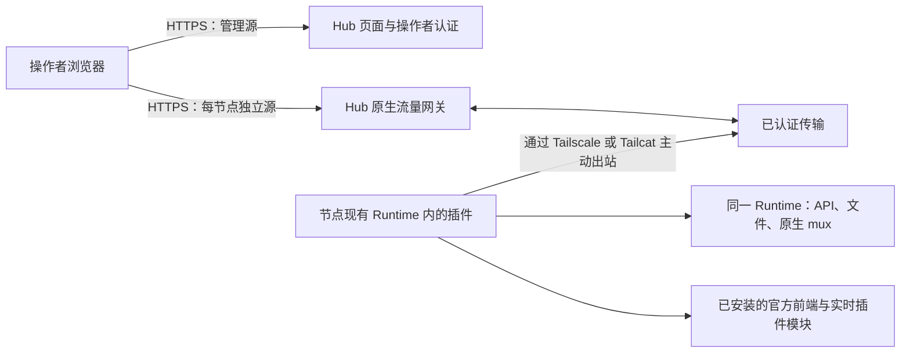

# 原生节点网关设计

中文 | [English](gateway-design.md)

## 1. 范围与证据

本文描述最小网关重写。现有的集群工作台文档描述旧实现，不能用来证明新网关的行为。尤其是旧文档中由 Hub 提供集中审核 Web 快照的规则，不适用于本设计：每个受信任节点提供自己安装的官方前端。旧版产物保持不变。

**必须满足**表示发布验收条件；**已实现**表示网关源码中可以看到对应行为；**已验证**必须有针对明确版本和环境的成功检查记录。存在源码、测试用例或上游版本字符串，本身不等于验证通过。下方验收矩阵明确区分自动化证据与部署证据。

本次重写面向对已配对节点拥有完整权限的单一操作者。Hub 只提供服务端渲染的节点列表、添加节点、撤销接入和网络配置页面。打开节点后，浏览器进入完整的原生 DSH 页面。Hub 不实现 React 工作台，不聚合项目或会话，不同步模型，不解释 DSH 业务对象。

## 2. 架构与归属

Hub agent 监听器只绑定自身网络命名空间中的 `127.0.0.1:8081`，由 Tailscale 或 Tailcat helper 通过选定的覆盖网络提供接入。禁止为该端口配置容器端口发布、公网反向代理路由或局域网监听。浏览器公网入口独立，并要求操作者认证。

连接由节点主动发起。节点不开放入站端口，不暴露本地 Web 监听器，不接受通用代理目标，也不启动第二个 Runtime。插件从已经运行的 Runtime 获取服务。前端资源、实时 boot graph、插件模块、API、文件操作和原生流必须来自同一 Runtime 及其安装的 DSH 发行版。

路由归属必须明确：浏览器源选择一个已注册节点；经过认证的连接将该节点绑定到一个 Runtime；请求和流标识只在该连接内有效。请求体和过期的浏览器偏好都不能改变归属。重连时必须明确替换或拒绝重复连接，并取消旧连接上的工作。失败的操作绝不能转发给其他节点。

## 3. 浏览器源与信任

每个节点需要独立的 HTTPS 源，通常使用专用网关域名下生成的子域名。仅使用路径前缀不能隔离 `localStorage`、IndexedDB、service worker 或前端配置。用于主机路由的节点标识必须由系统生成并验证，未知主机必须拒绝访问。使用子域名时，通配 DNS 和证书是部署前提。

Hub 管理源和每个节点源都需要认证。操作者 Cookie 必须仅限当前主机，不能把父域会话 Cookie 共享给节点 JavaScript。如果实现从管理源传递授权，该凭据必须短期有效、一次性、绑定节点，并立即从 URL 移除。拒绝跨源写请求和 WebSocket 升级。不得将 Hub 登录 Cookie、Cloudflare 断言、邀请码或 agent 凭据转交给原生 DSH 请求。

提供节点前端意味着该节点及其安装的插件拥有该节点源内的执行权限。因此，配对同时是对前端可执行代码和 Runtime 的信任决定。独立源可以限制意外的跨节点状态共享，但不能使恶意节点变得安全，也不会把产品变成多租户沙箱。操作者可以通过原生 DSH 执行命令和修改文件。Hub、操作者会话、节点插件或覆盖网络宿主被攻破，都可能威胁这份权限。

Cloudflare Access 只有在阻止绕过源站并验证断言时，才能作为外层认证。仅检查邮箱请求头或解码未验签的令牌并不够；必须检查准确的签发者、受众、签名、有效期与操作者策略。密码后备认证必须显式配置并受保护，不能静默绕过已配置的 Access 策略。最终启用的模式和端点见下方实现快照。参见 [Cloudflare JWT 验证文档](https://developers.cloudflare.com/cloudflare-one/access-controls/applications/http-apps/authorization-cookie/validating-json/)。

## 4. 状态与注册

Hub 持久化节点身份、邀请生命周期记录和操作者会话／认证状态，同时需要运行配置与 helper 身份文件。Hub 不持久化 DSH 模型、提供商凭据、项目／会话索引、历史、消息正文、文件或插件数据。临时转发响应字节不代表可以记录或缓存它们。日志应只包含有限的连接／错误元数据，不包含原生载荷、令牌、登录链接或带秘密的安装命令。

节点在私有状态目录保存注册身份和长期 agent 凭据。覆盖网络身份独立于 Hub 注册身份；Tailcat 地址或 tailnet 成员资格不能替代 Hub 认证。

注册必须满足以下流程：

1. 已认证操作者只可选择 `tailscale` 或 `tailcat`。选中的 helper 就绪后，Hub 才能生成可用邀请命令。
2. Hub 创建有期限的邀请，并绑定选定端点及注册意图。敏感命令只展示给操作者。
3. 安装器检查已安装 DSH 和包的兼容性，启动或定位选定的网络 helper，经私有监听器注册。
4. 首次成功注册原子地消费邀请，并绑定稳定的节点与 Runtime 身份。在报告成功前持久化凭据。
5. 响应丢失后的重试只能由同一经过认证的注册身份恢复同一次注册。不同申请者、身份变化、未消费但已过期的邀请或已撤销注册必须失败。幂等字符串本身不是认证。
6. 后续启动使用持久化凭据认证，不再消费新邀请。凭据错误应停止反复尝试无效认证的重连。
7. 撤销后拒绝后续认证，并关闭当前隧道及其 HTTP／WS 操作。撤销不会卸载 DSH、删除历史或停止本地 Runtime。重新加入需要显式新注册。

邀请状态为 `可用 → 已消费`、`可用 → 已过期` 或 `可用 → 已撤销`。节点状态为 `已注册／离线 → 连接中 → 在线 → 离线`；对该身份而言，`已撤销`是终态。传输中断不清除身份。已撤销身份不能仅因 helper 重连而重新上线。

## 5. 端点与传输契约

以下是架构接口，随后列出实际网关路由；旧版 Hub 路由不属于此契约。

| 接口 | 契约 |
| --- | --- |
| 管理源 | 服务端渲染的列表／添加／撤销／网络页面；读请求认证，表单写操作受保护 |
| 节点源 `/` 与静态资源 | 所选 Runtime 发行版安装的官方前端，附带官方实时 index 注入 |
| 节点源 `/plugins/*` | 该 Runtime 的 `clientModules.fetchBundle`，保持原生模块解析 |
| 节点源 `/api/*` | 该 Runtime 的 `connection.createSharedFetchHandler('/api')`；保留方法、查询、正文、状态及端到端请求头 |
| 浏览器原生 mux | 上游 mux carrier 接入 `typertGateway.wireStream.open`；保留端点名、载荷、数据项及原生错误 |
| 私有注册 | 有期限邀请加稳定注册身份，返回持久化节点认证凭据 |
| 私有 agent 连接 | 转发前认证节点及 Runtime；复用 HTTP 与 WS 通道 |
| 网络设置 | helper 就绪状态、托管 Tailscale 登录、配置的宿主模式与诊断；不能执行任意 shell |

当前 `gateway-server/src/server.ts` 路由：

| 入口 | 方法与路径 | 认证／结果 |
| --- | --- | --- |
| 管理 | `GET /`、`GET /nodes/:id`、`GET /api/nodes` | 操作者；节点列表／详情及连接元数据 |
| 管理 | `GET /invites/new`、`POST /invites` | 操作者；写操作检查 Origin；15 分钟邀请命令 |
| 管理 | `POST /nodes/:id/rename`、`POST /nodes/:id/revoke` | 操作者及准确 Origin；重命名或撤销 |
| 管理 | `GET /network`、`POST /network/tailscale/login` | 操作者；登录检查 Origin；只作用于托管 helper |
| 管理 | `GET /login`、`POST /login` | 仅配置密码时启用；POST 检查 Origin 和速率 |
| 管理 | `GET /open/:id` | 操作者；节点在线；携带 60 秒节点绑定票据跳转 |
| 节点源 | `/_hub/ticket?ticket=…` | 一次性消费票据，颁发仅当前主机有效的节点会话，再跳转 `/` |
| 节点源 | 原生 HTTP 路径；WS `/api/remote.mux` | 节点范围浏览器会话；写操作及 WS 检查准确 Origin |
| 下载／管理源 | `GET /install.sh`、`GET/HEAD /downloads/:file` | 白名单公开产物，仍受配置的源站保护约束 |
| 下载／管理源 | `GET /api/enrollment/:token` | 邀请令牌和速率限制；返回注册／包清单 |
| 私有 agent 监听器 | `POST /enroll` | 邀请令牌、客户端生成的身份／凭据及 Runtime 元数据 |
| 私有 agent 监听器 | WS `/connect?nodeId=…` | Bearer 节点凭据；替换该节点旧连接 |
| 浏览器监听器 | `/healthz` | 仅进程存活，不证明覆盖网络就绪 |

邀请令牌是访问凭证：清单获取有意不要求操作者浏览器 Cookie。部署必须让安装器可以下载资源，而无需把 Cloudflare 服务令牌交给节点。代理访问日志必须脱敏注册 URL。独立下载源需要在清单和安装器中保留正确的管理源身份，必须端到端验收。

HTTP 传输必须逐步流式转发请求和响应正文，包括上传、下载与事件流。二进制字节不能经过文本转换。限制帧大小、并发请求数并提供背压；超限时终止相应传输，不能无限分配内存。去掉逐跳头，验证升级语义，并在需要时保留重复的端到端头。当前浏览器网关移除所有入站 `Authorization`、`Cookie` 以及 Cloudflare／源站秘密头；还会移除原生 `Set-Cookie`，强制 `Cache-Control: private, no-store`。这是明确的认证边界；对于需要自己 Cookie 或授权头的插件，必须测试兼容性，不能默认支持。断连必须取消原生请求，释放读写器及临时传输状态。HEAD 和禁止正文的响应状态必须保持无正文。

已实现传输使用协议 `1`、32 KiB credit 窗口、256 KiB 控制帧上限、8 MiB socket 缓冲上限、默认 128 个通道和默认 120 秒请求超时。原生 mux 适配器另外限制单帧 1 MiB、排队上行数据 256 KiB、活动原生流 256 个。请求和响应正文使用二进制帧，包含一字节协议标记及四字节无符号通道 ID；控制帧是带协议版本 `1` 和数字通道 ID 的 JSON。消费者拉取时最多授予 32 KiB credit（`highWaterMark: 0`），发送方收到 credit 才读取生产者。credit 限制传输中的字节，而非正文总大小。mux 文本封装在控制帧中，因此即使原生适配器单独接受更大帧，仍受外层 256 KiB 限制。这些是实现参数，不是吞吐保证。长时间 HTTP 流必须针对请求超时测试；短请求成功不能证明 SSE 可以无限持续。

HTTP 请求和响应正文保持字节形式：Hub 不解析再序列化业务 JSON，因此数字写法、精度敏感值和原生序列化仍由上游契约决定。传输可以封装字节和原生 mux 消息，但不能改写项目 ID、模型设置、API schema、凭据对象或业务载荷。重连后不得自动重放写操作。如果提交写操作后连接中断，其结果未知：显示连接失败，让操作者检查原生状态后再决定是否重试。普通重连可以重新打开 carrier，但不能宣称恢复了先前请求。

WebSocket 处理必须保留原生流生命周期，限制帧与队列大小，并双向传递取消／关闭。关闭浏览器标签、撤销节点、关闭网关、网络中断或 Runtime 重载都应终止关联工作。通过约定的原生 Connection／Fetch 或 mux 契约注册的新端点，可以使用同一 carrier，无需 Hub 维护业务端点注册表。旧版“Open in App”路由，以及只向 `webServer` 注册的自定义 HTTP 插件，不在该契约内。提供已安装的官方前端不代表所有本地 Web 服务功能都能远程使用；必须逐项说明和测试，不能因此代理本地监听器。

## 6. 网络打包与配置

Hub 发行包必须同时包含 Tailscale 和 Tailcat；托管 Tailscale 还需要 `tailscaled`。节点安装器安装选定的 helper；切换模式时需要显式准备另一种 helper。网络选择改变邀请命令和连接方式，不改变应用协议。不能提供公网 HTTP、任意 TCP、局域网 IP 或本地 Web URL 作为额外接入模式。

Tailscale 托管模式在网关容器内拥有独立的用户态 daemon、私有 socket 和持久化状态。设置页面可发起登录并展示返回的 HTTPS 登录链接。操作者完成 Tailscale 认证后，只有 daemon 运行、tailnet 地址有效且私有转发可用，才算就绪。配置只作用于专用 daemon，不改变 NAS 宿主 DNS、路由或原有 Tailscale 身份。显式选择宿主模式时，读取现有 daemon，由其所有者负责登录。持久化身份，避免更换容器时无谓地新增 tailnet 设备。[Tailscale 容器文档](https://tailscale.com/docs/features/containers/docker)说明了用户态网络支持。

Tailcat 使用持久化密钥，并将地址交给节点，不需要 Tailscale 账号。它使用 Tailscale 加密数据平面，直连不可用时可中继；中继可用性仍是外部依赖。Hub 仍须验证注册与重连身份。这些特性见 [Tailcat 官方 README](https://github.com/tailscale/tailcat)。

helper 状态区分 `starting`、`needs-login`、`ready` 和 `unavailable`，两种工具独立监测。已安装二进制不等于监听器已经就绪。某个 helper 失联后，不能静默把已注册节点切到另一种网络。改变网络或端点需要显式修复／重新配置流程。

宿主模式 Compose 方案共享宿主网络命名空间，并挂载 Tailscale socket。它比托管模式赋予容器更多权限：只读 socket 挂载不代表 daemon RPC 只读。必须由操作者显式选择，检查实际绑定地址，默认仍使用托管容器模式。

发行资源必须固定版本和各架构校验和，执行前验证下载内容，保留上游许可声明，并拒绝不支持的平台。目前网络源码固定 Linux `amd64`／`arm64`、Tailscale `1.102.4` 和 Tailcat `0.7.0`；这是源码锁定值，不代表两个架构都已成功部署。

## 7. 安装、重载、更新与回滚

安装命令必须包含选定网络及固定网关版本所需的信息。安装器必须识别现有 DSH 安装与配置，暂存并验证插件和 helper 资源，备份将修改的配置，以严格权限写入配对状态。重复执行应复用有效注册，不能重复添加插件声明或创建另一个 Runtime。

加载插件可能需要现有 Runtime 支持的配置重载或重启。命令结果必须说明这一要求；未经安装版本实测，不应承诺热重载。需要重启时，应提示对运行中原生工作的影响，并使用操作者现有的服务管理方式。绝不能为了打开 Hub 页面启动第二个 DSH 进程。卸载只移除网关拥有的配置与 helper，保留原 Runtime、数据和旧 agent 服务。

发布兼容性记录必须覆盖网关协议修订、DSH 包版本、官方前端版本、Runtime carrier 接口、网络二进制版本／校验和、架构和测试环境。`gateway-node` 检查所需原生服务方法；安装器当前只接受 DSH `0.1.7-rc.2`，Runtime 适配器自身检查方法而非版本白名单。结构化方法检查本身不构成支持版本策略。缺少原生浏览器与传输测试记录的版本保持未验证；carrier 不兼容时必须明确失败并给出升级说明。

更新前备份 Hub 身份／会话状态及 helper 密钥，暂存固定版本容器／插件，验证 schema 和协议兼容性，然后先重连一个节点再扩大范围。节点前端必须与其 Runtime 来自同一安装版本。不能把旧版缓存 index 与新版插件图组合。原生插件或 Runtime 更新后重新加载页面。

回滚需保留旧镜像摘要、插件包、配置备份及状态 schema 版本。停止新网关，必要时恢复兼容状态备份，还原配置和镜像，重新检查认证及一次原生请求。不能通过丢弃节点身份或恢复已撤销凭据来回滚。网关回滚不会撤销更新期间已经完成的原生写操作。

## 8. 部署与故障处理

在 NAS 上部署为新的独立 Docker 应用，使用独立名称、镜像、状态卷及浏览器公网端口。保留旧 agent 应用的容器、网络入口、数据、凭据和服务单元。选择未占用的浏览器端口，用支持 HTTPS 与 WebSocket 的代理将管理及节点主机名路由到新应用。不发布私有 `8081` 端口。若 host 网络会破坏隔离，就不能使用它。

启用路由前，检查实际镜像包含两种 helper、持久化卷只允许服务账户写入、浏览器源证书覆盖配置的主机名，并确保代理不缓存已认证原生流量，也不无限缓冲流。检查未知主机和直接访问源站的未认证请求均失败。容器健康检查应区分 HTTP 进程存活、覆盖网络就绪和节点在线。

| 故障 | 必须呈现的结果与恢复方式 |
| --- | --- |
| Tailscale 未登录 | 显示 `needs-login`；阻止生成 Tailscale 邀请；提供托管登录 |
| Tailcat 中继不可达或 helper 退出 | 显示不可用；有限恢复；不退回公网连接 |
| 邀请过期或已被其他身份消费 | 拒绝注册；显式创建新邀请 |
| 节点离线 | 显示离线；及时失败；不使用其他节点或缓存业务响应 |
| Runtime 重载或 carrier 不兼容 | 取消旧工作；报告原因；兼容性检查后再重连 |
| 浏览器取消或消费缓慢 | 取消上游工作或施加有界背压；释放资源 |
| 写入后断连 | 报告结果未知；传输不重放 |
| Hub 重启 | 恢复身份／配置；节点重连；旧请求仍视为失败 |
| 撤销 | 关闭活动通道；拒绝重连；本地 DSH 仍可使用 |
| 存储或迁移失败 | 安全失败，不谎报注册／撤销成功 |

## 9. 验收矩阵

所有行都是发布要求。单元测试通过只验证其覆盖的行为。在实际容器、覆盖网络和已安装 DSH 上执行前，部署验收仍为待完成。使用 Runtime 桩服务的测试不能证明官方前端兼容。

| 范围 | 必须覆盖的场景 | 所需证据 |
| --- | --- | --- |
| 产品范围 | 列表／添加／撤销／网络页面；完整原生节点页面；无集群聚合 | 页面／路由测试及浏览器检查 |
| 认证 | 缺失／过期／伪造会话、错误主机、CSRF、WS Origin、实际 Access／密码行为 | 反例路由测试及源站绕过测试 |
| 注册 | 过期、并发消费、丢失响应后同身份重试、异身份重试、持久化重启 | 存储与注册集成测试 |
| 撤销 | 在线 HTTP／WS 取消、离线撤销、拒绝重连、本地 Runtime 仍工作 | 集成及真实节点测试 |
| 并发归属 | 两节点使用相同请求／流／项目 ID，同时上传与 WS 流 | 多节点传输测试，无字节或状态串线 |
| 浏览器隔离 | 独立源；不同模型／提供商／localStorage；不共享 Hub Cookie | 双节点浏览器测试 |
| 原生前端 | 安装的 index、资源、boot graph、插件导入、刷新、设置、终端／文件 | 真实支持版本 DSH 浏览器测试 |
| 原生 API | 方法／查询／正文／状态／头、二进制大文件、HEAD、SSE、原生错误 | 传输与 Runtime 集成测试 |
| 生命周期 | 中止上传／下载、取消 mux、慢消费者、队列／帧超限、写入中关闭 | 有界资源和清理测试 |
| 不重放 | 原生写入后断连，重连不重复提交 | 统计写入次数的集成测试 |
| 边界 | 不代理节点监听器、不创建第二 Runtime、不接受任意目标、防路径穿越／符号链接越界 | 代码检查和反例测试 |
| 打包 | 两种工具、固定校验和、许可、不支持的架构、篡改归档 | 发行产物检查 |
| 网络 | 托管登录、身份持久化、宿主模式、Tailcat 重启、直连／中继 | helper 测试及真实覆盖网络测试 |
| 安装器 | 发现现有 Runtime、重复安装、失败回滚、重载、保留旧服务 | 临时安装测试及真实节点演练 |
| 持久化／隐私 | 仅控制面状态；载荷／令牌日志脱敏；重启及磁盘故障 | 存储／日志测试及状态卷检查 |
| 部署 | 新隔离容器、HTTPS 主机、认证代理、私有端口扫描、旧服务健康 | NAS 部署记录；待完成 |
| 更新 | 兼容升级、拒绝不兼容、旧插件／镜像／状态回滚 | 带版本记录的演练；待完成 |
| 仓库 | `pnpm run check`、`pnpm run build`、双语一致及链接／隐私检查 | 最终共享版本的结果 |

### 性能与稳定性验收

初始逐节点页面实验和独立只读会话目录实验都要运行，并分别记录；聚合不是已发布的 Hub 功能。固定源码／包版本、硬件、浏览器、数据规模、节点数、并发数、载荷大小和覆盖网络拓扑。分别测量冷连接、热请求、重连和 Hub 重启，报告 p50／p95 延迟、尝试数、失败数、超时率、恢复时间及测量时长。与同环境下约定的基线比较，不能把本地毫秒数当作生产 SLA。

两个实验都必须测试重复导航、慢读者、同时上传与 mux 流、单节点失败而另一个仍可使用、写取消且不重放、保留配对的重连／重启。增加持续负载测试，检查负载前和清理后的内存、排队字节、描述符及活动通道。必须无归属泄漏、无写重放，取消／关闭后无残留通道；运行前明确延迟／错误／资源预算，记录任何超标。显式演练默认 120 秒 HTTP 超时。在独立物理节点及可用的直连／中继路径复测后，才能作部署性能声明。

## 10. 实现与验证记录

**已实现：**节点适配器定位安装的官方前端、渲染实时 boot graph、分发 Connection／Fetch 和插件资源，并使用现有 Runtime 的 mux。服务端路由见第 5 节。重连认证同时检查节点凭据与注册的 `runtimeId`，替换连接时释放旧 carrier。关闭时先标记服务正在停止，再销毁 peer，避免关闭回调访问已关闭的存储。

SQLite 保存节点／邀请／会话／票据记录，秘密以哈希保存。邀请有效期为 15 分钟，会话默认为 8 小时，节点绑定的一次性票据为 60 秒。恢复已消费邀请必须匹配客户端身份、凭据和 Runtime 身份。已消费邀请的清单在邀请清理前仍可读取（原到期时间之后 24 小时），这不允许其他身份注册。安装器按邀请哈希保存身份：同一邀请重试复用身份，新邀请轮换身份以显式重新配对。过期／恢复必须同时验证公开 shell 和存储路径，避免 shell 的过期检查意外拒绝本可恢复的注册。

清单区分 `hubUrl` 与 `downloadUrl`，以 `linux-amd64` 和 `linux-arm64` 为键提供 helper 数组。shell 检查下载源、校验插件和所选 helper，再调用包内 CLI。CLI 接受 DSH `0.1.7-rc.2`，只修改现有 profile 中自身依赖和带标记的 Cordis 块，保留备份，在原生插件安装失败时恢复 profile 文件。它返回 `needsReload: true`，不会启动或重载 Runtime。Linux 自动 helper 安装覆盖 amd64／arm64；macOS 要求所选工具已安装；该 shell 不支持 Windows。

可执行入口 `gateway-server/src/bin.ts` 从 `DSH_GATEWAY_AUTH_FILE` 读取认证信息（JSON 字段 `teamDomain`、`audience`、`operatorEmails`、`originSecret`、`ownerPassword`），并支持环境变量后备值。Cloudflare 配置生成验证器后，只向服务端传入人类 JWT 验证器，该模式不启用密码登录。独立密码模式要求至少 16 字符。Cloudflare 验证使用配置的签发者、受众、签名密钥与操作者邮箱白名单。保护认证文件和源站秘密，完整配置 Access，并验证部分配置会安全失败。通用 `createGateway` 库可同时接受回调和密码，因此部署以可执行入口的互斥模式为准。

`scripts/build-gateway.mjs` 构建独立服务端和自包含节点插件／安装器包，复制 shell 与网络版本锁定文件，并生成插件校验和。Docker 构建加入两种网络工具。Compose 定义独立持久化应用，仅在宿主回环地址发布浏览器监听器。这些产物不代表生产部署完成。

**已验证的本地证据：**集成负责人的共享完整门禁日志记录了 **248 个测试通过**、网关构建成功，以及 `nativeConnection: true` 的浏览器夹具通过。夹具使用真实网关 HTTP／WS 和已发布原生 Connection，但 shell／API 为测试夹具，并非完整安装的上游应用。初始逐节点导航／API 实验以并发 6 执行 80 次请求，p50 **6.30 ms**、p95 **10.65 ms**、错误率 **0%**。独立的只读会话目录／fanout 实验以并发 2 执行 40 次请求，p50 **2.70 ms**、p95 **4.00 ms**、错误率 **0%**。后者仅为测试实验，不向产品增加聚合功能。

真实覆盖网络测试在**同一台物理主机**上使用两个隔离客户端身份，每节点 40 次工作负载请求、并发 4、16 KiB 载荷、三轮重连和一次 Hub 重启。每种模式均完成 88/88 次交换，无失败，节点重连 6/6 成功，Hub 重启 1/1 成功。HTTP p50／p95：Tailcat 为 **4.17/6203.93 ms**，Tailscale 为 **4.38/24.13 ms**；恢复 p50／p95 分别为 **6258.73/6737 ms** 与 **28.72/52.27 ms**。不能隐藏 Tailcat 的高尾延迟。Tailscale 使用已登录宿主 daemon 连接自身 tailnet 地址。结果包含 CLI 适配器和 HTTP 开销，不衡量 WAN 路径或模型生成。报告中的原生状态保留针对测试状态，不证明生产历史持久性。

**尚待发布验证：**完整安装的 DSH 浏览器工作流、生产源／认证、真实多机覆盖网络、NAS 私有端口隔离与旧服务共存、跨过期／撤销的安装恢复、持续负载资源行为，以及更新／回滚演练。本文不宣称生产完成。最终仓库门禁由集成负责人运行；文档检查不能认证后续源码变化。

## 11. 一手资料

以下已查阅的一手资料用于设计，不为本实现提供认证：

- [DeepSeek Harness 官方仓库](https://github.com/deepseek-ai/deepseek-harness)：上游项目及插件架构。准确的安装包源码和网关测试决定 carrier 兼容性。
- [Tailscale 容器文档](https://tailscale.com/docs/features/containers/docker)：daemon 配置及容器身份持久化。
- [Tailcat 官方仓库](https://github.com/tailscale/tailcat)：地址／密钥模型、用户态运行及加密传输。
- [Cloudflare Access JWT 验证](https://developers.cloudflare.com/cloudflare-one/access-controls/applications/http-apps/authorization-cookie/validating-json/)：源站认证要求。

实验增强分支的节点管理、生命周期监督器与原生委派见 [节点控制指南](node-control.zh.md)。
