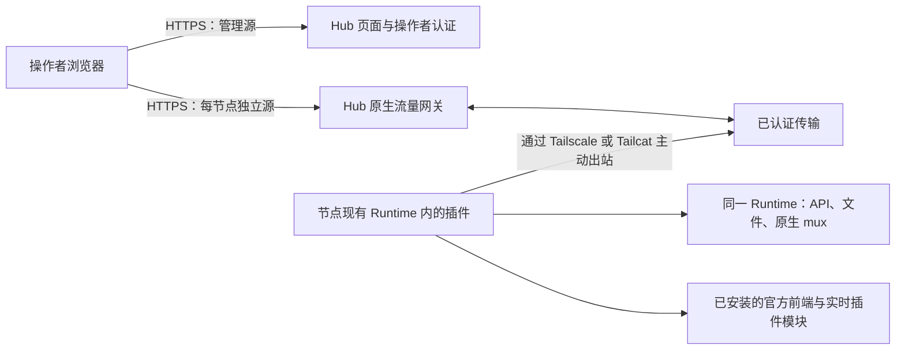

# 原生节点网关设计

中文 | [English](gateway-design.md)

## 1. 范围与证据

本文描述最小网关重写。现有的集群工作台文档描述旧实现，不能用来证明新网关的行为。尤其是旧文档中由 Hub 提供集中审核 Web 快照的规则，不适用于本设计：每个受信任节点提供自己安装的官方前端。旧版产物保持不变。

**必须满足**表示发布验收条件；**已实现**表示网关源码中可以看到对应行为；**已验证**必须有针对明确版本和环境的成功检查记录。存在源码、测试用例或上游版本字符串，本身不等于验证通过。下方验收矩阵明确区分自动化证据与部署证据。

初版 Gateway 面向对已配对节点拥有完整权限的单一操作者。Hub 只提供服务端渲染的节点列表、添加节点、撤销接入和网络配置页面。打开节点后，浏览器进入完整的原生 DSH 页面。初版不含 React 工作台、会话／项目聚合、节点运维管理或节点间相互控制。会话目录与节点运维方案属于另外的独立实验分支。Hub 不同步模型，不解释 DSH 业务对象。

## 2. 架构与归属

Hub agent 监听器只绑定自身网络命名空间中的 `127.0.0.1:8081`，由 Tailscale 或 Tailcat helper 通过选定的覆盖网络提供接入。禁止为该端口配置容器端口发布、公网反向代理路由或局域网监听。浏览器公网入口独立，并要求操作者认证。

连接由节点主动发起。节点不开放入站端口，不暴露本地 Web 监听器，不接受通用代理目标，也不启动第二个 Runtime。插件从已经运行的 Runtime 获取服务。前端资源、实时 boot graph、插件模块、API、文件操作和原生流必须来自同一 Runtime 及其安装的 DSH 发行版。

路由归属必须明确：浏览器源选择一个已注册节点；经过认证的连接将该节点绑定到一个 Runtime；请求和流标识只在该连接内有效。请求体和过期的浏览器偏好都不能改变归属。重连时必须明确替换或拒绝重复连接，并取消旧连接上的工作。失败的操作绝不能转发给其他节点。

## 3. 浏览器源与信任

每个节点需要独立的 HTTPS 源，通常使用专用网关域名下生成的子域名。仅使用路径前缀不能隔离 `localStorage`、IndexedDB、service worker 或前端配置。用于主机路由的节点标识必须由系统生成并验证，未知主机必须拒绝访问。使用子域名时，通配 DNS 和证书是部署前提。

Hub 管理源和每个节点源都需要认证。操作者 Cookie 必须仅限当前主机，不能把父域会话 Cookie 共享给节点 JavaScript。如果实现从管理源传递授权，该凭据必须短期有效、一次性、绑定节点，并立即从 URL 移除。拒绝跨源写请求和 WebSocket 升级。不得将 Hub 登录 Cookie、Cloudflare 断言、邀请码或 agent 凭据转交给原生 DSH 请求。

提供节点前端意味着该节点及其安装的插件拥有该节点源内的执行权限。因此，配对同时是对前端可执行代码和 Runtime 的信任决定。独立源可以限制意外的跨节点状态共享，但不能使恶意节点变得安全，也不会把产品变成多租户沙箱。操作者可以通过原生 DSH 执行命令和修改文件。Hub、操作者会话、节点插件或覆盖网络宿主被攻破，都可能威胁这份权限。

Cloudflare Access 只有在阻止绕过源站并验证断言时，才能作为外层认证。仅检查邮箱请求头或解码未验签的令牌并不够；必须检查准确的签发者、受众、签名、有效期与操作者策略。密码后备认证必须显式配置并受保护，不能静默绕过已配置的 Access 策略。最终启用的模式和端点见下方实现快照。参见 [Cloudflare JWT 验证文档](https://developers.cloudflare.com/cloudflare-one/access-controls/applications/http-apps/authorization-cookie/validating-json/)。

## 4. 状态与注册

Hub 持久化节点身份、邀请生命周期记录和操作者会话／认证状态，同时需要运行配置与 helper 身份文件。Hub 不持久化 DSH 模型、提供商凭据、项目／会话索引、历史、消息正文、文件或插件数据。临时转发响应字节不代表可以记录或缓存它们。日志应只包含有限的连接／错误元数据，不包含原生载荷、令牌、登录链接或带秘密的安装命令。

节点在私有状态目录保存注册身份和长期 agent 凭据。覆盖网络身份独立于 Hub 注册身份；Tailcat 地址或 tailnet 成员资格不能替代 Hub 认证。

注册必须满足以下流程：

1. 已认证操作者只可选择 `tailscale` 或 `tailcat`。选中的 helper 就绪后，Hub 才能生成可用邀请命令。
2. Hub 创建有期限的邀请，并绑定选定端点及注册意图。敏感命令只展示给操作者。
3. 安装器检查已安装 DSH 和包的兼容性，启动或定位选定的网络 helper，经私有监听器注册。
4. 首次成功注册原子地消费邀请，并绑定稳定的节点与 Runtime 身份。在报告成功前持久化凭据。
5. 响应丢失后的重试只能由同一经过认证的注册身份恢复同一次注册。不同申请者、身份变化、未消费但已过期的邀请或已撤销注册必须失败。幂等字符串本身不是认证。
6. 后续启动使用持久化凭据认证，不再消费新邀请。凭据错误应停止反复尝试无效认证的重连。
7. 撤销后拒绝后续认证，并关闭当前隧道及其 HTTP／WS 操作。撤销不会卸载 DSH、删除历史或停止本地 Runtime。重新加入需要显式新注册。

邀请状态为 `可用 → 已消费`、`可用 → 已过期` 或 `可用 → 已撤销`。节点状态为 `已注册／离线 → 连接中 → 在线 → 离线`；对该身份而言，`已撤销`是终态。传输中断不清除身份。已撤销身份不能仅因 helper 重连而重新上线。

## 5. 端点与传输契约

以下是架构接口，随后列出实际网关路由；旧版 Hub 路由不属于此契约。

| 接口 | 契约 |
| --- | --- |
| 管理源 | 服务端渲染的列表／添加／撤销／网络页面；读请求认证，表单写操作受保护 |
| 节点源 `/` 与静态资源 | 所选 Runtime 发行版安装的官方前端，附带官方实时 index 注入 |
| 节点源 `/plugins/events` | 基于公开 `clientModules` 图／重建订阅的轻量 SSE 适配，无 Web 监听器 |
| 节点源 `/plugins/*` | 该 Runtime 的 `clientModules.fetchBundle`，保持原生模块解析 |
| 节点源 `/api/*` | 该 Runtime 的 `connection.createSharedFetchHandler('/api')`；保留方法、查询、正文、状态及端到端请求头 |
| 浏览器原生 mux | 上游 mux carrier 接入 `typertGateway.wireStream.open`；保留端点名、载荷、数据项及原生错误 |
| 私有注册 | 有期限邀请加稳定注册身份，返回持久化节点认证凭据 |
| 私有 agent 连接 | 转发前认证节点及 Runtime；复用 HTTP 与 WS 通道 |
| 网络设置 | helper 就绪状态、托管 Tailscale 登录、配置的宿主模式与诊断；不能执行任意 shell |

当前 `gateway-server/src/server.ts` 路由：

| 入口 | 方法与路径 | 认证／结果 |
| --- | --- | --- |
| 管理 | `GET /`、`GET /nodes/:id`、`GET /api/nodes` | 操作者；节点列表／详情及连接元数据 |
| 管理 | `GET /invites/new`、`POST /invites` | 操作者；写操作检查 Origin；15 分钟邀请命令 |
| 管理 | `POST /nodes/:id/rename`、`POST /nodes/:id/revoke` | 操作者及准确 Origin；重命名或撤销 |
| 管理 | `GET /network`、`POST /network/tailscale/login` | 操作者；登录检查 Origin；只作用于托管 helper |
| 管理 | `GET /login`、`POST /login` | 仅配置密码时启用；POST 检查 Origin 和速率 |
| 管理 | `GET /open/:id` | 操作者；节点在线；携带 60 秒节点绑定票据跳转 |
| 节点源 | `/_hub/ticket?ticket=…` | 一次性消费票据，颁发仅当前主机有效的节点会话，再跳转 `/` |
| 节点源 | 原生 HTTP 路径；WS `/api/remote.mux` | 节点范围浏览器会话；写操作及 WS 检查准确 Origin |
| 下载／管理源 | `GET /install.sh`、`GET/HEAD /downloads/:file` | 白名单公开产物，仍受配置的源站保护约束 |
| 下载／管理源 | `GET /api/enrollment/:token` | 邀请令牌和速率限制；返回注册／包清单 |
| 私有 agent 监听器 | `POST /enroll` | 邀请令牌、客户端生成的身份／凭据及 Runtime 元数据 |
| 私有 agent 监听器 | WS `/connect?nodeId=…` | Bearer 节点凭据；替换该节点旧连接 |
| 浏览器监听器 | `/healthz` | 仅进程存活，不证明覆盖网络就绪 |

邀请令牌是访问凭证：清单获取有意不要求操作者浏览器 Cookie。部署必须让安装器可以下载资源，而无需把 Cloudflare 服务令牌交给节点。代理访问日志必须脱敏注册 URL。独立下载源需要在清单和安装器中保留正确的管理源身份，必须端到端验收。

HTTP 传输必须逐步流式转发请求和响应正文，包括上传、下载与事件流。二进制字节不能经过文本转换。限制帧大小、并发请求数并提供背压；超限时终止相应传输，不能无限分配内存。去掉逐跳头，验证升级语义，并在需要时保留重复的端到端头。当前浏览器网关移除所有入站 `Authorization`、`Cookie` 以及 Cloudflare／源站秘密头；还会移除原生 `Set-Cookie`。API、历史和文件响应仍为 `Cache-Control: private, no-store`；下述严格限定的静态代码例外允许浏览器缓存。这是明确的认证边界；对于需要自己 Cookie 或授权头的插件，必须测试兼容性，不能默认支持。断连必须取消原生请求，释放读写器及临时传输状态。HEAD 和禁止正文的响应状态必须保持无正文。

浏览器明确接受 gzip 时，Hub 在回程对符合条件的 200 GET／HEAD JavaScript 和 CSS 资源流式压缩。它尊重已有编码、范围请求、附件响应和 `no-transform`；流水线保持背压与取消。重新编码会移除不再适用的长度／摘要／验证头，并设置 `Vary: Accept-Encoding`。原生 API、SSE 与文件载荷不变换。

只有符合条件的代码同时具备**确切版本 URL**与原生所有者的 **`immutable` 承诺**，才返回 `private, max-age=31536000, immutable`。当前规则要求受支持插件代码 URL 带唯一的 12 位十六进制 `rev`，或资源文件名以八字符哈希结尾；原生 `no-store`／`no-cache` 优先于 immutable。未版本化代码、HTML 和业务响应仍为 `private, no-store`。缓存只在浏览器的节点源内，不存在 Hub 共享缓存或代理缓存。撤销后静态文件可能仍在本地缓存，但不会赋予调用 Runtime 的权限。

已实现传输使用协议 `1`、32 KiB credit 窗口、256 KiB 控制帧上限、8 MiB socket 缓冲上限、默认 128 个通道和默认 120 秒请求超时。原生 mux 适配器另外限制单帧 1 MiB、排队上行数据 256 KiB、活动原生流 256 个。请求和响应正文使用二进制帧，包含一字节协议标记及四字节无符号通道 ID；控制帧是带协议版本 `1` 和数字通道 ID 的 JSON。消费者拉取时最多授予 32 KiB credit（`highWaterMark: 0`），发送方收到 credit 才读取生产者。credit 限制传输中的字节，而非正文总大小。mux 文本封装在控制帧中，因此即使原生适配器单独接受更大帧，仍受外层 256 KiB 限制。这些是实现参数，不是吞吐保证。120 秒 HTTP 时限也会关闭插件 SSE。原生 EventSource 会重连并取得完整的当前图，恢复最终状态，而不是重放断连期间的每条事件。

HTTP 请求和响应正文保持字节形式：Hub 不解析再序列化业务 JSON，因此数字写法、精度敏感值和原生序列化仍由上游契约决定。传输可以封装字节和原生 mux 消息，但不能改写项目 ID、模型设置、API schema、凭据对象或业务载荷。重连后不得自动重放写操作。如果提交写操作后连接中断，其结果未知：显示连接失败，让操作者检查原生状态后再决定是否重试。普通重连可以重新打开 carrier，但不能宣称恢复了先前请求。

WebSocket 处理必须保留原生流生命周期，限制帧与队列大小，并双向传递取消／关闭。关闭浏览器标签、撤销节点、关闭网关、网络中断或 Runtime 重载都应终止关联工作。通过约定的原生 Connection／Fetch 或 mux 契约注册的新端点，可以使用同一 carrier，无需 Hub 维护业务端点注册表。旧版“Open in App”路由，以及只向 `webServer` 注册的自定义 HTTP 插件，不在该契约内。提供已安装的官方前端不代表所有本地 Web 服务功能都能远程使用；必须逐项说明和测试，不能因此代理本地监听器。

## 6. 网络打包与配置

Hub 发行包必须同时包含 Tailscale 和 Tailcat；托管 Tailscale 还需要 `tailscaled`。节点安装器安装选定的 helper；切换模式时需要显式准备另一种 helper。网络选择改变邀请命令和连接方式，不改变应用协议。不能提供公网 HTTP、任意 TCP、局域网 IP 或本地 Web URL 作为额外接入模式。

Tailscale 托管模式在网关容器内拥有独立的用户态 daemon、私有 socket 和持久化状态。设置页面可发起登录并展示返回的 HTTPS 登录链接。操作者完成 Tailscale 认证后，只有 daemon 运行、tailnet 地址有效且私有转发可用，才算就绪。配置只作用于专用 daemon，不改变 NAS 宿主 DNS、路由或原有 Tailscale 身份。显式选择宿主模式时，读取现有 daemon，由其所有者负责登录。持久化身份，避免更换容器时无谓地新增 tailnet 设备。[Tailscale 容器文档](https://tailscale.com/docs/features/containers/docker)说明了用户态网络支持。

Tailcat 使用持久化密钥，并将地址交给节点，不需要 Tailscale 账号。它使用 Tailscale 加密数据平面，直连不可用时可中继；中继可用性仍是外部依赖。Hub 仍须验证注册与重连身份。这些特性见 [Tailcat 官方 README](https://github.com/tailscale/tailcat)。

helper 状态区分 `starting`、`needs-login`、`ready` 和 `unavailable`，两种工具独立监测。已安装二进制不等于监听器已经就绪。某个 helper 失联后，不能静默把已注册节点切到另一种网络。改变网络或端点需要显式修复／重新配置流程。

宿主模式 Compose 方案共享宿主网络命名空间，并挂载 Tailscale socket。它比托管模式赋予容器更多权限：只读 socket 挂载不代表 daemon RPC 只读。必须由操作者显式选择，检查实际绑定地址，默认仍使用托管容器模式。

发行资源必须固定版本和各架构校验和，执行前验证下载内容，保留上游许可声明，并拒绝不支持的平台。目前网络源码固定 Linux `amd64`／`arm64`、Tailscale `1.102.4` 和 Tailcat `0.7.0`；这是源码锁定值，不代表两个架构都已成功部署。

## 7. 安装、重载、更新与回滚

安装命令必须包含选定网络及固定网关版本所需的信息。安装器必须识别现有 DSH 安装与配置，暂存并验证插件和 helper 资源，备份将修改的配置，以严格权限写入配对状态。重复执行应复用有效注册，不能重复添加插件声明或创建另一个 Runtime。

加载插件可能需要现有 Runtime 支持的配置重载或重启。命令结果必须说明这一要求；未经安装版本实测，不应承诺热重载。需要重启时，应提示对运行中原生工作的影响，并使用操作者现有的服务管理方式。绝不能为了打开 Hub 页面启动第二个 DSH 进程。卸载只移除网关拥有的配置与 helper，保留原 Runtime、数据和旧 agent 服务。

发布兼容性记录必须覆盖网关协议修订、DSH 包版本、官方前端版本、Runtime carrier 接口、网络二进制版本／校验和、架构和测试环境。`gateway-node` 检查所需原生服务方法；安装器当前只接受 DSH `0.1.7-rc.2`，Runtime 适配器自身检查方法而非版本白名单。结构化方法检查本身不构成支持版本策略。缺少原生浏览器与传输测试记录的版本保持未验证；carrier 不兼容时必须明确失败并给出升级说明。

更新前备份 Hub 身份／会话状态及 helper 密钥，暂存固定版本容器／插件，验证 schema 和协议兼容性，然后先重连一个节点再扩大范围。节点前端必须与其 Runtime 来自同一安装版本。不能把旧版缓存 index 与新版插件图组合。原生插件或 Runtime 更新后重新加载页面。

回滚需保留旧镜像摘要、插件包、配置备份及状态 schema 版本。停止新网关，必要时恢复兼容状态备份，还原配置和镜像，重新检查认证及一次原生请求。不能通过丢弃节点身份或恢复已撤销凭据来回滚。网关回滚不会撤销更新期间已经完成的原生写操作。

## 8. 部署与故障处理

在 NAS 上部署为新的独立 Docker 应用，使用独立名称、镜像、状态卷及浏览器公网端口。保留旧 agent 应用的容器、网络入口、数据、凭据和服务单元。选择未占用的浏览器端口，用支持 HTTPS 与 WebSocket 的代理将管理及节点主机名路由到新应用。不发布私有 `8081` 端口。若 host 网络会破坏隔离，就不能使用它。

启用路由前，检查实际镜像包含两种 helper、持久化卷只允许服务账户写入、浏览器源证书覆盖配置的主机名，并确保代理不缓存已认证原生流量，也不无限缓冲流。检查未知主机和直接访问源站的未认证请求均失败。容器健康检查应区分 HTTP 进程存活、覆盖网络就绪和节点在线。

节点工作目录需要持久卷支持。一次生产 QA 的临时目录位于容器 tmpfs，Runtime 重启后会话显示在 Ungrouped；后续目录虽存在，其 inode 时间晚于 Runtime 启动。记录只证明观测时状态一致，没有证明准确的历史因果。`cwd` 字符串保持不变不等于目录或文件已持久化。部署健康检查也应区分应用 HTTP 故障与 OCI exec／宿主运行目录故障；脱离交互会话后验证后台探针，不能仅凭一次 exec 失败判定应用离线。

| 故障 | 必须呈现的结果与恢复方式 |
| --- | --- |
| Tailscale 未登录 | 显示 `needs-login`；阻止生成 Tailscale 邀请；提供托管登录 |
| Tailcat 中继不可达或 helper 退出 | 显示不可用；有限恢复；不退回公网连接 |
| 邀请过期或已被其他身份消费 | 拒绝注册；显式创建新邀请 |
| 节点离线 | 显示离线；及时失败；不使用其他节点或缓存业务响应 |
| Runtime 重载或 carrier 不兼容 | 取消旧工作；报告原因；兼容性检查后再重连 |
| 浏览器取消或消费缓慢 | 取消上游工作或施加有界背压；释放资源 |
| 写入后断连 | 报告结果未知；传输不重放 |
| Hub 重启 | 恢复身份／配置；节点重连；旧请求仍视为失败 |
| 撤销 | 关闭活动通道；拒绝重连；本地 DSH 仍可使用 |
| 存储或迁移失败 | 安全失败，不谎报注册／撤销成功 |

## 9. 验收矩阵

所有行都是发布要求。单元测试通过只验证其覆盖的行为。在实际容器、覆盖网络和已安装 DSH 上执行前，部署验收仍为待完成。使用 Runtime 桩服务的测试不能证明官方前端兼容。

| 范围 | 必须覆盖的场景 | 所需证据 |
| --- | --- | --- |
| 产品范围 | 列表／添加／撤销／网络页面；完整原生节点页面；无集群聚合 | 页面／路由测试及浏览器检查 |
| 认证 | 缺失／过期／伪造会话、错误主机、CSRF、WS Origin、实际 Access／密码行为 | 反例路由测试及源站绕过测试 |
| 注册 | 过期、并发消费、丢失响应后同身份重试、异身份重试、持久化重启 | 存储与注册集成测试 |
| 撤销 | 在线 HTTP／WS 取消、离线撤销、拒绝重连、本地 Runtime 仍工作 | 集成及真实节点测试 |
| 并发归属 | 两节点使用相同请求／流／项目 ID，同时上传与 WS 流 | 多节点传输测试，无字节或状态串线 |
| 浏览器隔离 | 独立源；不同模型／提供商／localStorage；不共享 Hub Cookie | 双节点浏览器测试 |
| 原生前端 | 安装的 index、资源、boot graph、插件导入、刷新、设置、终端／文件 | 真实支持版本 DSH 浏览器测试 |
| 原生 API | 方法／查询／正文／状态／头、二进制大文件、HEAD、SSE、原生错误 | 传输与 Runtime 集成测试 |
| 生命周期 | 中止上传／下载、取消 mux、慢消费者、队列／帧超限、写入中关闭 | 有界资源和清理测试 |
| 不重放 | 原生写入后断连，重连不重复提交 | 统计写入次数的集成测试 |
| 边界 | 不代理节点监听器、不创建第二 Runtime、不接受任意目标、防路径穿越／符号链接越界 | 代码检查和反例测试 |
| 打包 | 两种工具、固定校验和、许可、不支持的架构、篡改归档 | 发行产物检查 |
| 网络 | 托管登录、身份持久化、宿主模式、Tailcat 重启、直连／中继 | helper 测试及真实覆盖网络测试 |
| 安装器 | 发现现有 Runtime、重复安装、失败回滚、重载、保留旧服务 | 临时安装测试及真实节点演练 |
| 持久化／隐私 | 仅控制面状态；载荷／令牌日志脱敏；重启及磁盘故障 | 存储／日志测试及状态卷检查 |
| 部署 | 新隔离容器、HTTPS 主机、认证代理、私有端口扫描、旧服务健康 | 双节点部署与浏览器检查见第 10 节，其余门槛单独保留 |
| 更新 | 兼容升级、拒绝不兼容、旧插件／镜像／状态回滚 | 带版本记录的演练；待完成 |
| 仓库 | `pnpm run check`、`pnpm run build`、双语一致及链接／隐私检查 | 最终共享版本的结果 |

### 性能与稳定性验收

初版 Gateway 测量逐节点页面；会话目录与节点运维实验属于独立分支，必须分别记录性能和稳定性，其结果不能作为本产品的验收证据。固定源码／包版本、硬件、浏览器、数据规模、节点数、并发数、载荷大小和覆盖网络拓扑。分别测量冷连接、热请求、重连和 Hub 重启，报告 p50／p95 延迟、尝试数、失败数、超时率、恢复时间及测量时长。与同环境下约定的基线比较，不能把本地毫秒数当作生产 SLA。

每个独立验收的实现都必须测试重复导航、慢读者、同时上传与 mux 流、单节点失败而另一个仍可使用、写取消且不重放、保留配对的重连／重启。增加持续负载测试，检查负载前和清理后的内存、排队字节、描述符及活动通道。必须无归属泄漏、无写重放，取消／关闭后无残留通道；运行前明确延迟／错误／资源预算，记录任何超标。显式演练默认 120 秒 HTTP 超时。在独立物理节点及可用的直连／中继路径复测后，才能作部署性能声明。

## 10. 当前实现与验收证据

证据快照：2026-10-03。

### 已实现的契约

插件在声明的 Cordis 插件作用域内，提供同一 Runtime 已安装的官方前端和实时 boot graph，不新增本地 Web 监听器。`/plugins/events` 使用公开 `clientModules.graph`、`onGraphChanged`、`onRebuilt` 和官方 `PluginsEventFrame` 格式。这个轻量 HMR 适配器发送初始完整图、原样重建／图事件、15 秒注释心跳，队列限制为 1 MiB；中止／取消会释放订阅和定时器。实际 rc2 Chromium／WebKit 图／重建／取消检查通过，两个生产节点的 events 端点现均返回 200。重连同时检查节点凭据及注册的 `runtimeId`；替换连接会释放旧 carrier。关闭流程阻止 peer 关闭回调访问已关闭的存储。

邀请有效期为 15 分钟，浏览器会话默认为 8 小时，节点绑定的一次性票据为 60 秒。已消费邀请的清单保留到原到期时间之后 24 小时的清理阶段。shell 允许恢复已消费邀请；CLI 要求已有身份匹配同一邀请哈希，存储还会检查客户端身份、凭据和 Runtime。新邀请轮换身份以显式重新配对。未消费的过期邀请和异身份恢复都会被拒绝。Tailcat 注册使用临时独立的传输密钥：在线重复安装不能使用 Runtime 的活动密钥另起 WireGuard 进程。已保存的 Hub 客户端身份／凭据及 Runtime Tailcat 密钥保持不变。真实 Tailcat 首装和已消费邀请重试测试通过，测试中的 Runtime PID 不变，旧连接未中断。

清单区分管理 `hubUrl` 与 `downloadUrl`，按 Linux 架构提供 helper 数组。安装器验证插件与所选 helper，安装到现有 profile，保留其他依赖并备份配置修改。当前下载代码将归档流式写入临时文件并计算哈希，显示进度，拒绝声明或实际大小超限、校验和不符，只安装完整文件。归档上限为 300 MiB，总时限五分钟；清单上限为 1 MiB，时限 30 秒。30 秒未收到响应头或下载连续 30 秒无进展会失败并清理残留文件。这些描述来自已检查的源码；安装器后续改动仍需发布验收。

可执行入口读取受保护的 `DSH_GATEWAY_AUTH_FILE` JSON 或环境配置。完整 Cloudflare 配置启用签发者／受众／签名／操作者验证，同时禁用密码登录。Compose 传入的全空可选 Cloudflare 值视为未配置，允许独立密码模式；只要填入了非空值但配置不完整，就会阻止启动，不会降级到密码认证。独立密码模式要求至少 16 字符。运行镜像已包含用于出站 HTTPS 验证的 CA 证书。独立网关构建打包服务端、节点插件、安装器及两种网络工具；默认 Compose 应用仅在宿主回环地址发布浏览器端口。

### 证据及适用范围

| 检查 | 实际结果 | 能证明什么 |
| --- | --- | --- |
| 仓库门禁 | 修订 `47b45a68c3` 的发行 `check`／`build` 退出 0：291 通过、四个可选跳过；CI 修订另列 | 对应源码版本通过已配置门禁；跳过项不算已执行 |
| CI | 修订 `69def3feee` 的 [运行 37050742806](https://github.com/k1412/dsh-hub/actions/runs/37050742806) 成功 | macOS／Windows／Ubuntu 全量作业、Gateway 及完整安装 DSH 的 Chromium／WebKit 检查通过；早期失败已解决 |
| 优雅关停测试 | 启用 `GATEWAY_BROWSER_TEST=1` 并提供完整 DSH 安装，98 个 Gateway 测试通过；32 个 server 测试包含真实浏览器 1012 关闭检查 | 本机双节点原生浏览器、未应答 raw TCP 的一秒兜底；新 CI 已启用浏览器测试，不能据此预报新 CI 结果 |
| 完整安装的 DSH | DSH `0.1.7-rc.2`，63 个官方插件条目，Chromium 与 WebKit | 真实前端／Runtime 启动、受限插件作用域、无新增 Web 监听器、手机输入框、Full access 与模型控件 |
| 原生对话与文件 | fixture LLM 发消息／回包／刷新历史；65,537 字节 UI 上传与原生 `workspaceFiles` 下载逐字节一致 | 完整安装的原生路径在受控模型夹具下可用；不代表付费供应商或生产模型测试 |
| 正式包 profile 安装 | 正式网关 tarball 与真实 CLI → 已启动 profile → 真实 Tailcat → HMR；Runtime 只启动一次、PID 不变；首页与官方 JS 返回 200 | 插件可以在已测试的现有 profile 内激活，不创建第二 Runtime，也未重启该进程 |
| 生产配对 | Node A、Node B 分别通过 Tailscale、Tailcat 安装并在线 | 两种覆盖网络在真实机器间可用；初次安装保留 Node B 原 Runtime／agent PID 及旧凭据哈希，后续受控 Runtime 重载见下文 |
| 生产原生读取 | 两节点部署 boot graph 均有 64 个客户端条目；模型目录读取和工作区选择成功 | 生产原生读取可用；干净安装测试的 63 条目与部署的 64 条目属于不同配置，不是插件数量回归 |
| 生产对话 | 每节点一次真实模型请求，准确回复及刷新历史均为 2/2 | 两个会话中的真实供应商对话可用；未重试，也未改模型配置 |
| 生产原生文件 | 每节点 65,537 字节原生二进制上传与官方 multipart `workspaceFiles/readBytes` 下载，SHA-256 一致，4/4 传输通过 | 真实节点的原生文件完整性；生成文件和临时终端已清理 |
| 生产归属 | 各节点返回自己的测试会话投影，对另一节点的精确会话 ID 返回 `ok:true/null` | 按原生缺失会话语义验证归属，不能只看 HTTP 成功 |
| 生产浏览器交互 | 两节点 Chromium 桌面／手机及 WebKit 手机；工作区、Full access、模型菜单、输入和自身历史通过 | 通过一次性票据及 host-only Cookie 的真实公网 HTTPS 交互；该 QA 未执行人类 Cloudflare 登录流程 |

首装和重复安装 smoke 测试通过 HMR 在同一 Runtime 激活。生产**更新**结果不同：两个节点的官方 rc2 `pluginManager/installBundle` 均返回 `HMR transactions cannot be nested`。依赖安装成功，但运行中仍是旧代码。操作者确认活动任务为零后，受控重载现有 Runtime，新 SSE 随后返回 200。这是上游热应用能力限制，不是第二个 Runtime；不能宣称生产 PID 在整个更新过程始终不变。旧 agent 入口与认证均保留。准入 DSH 版本为 `0.1.7-rc.2`，固定 Tailscale `1.102.4` 与 Tailcat `0.7.0`。CI 的操作系统覆盖不扩大 helper 自动安装范围：Linux 支持 amd64／arm64；macOS 要求已安装所选 helper；shell 安装器不支持 Windows。

“Open in App”使用上游仅本地监听器提供的路由，远程仍不可用。原生浏览器报告记录了对应的预期 404 限制；报告的错误列表为空，不能表述为支持所有自定义 Web 服务路由。

### 性能：分开记录不同拓扑

仓库内的[本地覆盖网络报告](../../deploy/gateway/reports/network-local-2026-10-03.json)在**同一台物理主机**使用两个隔离身份。每种模式均完成 **90/90** 次交换，无失败：每节点 40 次工作负载请求、并发 4，加上两次初始握手、六次节点重连检查，以及一次 Hub 重启后的两次客户端检查。载荷为 16 KiB。两种模式均通过 6/6 重连与 1/1 Hub 重启；状态保留指探针服务状态。

| 本地覆盖网络 | 全部 HTTP p50／p95 | 稳态 HTTP p50／p95 | 恢复 p50／p95 |
| --- | --- | --- | --- |
| Tailcat | 4.25 / 6243.14 ms | 4.12 / 14.06 ms | 6270.27 / 7746.22 ms |
| Tailscale | 4.30 / 15.84 ms | 4.27 / 15.84 ms | 27.24 / 47.24 ms |

数据包含 CLI 适配器与 HTTP 开销。Tailscale 使用已登录宿主 daemon 连接宿主自身 tailnet 地址，不衡量 WAN 性能或模型生成。Tailcat 恢复尾延迟约 **7.7 秒**，不能用稳态延迟隐藏这一成本。

以下单独列出**生产公网 HTTPS** 观测。测量期间存在并行部署和浏览器测试，不是隔离的固定版本基准。

| 生产观测 | Node A | Node B |
| --- | --- | --- |
| 首轮 Chromium 桌面输入框 | 24.70 s | 38.13 s |
| 首轮 WebKit 手机输入框 | 20.28 s | 19.43 s |
| 后续新 Chromium 上下文输入框 | 92.95 s | 94.48 s |
| 单次真实模型回复 | 116.68 s | 5.88 s |
| 刷新并恢复自身历史 | 35.18 s | 52.42 s |
| 65,537 字节原生上传／下载 | 2.04 / 1.18 s | 2.12 / 1.90 s |

回复计时从点击发送到目标文本出现，不是隔离的供应商延迟；两个节点使用各自不同的既有默认模型。这些小样本是观测值，不是 SLA，也不能证明覆盖网络或模型的固有速度差异。冷加载达到约 **94 秒**：功能成功不代表速度达标。应用 bundle 已观测到 gzip、约 5.30 MB，但部署中的观测不构成最终压缩后基准。该阶段尚未完成最终冷／热缓存测量；部署后的独立测量见下文。本地覆盖网络／夹具数字不能混入此表。

所有观测的应用插件 bundle 均返回 200，未观测页面异常或“Failed to load plugins”。但**确有 HTTP 错误**：历史 Chromium 样本含 `/plugins/events` 404；WebKit 含原生本地桌面功能 `/open-in-app/apps` 404 和 events 请求取消。首轮样本为每 Chromium 节点 22 成功／一个错误、每 WebKit 节点 23 成功／两个错误，包含辅助端点，并非业务成功率。390 像素屏幕打开原生侧栏会明显压窄聊天区域，收起后聊天和输入框可用。已完成的公开 `clientModules` 适配器修复了历史 events 404，后续两节点检查均返回 200。EventSource 在取消／时限后可正常重连；不支持的本地桌面端点仍单独列为限制。

### 最终部署状态检查

已完成的恢复 JSON 覆盖带标记的 `45351c0a8f` 部署。完成标记后，两节点快照的消息哈希、用户提交次数、工作区与模型状态均保持一致；预期历史可见，原生 mux 可用。没有新增模型提示。快照包含额外系统记录，不能把原始消息记录数当作用户提交次数。

这证明观测部署窗口内的状态保留。报告**没有**捕获可归因于该标记窗口的 UI 断连（`observedUiDisconnect: false`），早先断连发生在部署标记之前，因此不能据此给出最终重建的准确中断／重连耗时。最终双引擎冷／热记录在部署完成标记之后开始，并已写入完成时间，结果如下。

### 最终部署后的冷／热加载

修订 `45351c0a8f` 部署完成后，通过公网 HTTPS 测量：每个引擎同时测试两个节点；每节点一个新浏览器上下文冷加载，再在同一上下文 reload 两次。Chromium 使用桌面视口，WebKit 使用手机视口。主测共 12 轮，11 轮输入框可用、一轮失败。之后 Node A 单独执行一次新 Chromium 上下文冷加载与两次同上下文 reload，补测 3/3 通过；本轮没有新增模型请求。下表为输入框可见时间，每格是单次观测，不是分位数或 SLA。

| 节点／引擎 | 冷加载 | reload 1 | reload 2 |
| --- | --- | --- | --- |
| Node A／Chromium | 连接关闭，导航超时失败 | 12.79 s（仍下载代码） | 4.58 s |
| Node B／Chromium | 15.36 s | 7.96 s | 5.07 s |
| Node A／WebKit | 18.57 s | 6.45 s | 5.28 s |
| Node B／WebKit | 16.27 s | 7.40 s | 6.73 s |
| Node A／Chromium，独立补测 | 21.45 s | 3.91 s | 5.10 s |

Node A 的 Chromium 冷轮记录 `ERR_CONNECTION_CLOSED`，触发 150 秒导航超时，整轮约 165 秒；不能从统计中删掉该失败，也不能直接归因于压缩或某种覆盖网络。它的第一次 reload 仍传输约 5.41 MB 代码，因此不算完整热缓存命中。其余七个 reload 轮次记录的代码网络传输字节为零，输入框就绪约 4.58–7.96 秒；业务 API 仍请求且保持 no-store，并非页面不再使用网络。成功冷轮代码传输约 5.41–5.61 MB，gzip、私有 immutable 头均已观测。WebKit 的缓存资源计数不完整，以传输字节和响应头解释，不据此声称所有资源来自某个特定缓存层。

这些最终部署后样本与此前约 94 秒观测分阶段保留，测试环境和并发条件不完全相同，不能计算严格的加速比。补测成功没有消除首次失败：主测仍为 11/12，含补测为 14/15。14 个成功轮次的输入框延迟 p50 为 6.73 秒、nearest-rank p95 为 21.45 秒；失败的 150 秒导航计入失败率、不进入成功延迟分位数，小样本不代表长期 p95。反向代理只读检查未能确定最初连接关闭的根因，不能写成已修复。本轮不构成长稳测试，也未隔离模型后端延迟。

### `69def3feee` 关闭顺序与独立恢复验收

服务停止时先关闭 Gateway HTTP／WebSocket carrier，再停止覆盖网络 helper；避免覆盖网络先消失而 agent 仍等待旧连接失效。已记录的真实**本地主机 Tailcat**对照中，旧顺序约 46.95 秒发现断线、48.88 秒恢复；新顺序两次均约 2 秒发现断线，分别 4.211／6.002 秒恢复。这是本地、两次新顺序样本，不是公网 WAN 或生产保证，也不解决前轮冷加载连接关闭的未明根因。

该修订带标记重启后的独立生产 JSON 已进入完成态。Node B（Tailcat）记录了原始原生 UI socket 关闭、两次未成功的替换尝试，随后自动建立的新 socket 收到原生帧；这一次观测从首次关闭到首帧为 **6.96 秒**。Node A（Tailscale）没有记录原始 UI socket 关闭或替换，因此**未证明 Node A 的实际断线恢复**。两节点历史哈希、模型、工作区状态及恰好一次用户提交保持一致，历史可见，未新增提示。这区分了实际 UI 恢复与状态保留：额外只读探针流、标记之前的偶发重连均不算恢复证据。前轮不完整恢复观测和 14/15 浏览器性能记录继续单独保留；本轮不消除冷加载失败，也不构成生产恢复 SLA。

### 最新已完成的冷／热加载测量

修订 `69def3feee` 部署之后，两个节点并行使用 Chromium 桌面视口，各执行一次新上下文冷加载和同上下文 reload，共 **4/4** 输入框可用。新上下文复用已有 host-only 会话 Cookie，源存储／缓存为空；没有新增模型请求。

| 节点 | 冷加载 | 热 reload |
| --- | --- | --- |
| Node A | 15.71 s | 3.89 s |
| Node B | 14.26 s | 7.00 s |

以上每格仅一次观测，计时到输入框可见。热轮代码传输为零，62 个 API 响应均为 no-store；仍有本地桌面端点 404 和请求取消。此前成功冷轮为 15.36–21.45 秒、完整热轮为 3.91–7.96 秒。认证入口条件与前轮不同，不能算作严格压缩 A/B，也不覆盖后续 `8df24c10d6` 的性能。主测 11/12、补测后 14/15 及原因未明的 150 秒冷加载超时继续保留；四轮成功不代表长期稳定性、性能达标或 SLA。

### `8df24c10d6` 优雅关停

实现先向原浏览器 WebSocket 发送 `1012 Hub restarting`，最多等待一秒关闭应答，再终止未应答连接、关闭 node carrier，最后停止网络 helper。进入 closing 后，公网和私有端口的新 WebSocket 升级均返回 503。真实本机双节点浏览器检查及 raw TCP 不应答的一秒兜底测试已通过。

修订 `47b45a68c3` 只补测试和 CI：旧 connector 测试总预算一秒，小于合法的 999 毫秒回退加进程通信时间；已复现并改为等待实际重放事件，时限三秒，finally 清理资源。这是测试同步修正，不能替代生产原 UI 关闭／新建／原生帧证据。

新生产 QA 首次准备因复用原订阅而没有新 snapshot，未进入有效重启观测；保留为测试准备失败，不归因产品。随后通过原生侧栏首次选择原 QA 会话，以真实 subscribe／snapshot 和正确源／路径作为就绪门禁。最终报告已完成，结果如下；额外探针或 HTTP 就绪不构成原 UI 恢复证据。

本轮两个节点的**原 UI** 均收到 `1012 Hub restarting`，`wasClean=true`，随后在各自节点源自动打开新 WebSocket、重新订阅原生流并收到 `session/follow` snapshot。没有手动刷新／重连，也没有新增模型提示。历史哈希、模型、实际工作区归属及恰好一次用户提交保持一致；Node A 仍为 Ungrouped。这补上本轮 Node A 的实际恢复证据，但不改写 `69def3feee` 当时未证明恢复的结论。

| 生产节点（各一次） | 客户端关闭→新连接 open | 关闭→首个原生帧 | 关闭→会话 snapshot | 开始标记→snapshot |
| --- | --- | --- | --- | --- |
| Node A | 1.424 s | 1.819 s | 2.228 s | 100.818 s |
| Node B | 1.421 s | 1.887 s | 2.275 s | 100.867 s |

**尚未证明端到端快速恢复。** 客户端在开始标记后约 98.6 秒才收到关闭通知；标记时间也没有被独立证明就是服务进程实际开始关停的时刻。只读 HTTP 失败在标记之前已经出现，之后 HTTP 恢复可读早于原 UI 收到关闭。停顿的位置和原因仍未明，不能归因某种覆盖网络，也不能用关闭后约 2.2 秒的 snapshot 恢复掩盖整个窗口。观察包含 API 取消／超时、SSE HTTP/2 ping 失败／超时及本地桌面端点 404，不能声称零网络错误。每 15 秒轮询并设六秒读取时限，只提供采样可用性，不能推导精确停机时长。本轮证明两节点自动恢复原生订阅和状态保留，不构成恢复 SLA。

### 仍需完成的验收

真实生产提示、回复、刷新历史和原生文件完整性已通过上述有限测试。**仍待完成：**Node A 冷加载连接关闭的调查／复测、优雅重启前后停顿的定位及更多恢复样本、持续资源／稳定性测试及生产更新／回滚演练。部署前后状态一致及上述冷／热测量已记录，不能与这些未完成项混为一谈。每节点一次成功请求不是长稳测试。后续源码改动需单独运行发布检查，不因先前通过而自动获验收。

## 11. 一手资料

以下已查阅的一手资料用于设计，不为本实现提供认证：

- [DeepSeek Harness 官方仓库](https://github.com/deepseek-ai/deepseek-harness)：上游项目及插件架构。准确的安装包源码和网关测试决定 carrier 兼容性。
- [Tailscale 容器文档](https://tailscale.com/docs/features/containers/docker)：daemon 配置及容器身份持久化。
- [Tailcat 官方仓库](https://github.com/tailscale/tailcat)：地址／密钥模型、用户态运行及加密传输。
- [Cloudflare Access JWT 验证](https://developers.cloudflare.com/cloudflare-one/access-controls/applications/http-apps/authorization-cookie/validating-json/)：源站认证要求。
