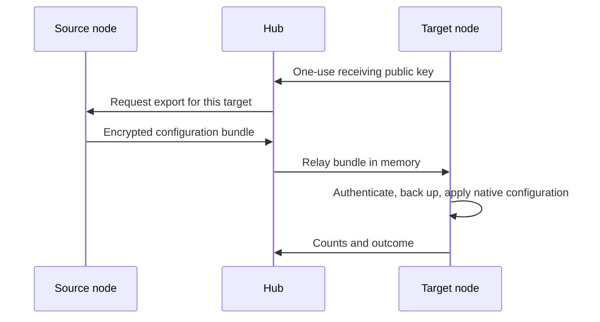

# Model sync

Configure providers and models on one node, then copy them to several nodes from **Settings → Model sync**. Targets update their own model lists live, without repeating endpoint, model and API-key entry on every machine.

## Use

1. Verify that the source can use the desired models and that source and targets are online with upgraded Connectors and Node Agents.
2. Open Settings → Model sync, choose the source, and select targets.
3. Select Sync to selected nodes. Each target reports provider and custom-model counts and the number of matching providers skipped.
4. Open a Session on a target and choose a copied model from its model selector.

Matching provider routes on targets are skipped by default. To update them from the source, select Replace matching providers and credentials. This replaces each matching provider’s complete configuration, including its model list and authentication configuration; other providers are preserved. Target defaults and existing Session model selections stay unchanged.

Run sync again after changing the source. This feature has no background automatic synchronization, central model library, or automatic overwrite for offline nodes.

## Scope

Custom `llm-pi-ai` providers are supported, including protocol, endpoint, model list, model parameters, request headers, and referenced API keys. Keys are written under separate credential references on targets, rather than overwriting existing environment-variable references. Matching providers require explicit replacement.

Built-in models come from each node’s installed DSH version; another version’s built-in catalog is not copied. Device login and OAuth grants require separate sign-in on the target. Targets need a provider plugin supporting the configured protocol and access to its endpoint. Sync does not install model weights, deploy inference services, or change networking.

## Storage boundary

**Model configuration and credentials live only on nodes. Hub provides the transfer operation.**

The receiving private key exists only in the target Connector’s memory, expires after two minutes, and is discarded after one use. The source seals configuration and credentials using X25519, HKDF-SHA256, and AES-256-GCM. Only the target holding that receiving private key can decrypt the bundle.

Hub’s transfer channel uses process memory only. It never writes transfers to command tables, reliable replay queues, or browser event history. Browsers receive receipts only. Audit records contain source, target, counts and outcome, without model definitions, keys or encrypted bundles. Hub provides no model-configuration download or credential-reading endpoint.

Before applying a transfer, the target saves a local backup under `model-sync-backups/` in its Connector state directory, with directory mode `0700` and file mode `0600`. If the native configuration editor refuses an update after credential writes, those credential writes are reverted; unrelated model settings are preserved.

## Failure and retry

An offline source or target, missing plugins or credentials, or a non-transferable device grant makes that target report an incomplete sync. Other targets can finish independently. Disconnects and service restarts discard temporary transfers rather than replaying them; explicitly retry once the nodes recover.

A connection may fail after a target has already committed. Retrying skips matching providers by default, avoiding automatic overwrite; explicitly select replacement when updating them. Running Sessions keep their own model selections.
