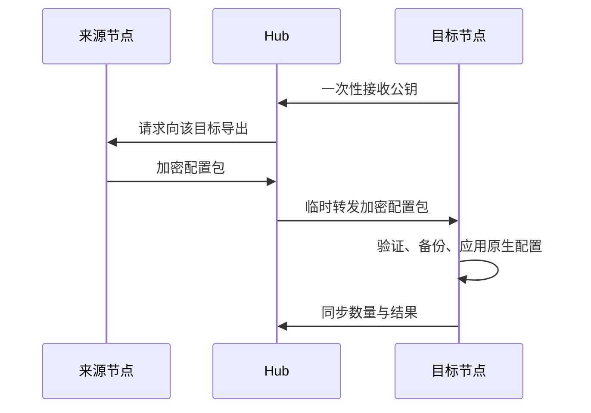

# 模型同步

在一个节点配置好提供方和模型后，可以从 Hub 的 **设置 → 模型同步** 一次复制到多个节点。目标节点收到配置后立即更新自己的模型列表，不必逐台填写地址、模型名称和 API 密钥。

## 使用方法

1. 确认来源节点能正常使用需要的模型，且来源和目标节点均在线、已升级 Connector 与 Node Agent。
2. 打开“设置 → 模型同步”，选择来源节点，勾选目标节点。
3. 点击“同步到选中的节点”。每个目标分别显示同步的提供方、自定义模型数量以及跳过的同名提供方数量。
4. 切换到目标节点的会话，打开模型选择器，选择刚同步的模型。

默认跳过目标上已经存在的同名提供方。需要让来源配置覆盖同名提供方时，勾选“替换目标上的同名提供方及其凭据”。这是整个提供方配置的替换，包含其模型列表与认证配置；其他提供方保留。同步不改变目标默认模型，也不改变已有会话的模型选择。

来源配置以后有变化，可以再次发起同步。该功能没有后台自动同步、中央模型库或自动覆盖离线节点的机制。

## 同步范围

支持 `llm-pi-ai` 中的自定义提供方，包括协议、服务地址、模型列表、模型参数、请求头，以及该提供方引用的 API 密钥。API 密钥在目标节点写入独立的凭据引用，不会覆盖目标上原有的同名环境变量。现有同名提供方需要明确选择替换。

内置模型由各节点所安装的 DSH 版本提供，不复制其他版本的内置目录。设备登录和 OAuth 授权需在目标节点分别完成，不迁移登录授权。目标必须已安装支持该协议的提供方插件，并能够访问提供方服务；同步配置不会安装模型权重、部署推理服务或改变网络配置。

## 保存边界

**模型配置和凭据只保存在节点，Hub 只提供同步功能。**

接收私钥仅存在于目标 Connector 的内存中，有效期两分钟，使用一次后销毁。来源用 X25519、HKDF-SHA256 和 AES-256-GCM 封装配置与凭据；只有持有该接收私钥的目标能够解密这个包。

Hub 的转发通道只在内存中工作，不写入命令表、可靠重放队列或浏览器事件历史。浏览器只收到结果。审计记录仅包含来源、目标、数量和成功或失败，不包含模型定义、密钥或加密包。Hub 不提供模型配置下载或凭据读取接口。

每次应用之前，目标节点在 Connector 状态目录的 `model-sync-backups/` 保存本地配置备份；目录权限 `0700`，文件权限 `0600`。凭据写入后若原生配置编辑器拒绝更新，本次写入的凭据会回退；其他模型设置不变。

## 失败与重试

来源或目标离线、插件缺失、凭据缺失或设备登录授权不能迁移时，该目标显示同步未完成，其他目标仍会独立完成。连接断开或服务重启后，临时传输不重放；确认节点恢复在线后显式重试。

连接中断也可能发生在目标已经提交之后。重试默认跳过同名提供方，避免自动覆盖目标；需要更新时再明确选择替换。正在运行的会话继续使用自身选择的模型。
